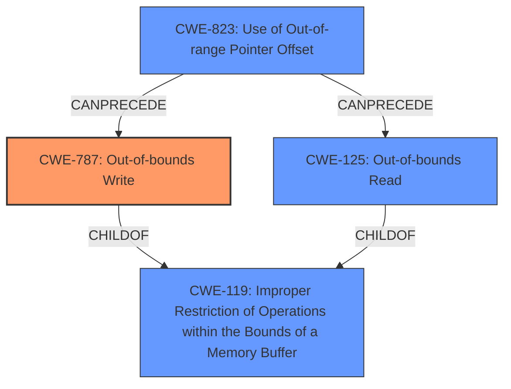

# Raw Analyzer Response for CVE-2022-2947

# Summary
| CWE ID | CWE Name | Confidence | CWE Abstraction Level | CWE Vulnerability Mapping Label | CWE-Vulnerability Mapping Notes |
|---|---|---|---|---|---|
| CWE-787 | Out-of-bounds Write | 1.0 | Base | Allowed | Primary CWE. The description clearly states the vulnerability involves writing outside the intended buffer boundary. |
| CWE-125 | Out-of-bounds Read | 0.7 | Base | Allowed | Secondary CWE. The description also mentions the potential for reading outside the intended buffer boundary. |
| CWE-119 | Improper Restriction of Operations within the Bounds of a Memory Buffer | 0.6 | Class | Discouraged | Secondary CWE. While the CVE summary mentions this, it's a higher-level abstraction than CWE-787 and CWE-125. |

## Evidence and Confidence

*   **Confidence Score:** 0.9
*   **Evidence Strength:** HIGH

## Relationship Analysis
The primary CWE is CWE-787 (**Out-of-bounds Write**), which is a base-level CWE and a child of CWE-119 (**Improper Restriction of Operations within the Bounds of a Memory Buffer**). The vulnerability description and CVE summary explicitly mention writing outside the buffer boundary. CWE-125 (**Out-of-bounds Read**) is also relevant, as the description mentions reading outside the buffer. CWE-125 and CWE-787 can both be caused by issues like CWE-823 (**Use of Out-of-range Pointer Offset**).

## Vulnerability Chain
The vulnerability chain starts with **improper handling of a crafted H3D file**. This leads to operations being performed outside the intended boundary of a memory buffer, resulting in either an **out-of-bounds read** (CWE-125) or an **out-of-bounds write** (CWE-787), ultimately causing **memory corruption**.

## Summary of Analysis
The initial analysis focused on the **memory corruption** aspect, but the key phrase analysis and CVE summary pointed towards an "Improper Restriction of Operations within the Bounds of a Memory Buffer." The "Retriever Results" highlighted CWE-787 (**Out-of-bounds Write**) as the top candidate, aligning with the **memory corruption** and buffer boundary issues described in the vulnerability. The vulnerability description explicitly mentions reading or writing to a memory location outside of the intended boundary of the buffer: "Altair HyperView Player versions 2021.1.0.27 and prior perform operations on a memory buffer but can read from or write to a memory location outside of the intended boundary of the buffer."

CWE-787 is the most specific and accurate representation of the vulnerability's root cause, and is a Base level CWE.

Other considered CWEs:

*   CWE-119: Although mentioned in the CVE summary, this is a class-level CWE and too general. The vulnerability description provides enough information to identify more specific weaknesses like CWE-787 and CWE-125. Mapping guidance discourages its use when more specific CWEs are available.
*   CWE-125: The vulnerability description mentions the possibility of reading outside buffer bounds which is why this is included as a secondary CWE.
*   CWE-908 (**Use of Uninitialized Resource**): While potentially related to memory corruption, there's no direct evidence in the provided information to suggest that uninitialized resources are the root cause.
*   CWE-823 (**Use of Out-of-range Pointer Offset**): This could be a contributing factor, but the primary issue is the out-of-bounds access itself (read or write).
* CWE-190 (**Integer Overflow or Wraparound**): This is often a cause of buffer overflows but there is no mention that this is the case for the current vulnerability.