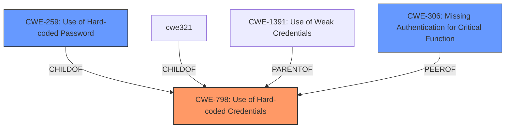

# Analysis Report for CVE-2022-29477

# Vulnerability Analysis Report: CVE-2022-29477

## Description


## Analysis (with Relationship Data)

# Summary
| CWE ID | CWE Name | Confidence | CWE Abstraction Level | CWE Vulnerability Mapping Label | CWE-Vulnerability Mapping Notes |
|---|---|---|---|---|---|
| CWE-798 | Use of Hard-coded Credentials | 1.0 | Base | Allowed | Primary CWE |
| CWE-259 | Use of Hard-coded Password | 0.8 | Variant | Allowed | Secondary Candidate |
| CWE-306 | Missing Authentication for Critical Function | 0.7 | Base | Allowed | Secondary Candidate |

## Evidence and Confidence

*   **Confidence Score:** 0.9
*   **Evidence Strength:** HIGH

## Relationship Analysis
The primary CWE is CWE-798 [Use of Hard-coded Credentials], which has a child relationship to CWE-1391 [Use of Weak Credentials]. CWE-259 [Use of Hard-coded Password] is a variant of CWE-798, providing a more specific classification if the hardcoded credential is a password. CWE-306 [Missing Authentication for Critical Function] could also be considered if the hardcoded credential is the *only* authentication mechanism, effectively resulting in a missing authentication. The choice of CWE-798 as primary is due to the broader scope encompassing any hardcoded credential, with CWE-259 considered as a more specific variant.



## Vulnerability Chain
The vulnerability chain starts with the **hardcoded credential** (CWE-798 or CWE-259), leading to an **authentication bypass** (CWE-306 if authentication is completely missing due to the hardcoded credential being the only check). The final impact is unauthorized access to sensitive functionality.

## Summary of Analysis
The analysis is primarily based on the provided vulnerability description and CVE reference links content summary. The key evidence is the statement that the web interface uses a **hardcoded HTTP header** for authentication, leading to an **authentication bypass**.

The graph relationships show that CWE-798 [Use of Hard-coded Credentials] is a parent to more specific CWEs like CWE-259 [Use of Hard-coded Password], which are considered when the hardcoded credential is, in fact, a password. CWE-306 [Missing Authentication for Critical Function] is considered a peer of CWE-798, and is a potential mapping if the reliance on the hardcoded credential is the *only* authentication mechanism.

The selected CWEs are at the optimal level of specificity. CWE-798 is chosen as the primary because it directly reflects the **root cause** of the vulnerability which is the **use of hard-coded credentials**. If the **hard-coded credential** is a password, CWE-259 [Use of Hard-coded Password] would be a more specific variant.

Relevant CWE Information:

# Enhanced Context (25 CWEs)
The following CWEs were identified as potentially relevant to this vulnerability:

## CWE-74: Improper Neutralization of Special Elements in Output Used by a Downstream Component ('Injection')
**Abstraction Level**: Class
**Similarity Score**: 0.80
**Source**: dense

**Description**:
The product constructs all or part of a command, data structure, or record using externally-influenced input from an upstream component, but it does not neutralize or incorrectly neutralizes special elements that could modify how it is parsed or interpreted when it is sent to a downstream component.

**Mapping Guidance**:
- Usage: Discouraged
- Rationale: CWE-74 is high-level and often misused when lower-level weaknesses are more appropriate.

*Not selected*: Injection is not the **root cause** here. The **root cause** is the **use of a hardcoded credential.**

## CWE-134: Use of Externally-Controlled Format String
**Abstraction Level**: Base
**Similarity Score**: 0.78
**Source**: dense

**Description**:
The product uses a function that accepts a format string as an argument, but the format string originates from an external source.

**Mapping Guidance**:
- Usage: Allowed
- Rationale: This CWE entry is at the Base level of abstraction, which is a preferred level of abstraction for mapping to the root causes of vulnerabilities.

*Not selected*: Format string vulnerability is not the **root cause** here. The **root cause** is the **use of a hardcoded credential.**

## CWE-807: Reliance on Untrusted Inputs in a Security Decision
**Abstraction Level**: Base
**Similarity Score**: 0.77
**Source**: dense

**Description**:
The product uses a protection mechanism that relies on the existence or values of an input, but the input can be modified by an untrusted actor in a way that bypasses the protection mechanism.

**Mapping Guidance**:
- Usage: Allowed
- Rationale: This CWE entry is at the Base level of abstraction, which is a preferred level of abstraction for mapping to the root causes of vulnerabilities.

*Not selected*: While the system relies on the `X-Climax-Tag` header, the core issue is the **hardcoded value** rather than the reliance on an untrusted input.

## CWE-1289: Improper Validation of Unsafe Equivalence in Input
**Abstraction Level**: Base
**Similarity Score**: 0.77
**Source**: dense

**Description**:
The product receives an input value that is used as a resource identifier or other type of reference, but it does not validate or incorrectly validates that the input is equivalent to a potentially-unsafe value.

**Mapping Guidance**:
- Usage: Allowed
- Rationale: This CWE entry is at the Base level of abstraction, which is a preferred level of abstraction for mapping to the root causes of vulnerabilities.

*Not selected*: Validation issues are not at the **root cause** of the vulnerability. The **root cause** is the **use of a hardcoded credential.**

## CWE-184: Incomplete List of Disallowed Inputs
**Abstraction Level**: Base
**Similarity Score**: 0.77
**Source**: dense

**Description**:
The product implements a protection mechanism that relies on a list of inputs (or properties of inputs) that are not allowed by policy or otherwise require other action to neutralize before additional processing takes place, but the list is incomplete.

**Mapping Guidance**:
- Usage: Allowed
- Rationale: This CWE entry is at the Base level of abstraction, which is a preferred level of abstraction for mapping to the root causes of vulnerabilities.

*Not selected*: Disallowed inputs are not at the **root cause** of the vulnerability. The **root cause** is the **use of a hardcoded credential.**

## CWE-303: Incorrect Implementation of Authentication Algorithm
**Abstraction Level**: Base
**Similarity Score**: 0.77
**Source**: dense

**Description**:
The requirements for the product dictate the use of an established authentication algorithm, but the implementation of the algorithm is incorrect.

**Mapping Guidance**:
- Usage: Allowed
- Rationale: This CWE entry is at the Base level of abstraction, which is a preferred level of abstraction for mapping to the root causes of vulnerabilities.

*Not selected*: Incorrect algorithm implementation is not at the **root cause** of the vulnerability. The **root cause** is the **use of a hardcoded credential.**

## CWE-138: Improper Neutralization of Special Elements
**Abstraction Level**: Class
**Similarity Score**: 0.77
**Source**: dense

**Description**:
The product receives input from an upstream component, but it does not neutralize or incorrectly neutralizes special elements that could be interpreted as control elements or syntactic markers when they are sent to a downstream component.

**Mapping Guidance**:
- Usage: Discouraged
- Rationale: This CWE entry is a level-1 Class (i.e., a child of a Pillar). It might have lower-level children that would be more appropriate

*Not selected*: Improper neutralization is not at the **root cause** of the vulnerability. The **root cause** is the **use of a hardcoded credential.**

## CWE-41: Improper Resolution of Path Equivalence
**Abstraction Level**: Base
**Similarity Score**: 0.77
**Source**: dense

**Description**:
The product is vulnerable to file system contents disclosure through path equivalence. Path equivalence involves the use of special characters in file and directory names. The associated manipulations are intended to generate multiple names for the same object.

**Mapping Guidance**:
- Usage: Allowed
- Rationale: This CWE entry is at


## CWE Relationship Analysis

Current CWEs represent these abstraction levels: .


### Vulnerability Chain Analysis

**Chain starting from CWE-41:**
- 41 (Improper Resolution of Path Equivalence) - ROOT


**Chain starting from CWE-184:**
- 184 (Incomplete List of Disallowed Inputs) - ROOT


### CWE Relationship Diagram

```mermaid
graph TD
    classDef primary fill:#f96,stroke:#333,stroke-width:2px
    classDef secondary fill:#69f,stroke:#333
    classDef tertiary fill:#9e9,stroke:#333
```


*Report generated on 2025-03-31 08:46:46*
