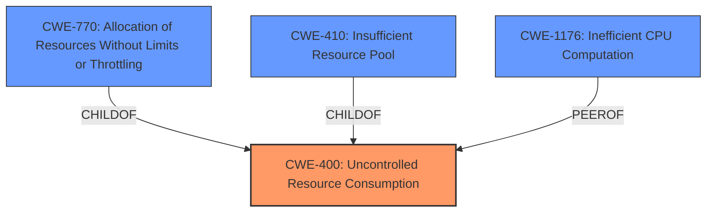

# Enhanced Analysis for CVE-2022-29480

# Summary
| CWE ID | CWE Name | Confidence | CWE Abstraction Level | CWE Vulnerability Mapping Label | CWE-Vulnerability Mapping Notes |
|---|---|---|---|---|---|
| CWE-400 | Uncontrolled Resource Consumption | 0.7 | Class | Primary | Discouraged |
| CWE-770 | Allocation of Resources Without Limits or Throttling | 0.6 | Base | Secondary | Allowed |
| CWE-410 | Insufficient Resource Pool | 0.5 | Base | Secondary | Allowed |
| CWE-1176 | Inefficient CPU Computation | 0.4 | Class | Secondary | Allowed-with-Review |

## Evidence and Confidence

*   **Confidence Score:** 0.7
*   **Evidence Strength:** MEDIUM

## Relationship Analysis
The primary weakness identified is CWE-400, which represents uncontrolled resource consumption. While broad, it aligns with the reported impact of increased CPU utilization. CWE-400 is a Class-level CWE, and the mapping guidance discourages its use when more specific options exist. Given the available information, two potential child CWEs are relevant: CWE-770 (Allocation of Resources Without Limits or Throttling) and CWE-410 (Insufficient Resource Pool). CWE-770 suggests a weakness in limiting resource allocation, while CWE-410 indicates that the resource pool is not large enough to handle peak demand. These two CWEs explain the general CWE-400. Also, CWE-1176 is a child of CWE-405 (Asymmetric Resource Consumption (Amplification)). 



## Vulnerability Chain
The vulnerability chain involves undisclosed requests to big3d, leading to increased CPU resource utilization due to a lack of proper resource management or inefficient CPU computation. This results in uncontrolled resource consumption.
  - **Root Cause**: Undisclosed requests
  - **Weakness**: **Uncontrolled Resource Consumption (CWE-400)** due to **Allocation of Resources Without Limits or Throttling (CWE-770)** or **Insufficient Resource Pool (CWE-410)** which causes **Inefficient CPU Computation (CWE-1176)**
  - **Impact**: increase in CPU resource utilization

## Summary of Analysis
The initial analysis pointed towards CWE-400 as the primary weakness, supported by the description's emphasis on increased CPU resource utilization. However, the mapping guidance for CWE-400 discourages its use when more specific CWEs are available. Given the limited information, CWE-770 and CWE-410 are potential contributing factors, as they represent specific resource management issues. In addition, CWE-1176 represents the inefficient CPU computation that can lead to uncontrolled resource consumption. The final decision involves selecting CWE-400 as the primary weakness, acknowledging its limitations as a Class-level CWE, and including CWE-770, CWE-410, and CWE-1176 as secondary CWEs to provide a more detailed explanation of the vulnerability.

The assessment is primarily based on the vulnerability description, which states that undisclosed requests to big3d can cause an increase in CPU resource utilization. The evidence is limited due to the lack of specific details about the underlying cause of the resource consumption. The graph relationships influenced the selection by highlighting potential child CWEs of CWE-400 that could provide a more precise classification. The selected CWEs represent the optimal level of specificity given the available evidence, balancing the need for accuracy with the limitations of the provided information.

Relevant CWE Information:

# Enhanced Context (25 CWEs)

## CWE-1289: Improper Validation of Unsafe Equivalence in Input
CWE-1289 was not selected because the vulnerability description doesn't suggest any issues with validating equivalence of inputs.

## CWE-807: Reliance on Untrusted Inputs in a Security Decision
CWE-807 was not selected because the description does not emphasize the reliance on inputs in a security decision.

## CWE-405: Asymmetric Resource Consumption (Amplification)
CWE-405 was not selected as its Class status is less preferred, and CWE-1176 (child of CWE-405) is a better fit to the description.

## CWE-183: Permissive List of Allowed Inputs
CWE-183 was not selected because the description doesn't suggest any issues with the product using a protection mechanism that relies on a permissive list of allowed inputs.

## CWE-653: Improper Isolation or Compartmentalization
CWE-653 was not selected because the vulnerability description doesn't indicate any issues with isolating or compartmentalizing functionality, processes, or resources.

## CWE-184: Incomplete List of Disallowed Inputs
CWE-184 was not selected because the description doesn't suggest any issues with the product using a protection mechanism that relies on an incomplete list of disallowed inputs.

## CWE-274: Improper Handling of Insufficient Privileges
CWE-274 was not selected because the vulnerability description doesn't indicate any issues with the product incorrectly handling when it has insufficient privileges to perform an operation.

## CWE-668: Exposure of Resource to Wrong Sphere
CWE-668 was not selected because the description doesn't indicate any issues with exposing a resource to the wrong control sphere.

## CWE-280: Improper Handling of Insufficient Permissions or Privileges
CWE-280 was not selected because the vulnerability description doesn't indicate any issues with the product incorrectly handling when it has insufficient privileges to access resources or functionality.

## CWE-41: Improper Resolution of Path Equivalence
CWE-41 was not selected because the description doesn't suggest any path equivalence issues.

## CWE-22: Improper Limitation of a Pathname to a Restricted Directory ('Path Traversal')
CWE-22 was not selected because the vulnerability description doesn't suggest any path traversal issues.

## CWE-23: Relative Path Traversal
CWE-23 was not selected because the vulnerability description doesn't suggest any path traversal issues.

## CWE-863: Incorrect Authorization
CWE-863 was not selected because the vulnerability description doesn't indicate any authorization issues.

## CWE-770: Allocation of Resources Without Limits or Throttling
CWE-770 was selected as a secondary weakness because it is a child of CWE-400. The **lack of limits or throttling** on resource allocation could contribute to the increase in CPU resource utilization. This is a potential root cause for uncontrolled resource consumption.

## CWE-1284: Improper Validation of Specified Quantity in Input
CWE-1284 was not selected because the description doesn't suggest any issues with validating the specified quantity in input.

## CWE-73: External Control of File Name or Path
CWE-73 was not selected because the description doesn't suggest any issues with external control of file names or paths.

## CWE-410: Insufficient Resource Pool
CWE-410 was selected as a secondary weakness because it is a child of CWE-664. An **insufficient resource pool** could contribute to the CPU resource utilization.

## CWE-1284: Improper Validation of Specified Quantity in Input
CWE-1284 was not selected because the description doesn't suggest any issues with validating the specified quantity in input.

## CWE-22: Improper Limitation of a Pathname to a Restricted Directory ('Path Traversal')
CWE-22 was not selected because the description doesn't suggest any path traversal issues.

## CWE-190: Integer Overflow or Wraparound
CWE-190 was not selected because the description doesn't suggest any integer overflow or wraparound issues.

## CWE-789: Memory Allocation with Excessive Size Value
CWE-789 was not selected because the description doesn't suggest any memory allocation with excessive size value.

## CWE-252: Unchecked Return Value
CWE-252 was not selected because the description doesn't suggest any unchecked return value issues.

## CWE-178: Improper Handling of Case Sensitivity
CWE-178 was not selected because the description doesn't suggest any issues with case sensitivity.

## CWE-843: Access of Resource Using Incompatible Type ('Type Confusion


## CWE Relationship Analysis

Current CWEs represent these abstraction levels: .


### Vulnerability Chain Analysis

**Chain starting from CWE-41:**
- 41 (Improper Resolution of Path Equivalence) - ROOT


**Chain starting from CWE-807:**
- 807 (Reliance on Untrusted Inputs in a Security Decision) - ROOT


### CWE Relationship Diagram

```mermaid
graph TD
    classDef primary fill:#f96,stroke:#333,stroke-width:2px
    classDef secondary fill:#69f,stroke:#333
    classDef tertiary fill:#9e9,stroke:#333
```