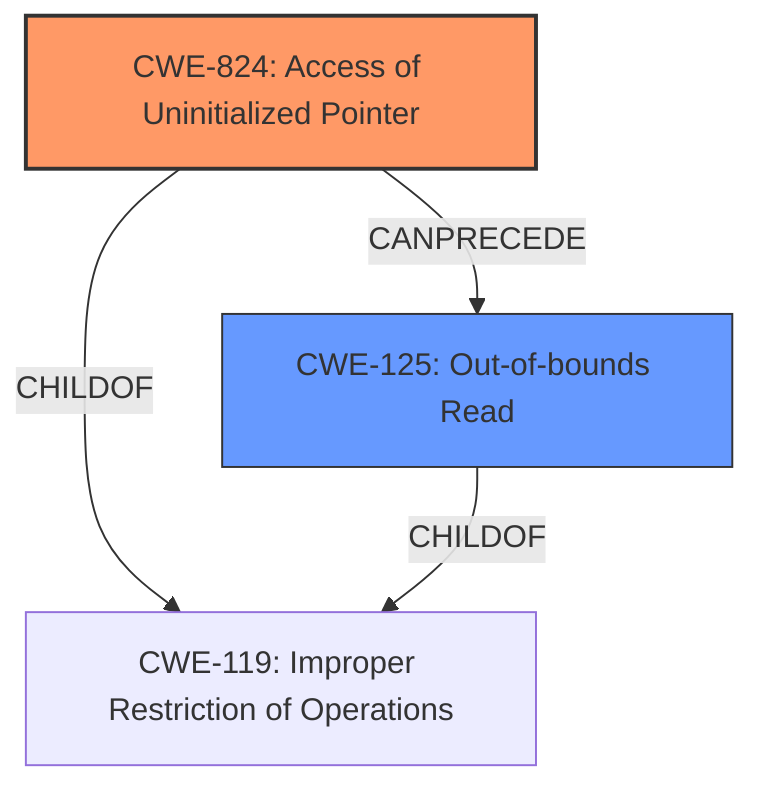

# Raw Analyzer Response for CVE-2022-29488

# Summary
| CWE ID  | CWE Name                                                        | Confidence | CWE Abstraction Level | CWE Vulnerability Mapping Label | CWE-Vulnerability Mapping Notes |
|---------|-----------------------------------------------------------------|------------|-----------------------|---------------------------------|------------------------------------|
| CWE-824 | Access of Uninitialized Pointer                                 | 1.0        | Base                  | Primary                           | Allowed                            |
| CWE-125 | Out-of-bounds Read                                               | 1.0        | Base                  | Secondary                         | Allowed                            |

## Evidence and Confidence

*   **Confidence Score:** 1.0
*   **Evidence Strength:** HIGH

## Relationship Analysis
The primary weakness is **CWE-824 [Access of Uninitialized Pointer]**, which can **CANPRECEDE** **CWE-125 [Out-of-bounds Read]**. This means that the uninitialized pointer is accessed first, and then the code attempts to read data using this pointer. Because the pointer is uninitialized, it is pointing to a random memory location, which results in reading data from outside the intended buffer which leads to the out-of-bounds read. **CWE-824 [Access of Uninitialized Pointer]** is the root cause and **CWE-125 [Out-of-bounds Read]** is a consequence of that root cause. Both are base level CWEs.

## Vulnerability Chain
The vulnerability chain starts with the **uninitialized pointer** (**CWE-824 [Access of Uninitialized Pointer]**), leading to an **out-of-bounds read** (**CWE-125 [Out-of-bounds Read]**), and potentially resulting in arbitrary code execution.

## Summary of Analysis
The vulnerability description clearly indicates an **out-of-bounds read** caused by an **uninitialized pointer**.

The vulnerability description states: "The affected product is vulnerable to an **out-of-bounds read** via **uninitialized pointer**, which may allow an attacker to execute arbitrary code."

The "CVE Reference Links Content Summary" elaborates: "The software is vulnerable to an out-of-bounds read via an uninitialized pointer" and indicates that successful exploitation could allow arbitrary code execution.

The primary CWE is **CWE-824 [Access of Uninitialized Pointer]** because the root cause is the **uninitialized pointer**. This leads to **CWE-125 [Out-of-bounds Read]**. Both are base level CWEs which is the preferred level of abstraction.

The other CWEs were considered but were not the best fit.
*   CWE-476 [NULL Pointer Dereference]: This is similar, but the pointer is not necessarily NULL, just uninitialized.
*   CWE-908 [Use of Uninitialized Resource]: This is a broader category, and **CWE-824 [Access of Uninitialized Pointer]** is more specific.
*   CWE-457 [Use of Uninitialized Variable]: This is also similar, but **CWE-824 [Access of Uninitialized Pointer]** is more specific to pointers.
*   CWE-823 [Use of Out-of-range Pointer Offset]: The offset isn't necessarily out-of-range; the pointer itself is uninitialized.
*   CWE-825 [Expired Pointer Dereference]: The pointer wasn't necessarily expired; it was never initialized.

I am confident in this assessment because the evidence clearly points to an uninitialized pointer as the root cause of the out-of-bounds read.