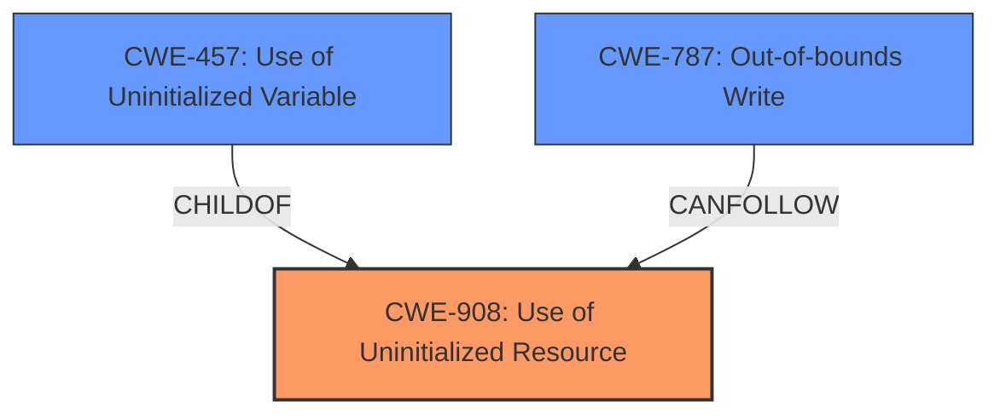

# Analysis Report for CVE-2022-2949

# Vulnerability Analysis Report: CVE-2022-2949

## Description


## Analysis (with Relationship Data)

# Summary
| CWE ID | CWE Name | Confidence | CWE Abstraction Level | CWE Vulnerability Mapping Label | CWE-Vulnerability Mapping Notes |
|---|---|---|---|---|---|
| CWE-908 | Use of Uninitialized Resource | 1.0 | Base | Allowed | Primary CWE |
| CWE-787 | Out-of-bounds Write | 0.6 | Base | Allowed | Secondary Candidate |
| CWE-457 | Use of Uninitialized Variable | 0.5 | Variant | Allowed | Secondary Candidate |

## Evidence and Confidence

*   **Confidence Score:** 0.8
*   **Evidence Strength:** HIGH

## Relationship Analysis
The primary CWE identified is CWE-908, which has children CWEs such as CWE-457, making CWE-457 a more specific case of using uninitialized resources. While the vulnerability description mentions memory corruption, this is a symptom rather than the root cause. CWE-787 (Out-of-bounds Write) is considered because the uninitialized value leads to an index being used which results in memory corruption, implying a write outside the intended bounds.



## Vulnerability Chain
The vulnerability chain starts with the **use of uninitialized memory** (CWE-908). This uninitialized memory is then used as an index, leading to potential **memory corruption** (CWE-787) due to writing outside the bounds of allocated memory.

## Summary of Analysis
The initial analysis focused on identifying the root cause described in the vulnerability description and the CVE reference. The description clearly states "**use of uninitialized memory**" as the core issue.

The CVE Reference Links Content Summary supports this:
"**Root Cause of Vulnerability:** The vulnerability stems from the use of an uninitialized resource during the parsing of H3D files. Specifically, a DWORD value is extracted from an uninitialized buffer. This value, after sign extension, is used as an index into a stack variable to increment a counter."

"**Weaknesses/Vulnerabilities Present:** - Use of Uninitialized Resource (CWE-908): The software uses data from an uninitialized memory buffer, leading to unpredictable behavior and potential memory corruption."

Therefore, CWE-908 is the most accurate primary mapping. CWE-457 (Use of Uninitialized Variable) is a more specific variant of CWE-908, however, it's not clear if the uninitialized resource is specifically a variable. CWE-787 (Out-of-bounds Write) is a potential consequence but is not the root cause, making it a secondary consideration.

The graph relationships confirm that CWE-457 is a child of CWE-908. The chosen CWEs are at the base level of specificity where possible, accurately reflecting the vulnerability details.

Relevant CWE Information:

# Enhanced Context (25 CWEs)

## CWE-131: Incorrect Calculation of Buffer Size
**Abstraction Level**: Base
**Similarity Score**: 0.79
**Source**: dense

**Description**:
The product does not correctly calculate the size to be used when allocating a buffer, which could lead to a buffer overflow.

**Mapping Guidance**:
- Usage: Allowed
- Rationale: This CWE entry is at the Base level of abstraction, which is a preferred level of abstraction for mapping to the root causes of vulnerabilities.

*Not Selected*: This CWE is not selected because the **root cause** is using uninitialized data, not an incorrect buffer size calculation.

## CWE-805: Buffer Access with Incorrect Length Value
**Abstraction Level**: Base
**Similarity Score**: 0.79
**Source**: dense

**Description**:
The product uses a sequential operation to read or write a buffer, but it uses an incorrect length value that causes it to access memory that is outside of the bounds of the buffer.

**Mapping Guidance**:
- Usage: Allowed
- Rationale: This CWE entry is at the Base level of abstraction, which is a preferred level of abstraction for mapping to the root causes of vulnerabilities.

*Not Selected*: This CWE is not selected because the **root cause** is using uninitialized data, not an incorrect length value during buffer access.

## CWE-908: Use of Uninitialized Resource
**Abstraction Level**: Base
**Similarity Score**: 0.79
**Source**: dense

**Description**:
The product uses or accesses a resource that has not been initialized.

**Mapping Guidance**:
- Usage: Allowed
- Rationale: This CWE entry is at the Base level of abstraction, which is a preferred level of abstraction for mapping to the root causes of vulnerabilities.

*Selected*: This CWE is selected because the **root cause** is exactly this issue.

## CWE-125: Out-of-bounds Read
**Abstraction Level**: Base
**Similarity Score**: 0.79
**Source**: dense

**Description**:
The product reads data past the end, or before the beginning, of the intended buffer.

**Mapping Guidance**:
- Usage: Allowed
- Rationale: This CWE entry is at the Base level of abstraction, which is a preferred level of abstraction for mapping to the root causes of vulnerabilities.

*Not Selected*: This CWE is not selected because the **root cause** is using uninitialized data, not an out-of-bounds read directly.

## CWE-823: Use of Out-of-range Pointer Offset
**Abstraction Level**: Base
**Similarity Score**: 0.78
**Source**: dense

**Description**:
The product performs pointer arithmetic on a valid pointer, but it uses an offset that can point outside of the intended range of valid memory locations for the resulting pointer.

**Mapping Guidance**:
- Usage: Allowed
- Rationale: This CWE entry is at the Base level of abstraction, which is a preferred level of abstraction for mapping to the root causes of vulnerabilities.

*Not Selected*: This CWE is not selected because the **root cause** is using uninitialized data, not an out-of-range pointer offset.

## CWE-824: Access of Uninitialized Pointer
**Abstraction Level**: Base
**Similarity Score**: 0.78
**Source**: dense

**Description**:
The product accesses or uses a pointer that has not been initialized.

**Mapping Guidance**:
- Usage: Allowed
- Rationale: This CWE entry is at the Base level of abstraction, which is a preferred level of abstraction for mapping to the root causes of vulnerabilities.

*Not Selected*: While related, the vulnerability doesn't explicitly state that an uninitialized *pointer* is being used. The description mentions a DWORD from an uninitialized buffer being used as an index.

## CWE-404: Improper Resource Shutdown or Release
**Abstraction Level**: Class
**Similarity Score**: 0.78
**Source**: dense

**Description**:
The product does not release or incorrectly releases a resource before it is made available for re-use.

**Mapping Guidance**:
- Usage: Allowed-with-Review
- Rationale: This CWE entry is a Class and might have Base-level children that would be more appropriate

*Not Selected*: This CWE is not selected because the **root cause** is using uninitialized data, not improper resource shutdown or release.

## CWE-126: Buffer Over-read
**Abstraction Level**: Variant
**Similarity Score**: 0.78
**Source**: dense

**Description**:
The product reads from a buffer using buffer access mechanisms such as indexes or pointers that reference memory locations after the targeted buffer.

**Mapping Guidance**:
- Usage: Allowed
- Rationale: This CWE entry is at the Variant level of abstraction, which is a preferred level of abstraction for mapping to the root causes of vulnerabilities.

*Not Selected*: This CWE is not selected because the **root cause** is using uninitialized data, not a buffer over-read directly.

## CWE-191: Integer Underflow (Wrap or Wraparound)
**Abstraction Level**: Base
**Similarity Score**: 0.78
**Source**: dense

**Description**:
The product subtracts one value from another, such that the result is less than the minimum allowable integer value, which produces a value that is not equal to the correct result.

**Mapping Guidance**:
- Usage: Allowed
- Rationale: This CWE entry is at the Base level of abstraction, which is a preferred level of abstraction for mapping to the root causes of vulnerabilities.

*Not Selected*: This CWE is not selected because the **root cause** is using uninitialized data, not an integer underflow.

## CWE-119: Improper Restriction of Operations within the Bounds of a Memory Buffer
**Abstraction Level**: Class
**Similarity Score**:


## CWE Relationship Analysis

Current CWEs represent these abstraction levels: .


### Vulnerability Chain Analysis

**Chain starting from CWE-131:**
- 131 (Incorrect Calculation of Buffer Size) - ROOT


**Chain starting from CWE-908:**
- 908 (Use of Uninitialized Resource) - ROOT


### CWE Relationship Diagram

```mermaid
graph TD
    classDef primary fill:#f96,stroke:#333,stroke-width:2px
    classDef secondary fill:#69f,stroke:#333
    classDef tertiary fill:#9e9,stroke:#333
```


*Report generated on 2025-03-31 02:26:56*
