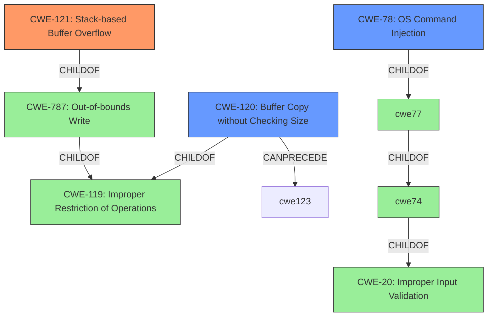

# Raw Analyzer Response for CVE-2022-29496

# Summary
| CWE ID    | CWE Name                                                                 | Confidence | CWE Abstraction Level | CWE Vulnerability Mapping Label | CWE-Vulnerability Mapping Notes |
| :-------- | :----------------------------------------------------------------------- | :--------- | :-------------------- | :------------------------------ | :------------------------------ |
| CWE-121   | Stack-based Buffer Overflow                                                | 0.9        | Variant               | Allowed                       | Primary CWE                     |
| CWE-120   | Buffer Copy without Checking Size of Input ('Classic Buffer Overflow') | 0.7        | Base                  | Allowed-with-Review         | Secondary Candidate             |
| CWE-78    | Improper Neutralization of Special Elements used in an OS Command ('OS Command Injection')                                                        | 0.6        | Base                  | Allowed         | Secondary Candidate             |

## Evidence and Confidence

*   **Confidence Score:** 0.8
*   **Evidence Strength:** HIGH

## Relationship Analysis
The primary CWE is CWE-121, which is a variant of CWE-787 (Out-of-bounds Write) and CWE-119 (Improper Restriction of Operations within the Bounds of a Memory Buffer). CWE-120 (Buffer Copy without Checking Size of Input) is a related base CWE that describes the classic buffer overflow scenario, and it's a child of CWE-119 as well. CWE-78 (Improper Neutralization of Special Elements used in an OS Command) is related due to the command execution impact, but it is less direct. The abstraction levels (Variant for CWE-121, Base for CWE-120 and CWE-78, and Class for CWE-119) guided the selection of the most specific and relevant CWE.

## Vulnerability Chain
The vulnerability chain begins with the **stack-based buffer overflow** (CWE-121) due to the **lack of bounds checking**. This leads to the ability to overwrite the return address and potentially execute arbitrary commands, indicating a command execution impact (CWE-78).

## Summary of Analysis
The initial analysis identified a **stack-based buffer overflow** vulnerability. The root cause is the **lack of bounds checking** when splitting the command string into arguments, allowing the `argv` array to be overflowed. This leads to command execution.

The vulnerability description clearly states "A **stack-based buffer overflow** vulnerability exists in the BlynkConsole.h runCommand functionality of Blynk -Library v1.0.1. A specially-crafted network request can lead to command execution." The CVE Reference Links Content Summary further supports this: "The `split_argv` function within the `runCommand` function in Blynk-Library does not validate the size of the input command against the size of the `argv` buffer allocated on the stack. This allows for a stack-based buffer overflow."

The graph relationships influenced the selection by showing the hierarchical structure. CWE-121 is a variant of CWE-787 and CWE-119, making it more specific than those parent classes.

CWE-121 is at the optimal level of specificity because it directly describes the type of buffer overflow (stack-based) and the root cause. CWE-120 was considered but not chosen as the primary CWE because the description explicitly mentions a stack-based overflow, making CWE-121 more precise.

CWE-190, CWE-197, CWE-125, CWE-1284 were considered but not selected as they did not directly address the **stack-based buffer overflow** and **lack of bounds checking**. CWE-119 was considered but the description explicitly refers to a **stack-based buffer overflow**, making CWE-121 a better and more precise match.

Relevant CWE Information:

# Enhanced Context (25 CWEs)
The following CWEs were identified as potentially relevant to this vulnerability:

## CWE-197: Numeric Truncation Error
**Abstraction Level**: Base
**Similarity Score**: 0.79
**Source**: dense

**Description**:
Truncation errors occur when a primitive is cast to a primitive of a smaller size and data is lost in the conversion.

**Mapping Guidance**:
- Usage: Allowed
- Rationale: This CWE entry is at the Base level of abstraction, which is a preferred level of abstraction for mapping to the root causes of vulnerabilities.

## CWE-191: Integer Underflow (Wrap or Wraparound)
**Abstraction Level**: Base
**Similarity Score**: 0.79
**Source**: dense

**Description**:
The product subtracts one value from another, such that the result is less than the minimum allowable integer value, which produces a value that is not equal to the correct result.

**Mapping Guidance**:
- Usage: Allowed
- Rationale: This CWE entry is at the Base level of abstraction, which is a preferred level of abstraction for mapping to the root causes of vulnerabilities.

## CWE-131: Incorrect Calculation of Buffer Size
**Abstraction Level**: Base
**Similarity Score**: 0.78
**Source**: dense

**Description**:
The product does not correctly calculate the size to be used when allocating a buffer, which could lead to a buffer overflow.

**Mapping Guidance**:
- Usage: Allowed
- Rationale: This CWE entry is at the Base level of abstraction, which is a preferred level of abstraction for mapping to the root causes of vulnerabilities.

## CWE-681: Incorrect Conversion between Numeric Types
**Abstraction Level**: Base
**Similarity Score**: 0.76
**Source**: dense

**Description**:
When converting from one data type to another, such as long to integer, data can be omitted or translated in a way that produces unexpected values. If the resulting values are used in a sensitive context, then dangerous behaviors may occur.

**Mapping Guidance**:
- Usage: Allowed
- Rationale: This CWE entry is at the Base level of abstraction, which is a preferred level of abstraction for mapping to the root causes of vulnerabilities.

## CWE-124: Buffer Underwrite ('Buffer Underflow')
**Abstraction Level**: Base
**Similarity Score**: 0.76
**Source**: dense

**Description**:
The product writes to a buffer using an index or pointer that references a memory location prior to the beginning of the buffer.

**Mapping Guidance**:
- Usage: Allowed
- Rationale: This CWE entry is at the Base level of abstraction, which is a preferred level of abstraction for mapping to the root causes of vulnerabilities.

## CWE-125: Out-of-bounds Read
**Abstraction Level**: Base
**Similarity Score**: 0.76
**Source**: dense

**Description**:
The product reads data past the end, or before the beginning, of the intended buffer.

**Mapping Guidance**:
- Usage: Allowed
- Rationale: This CWE entry is at the Base level of abstraction, which is a preferred level of abstraction for mapping to the root causes of vulnerabilities.

## CWE-190: Integer Overflow or Wraparound
**Abstraction Level**: Base
**Similarity Score**: 0.76
**Source**: dense

**Description**:
The product performs a calculation that can
         produce an integer overflow or wraparound when the logic
         assumes that the resulting value will always be larger than
         the original value. This occurs when an integer value is
         incremented to a value that is too large to store in the
         associated representation. When this occurs, the value may
         become a very small or negative number.

**Mapping Guidance**:
- Usage: Allowed
- Rationale: This CWE entry is at the Base level of abstraction, which is a preferred level of abstraction for mapping to the root causes of vulnerabilities.

## CWE-126: Buffer Over-read
**Abstraction Level**: Variant
**Similarity Score**: 0.76
**