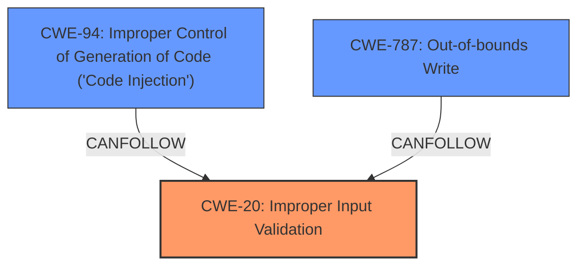

# Raw Analyzer Response for CVE-2022-29499

# Summary
| CWE ID | CWE Name | Confidence | CWE Abstraction Level | CWE Vulnerability Mapping Label | CWE-Vulnerability Mapping Notes |
|---|---|---|---|---|---|
| CWE-20 | Improper Input Validation | 0.9 | Class | Primary | Discouraged |
| CWE-94 | Improper Control of Generation of Code ('Code Injection') | 0.7 | Base | Secondary | Allowed-with-Review |
| CWE-787 | Out-of-bounds Write | 0.6 | Base | Secondary | Allowed |

## Evidence and Confidence

*   **Confidence Score:** 0.8
*   **Evidence Strength:** MEDIUM

## Relationship Analysis
The primary relationship influencing the decision is that CWE-20 is a broad class, and the description identifies **incorrect data validation** as the root cause, but the actual vulnerability could be refined further. The retriever results also included CWE-94, related to code injection, which could be a potential consequence of **incorrect data validation** if the validated data is used to construct code. CWE-787, Out-of-bounds Write, is included as a secondary candidate, since it is a common consequence of improper input validation, especially when dealing with memory buffers, as suggested by the description. The abstraction levels (Class for CWE-20, Base for CWE-94 and CWE-787) influenced the decision to make CWE-20 primary due to its direct alignment with the stated **rootcause**, while considering the other two as potential consequences.

## Vulnerability Chain
The vulnerability chain starts with **incorrect data validation** (CWE-20). If the validation involves data used to construct code, it could lead to code injection (CWE-94), resulting in remote code execution. Alternatively, if the improperly validated data is used as input to operations involving memory buffers, it can lead to out-of-bounds write (CWE-787).

## Summary of Analysis
The initial analysis focused on the provided evidence that states "**incorrect data validation**" as the **rootcause** of the vulnerability, directly pointing to CWE-20 (Improper Input Validation). The CVE Reference Links Content Summary reinforces this by stating: "This vulnerability stems from insufficient validation of input data processed by the Service Appliance."

However, the potential for remote code execution suggests that the improperly validated data might be used in a context where it can influence code execution, making CWE-94 (Improper Control of Generation of Code ('Code Injection')) a relevant secondary concern. Additionally, the possibility of memory corruption due to improper validation is also a concern, leading to the consideration of CWE-787.

CWE-20 is a Class-level CWE and the guidance discourages its use when more specific CWEs are available. However, without more specific information on *how* the data validation is incorrect, it is difficult to choose a more specific child CWE. Given the information, the assessment is based on the provided evidence, with CWE-20 as the primary **rootcause** and CWE-94 and CWE-787 as potential consequences.

The final selection balances the need for specificity with the limitations of the provided information. While a more detailed analysis might reveal a more precise weakness, the current evidence supports CWE-20 as the most accurate representation of the vulnerability's **rootcause**, with CWE-94 and CWE-787 representing possible downstream effects.

Relevant CWE Information:

# Enhanced Context (25 CWEs)
The following CWEs were identified as potentially relevant to this vulnerability:

## CWE-1289: Improper Validation of Unsafe Equivalence in Input
**Abstraction Level**: Base
**Similarity Score**: 0.76

**Description**:
The product receives an input value that is used as a resource identifier or other type of reference, but it does not validate or incorrectly validates that the input is equivalent to a potentially-unsafe value.

**Mapping Guidance**:
- Usage: Allowed
- Rationale: This CWE entry is at the Base level of abstraction, which is a preferred level of abstraction for mapping to the root causes of vulnerabilities.

*Not Selected*: This is a more specific type of input validation, but there's no indication that the unsafe equivalence validation is happening.

## CWE-807: Reliance on Untrusted Inputs in a Security Decision
**Abstraction Level**: Base
**Similarity Score**: 0.76

**Description**:
The product uses a protection mechanism that relies on the existence or values of an input, but the input can be modified by an untrusted actor in a way that bypasses the protection mechanism.

**Mapping Guidance**:
- Usage: Allowed
- Rationale: This CWE entry is at the Base level of abstraction, which is a preferred level of abstraction for mapping to the root causes of vulnerabilities.

*Not Selected*: This is more about relying on an input for a security decision, and while related to input validation, it is more specific than what is available in the description.

## CWE-799: Improper Control of Interaction Frequency
**Abstraction Level**: Class
**Similarity Score**: 0.76

**Description**:
The product does not properly limit the number or frequency of interactions that it has with an actor, such as the number of incoming requests.

**Mapping Guidance**:
- Usage: Allowed-with-Review
- Rationale: This CWE entry is a Class and might have Base-level children that would be more appropriate

*Not Selected*: It is not clear that frequency of interaction is an issue.

## CWE-303: Incorrect Implementation of Authentication Algorithm
**Abstraction Level**: Base
**Similarity Score**: 0.75

**Description**:
The requirements for the product dictate the use of an established authentication algorithm, but the implementation of the algorithm is incorrect.

**Mapping Guidance**:
- Usage: Allowed
- Rationale: This CWE entry is at the Base level of abstraction, which is a preferred level of abstraction for mapping to the root causes of vulnerabilities.

*Not Selected*: Authentication is not the primary weakness here.

## CWE-405: Asymmetric Resource Consumption (Amplification)
**Abstraction Level**: Class
**Similarity Score**: 0.74

**Description**:
The product does not properly control situations in which an adversary can cause the product to consume or produce excessive resources without requiring the adversary to invest equivalent work or otherwise prove authorization, i.e., the adversary's influence is "asymmetric."

**Mapping Guidance**:
- Usage: Allowed-with-Review
- Rationale: This CWE entry is a Class and might have Base-level children that would be more appropriate

*Not Selected*: Resource consumption is not the primary weakness here.

## CWE-653: Improper Isolation or Compartmentalization
**Abstraction Level**: Class
**Similarity Score**: 0.74

**Description**:
The product does not properly compartmentalize or isolate functionality, processes, or resources that require different privilege levels, rights, or permissions.

**Mapping Guidance**:
- Usage: Allowed
- Rationale: This CWE entry is at the Base level of abstraction, which is a preferred level of abstraction for mapping to the root causes of vulnerabilities.

*Not Selected*: Isolation or compartmentalization is not the primary weakness here.

## CWE-404: Improper Resource Shutdown or Release
**Abstraction Level**: Class
**Similarity Score**: 0.74

**Description**:
The product does not release or incorrectly releases a resource before it is made available for re-use.

**Mapping Guidance**:
- Usage: Allowed-with-Review
- Rationale: This CWE entry is a Class and might have Base-level children that would be more appropriate

*Not Selected*: Resource shutdown is not the primary weakness here.

## CWE-639: Authorization Bypass Through User-Controlled Key
**Abstraction Level**: Base
**Similarity Score**: 0.74

**Description**:
The system's authorization functionality does not prevent one user from gaining access to another user's data or record by modifying the key value identifying the data.

**Mapping Guidance**:
- Usage: Allowed
- Rationale: This CWE entry is at the Base level of abstraction, which is a preferred level of abstraction for mapping to the root causes of vulnerabilities.

*Not Selected*: Authorization is not the primary weakness here.

## CWE-664: Improper Control of a Resource Through its Lifetime
**Abstraction Level**: Pillar
**Similarity Score**: 0.74

**Description**:
The product does not maintain or incorrectly maintains control over a resource throughout its lifetime of creation, use, and release.

**Mapping Guidance**:
- Usage: Discouraged
- Rationale: This CWE entry is high-level when lower-level children are available.

*Not Selected*: Too broad and higher-level than