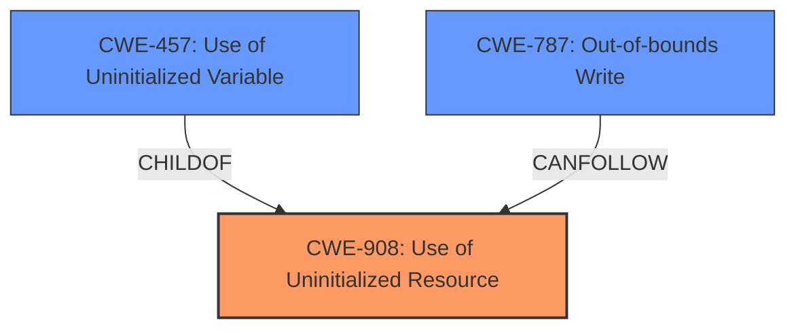

# Enhanced Analysis for CVE-2022-2950

# Summary
| CWE ID | CWE Name | Confidence | CWE Abstraction Level | CWE Vulnerability Mapping Label | CWE-Vulnerability Mapping Notes |
|---|---|---|---|---|---|
| CWE-908 | Use of Uninitialized Resource | 1.0 | Base | Allowed | Primary CWE. The vulnerability involves the use of uninitialized memory, which directly aligns with CWE-908. |
| CWE-457 | Use of Uninitialized Variable | 0.8 | Variant | Allowed | Secondary CWE.  A more specific case of CWE-908. |
| CWE-787 | Out-of-bounds Write | 0.6 | Base | Allowed | Secondary CWE. The vulnerability results in memory corruption due to an out-of-bounds write. |

## Evidence and Confidence

*   **Confidence Score:** 0.9
*   **Evidence Strength:** HIGH

## Relationship Analysis
The primary CWE is CWE-908, which represents the **use of uninitialized resource**. CWE-457 is a Variant of CWE-908, representing the **use of an uninitialized variable**, which is a more specific instance. The vulnerability's description clearly points to **use of uninitialized memory**, leading to memory corruption. The out-of-bounds write (CWE-787) is a consequence of the **use of the uninitialized memory**, which is then used as an index.



## Vulnerability Chain
The vulnerability chain starts with the **use of uninitialized memory** (CWE-908), specifically a DWORD from an uninitialized buffer. This value is then used as an index, leading to an out-of-bounds write (CWE-787) and ultimately, memory corruption.

CWE-908 (Root Cause) -> CWE-787 (Impact)

## Summary of Analysis
The analysis is based on the vulnerability description and the provided CVE reference summary. The description clearly states the **use of uninitialized memory** as the root cause, which aligns with CWE-908.

> Vulnerability Description:
> Altair HyperView Playerversions 2021.1.0.27 and priorare vulnerable to the **use of uninitialized memory** vulnerability during parsing of H3D files. A DWORD is extracted from an uninitialized buffer and, after sign extension, is used as an index into a stack variable to increment a counter leading to memory corruption.

> CVE Reference Links Content Summary:
> **Root cause of vulnerability:** The vulnerability is caused by the use of uninitialized memory during the parsing of H3D files. Specifically, a DWORD is extracted from an uninitialized buffer, and after sign extension, this value is used as an index into a stack variable to increment a counter. This leads to memory corruption.

The graph relationships further support this, with CWE-457 being a child of CWE-908, representing a more specific case of **using an uninitialized variable**. CWE-787 is included because the **use of the uninitialized memory** results in an out-of-bounds write, ultimately leading to memory corruption. The selected CWEs are at the optimal level of specificity, with CWE-908 being the base cause and CWE-457 providing a more specific variant. CWE-787 describes the impact of the vulnerability.

Relevant CWE Information:

# Enhanced Context (25 CWEs)
The following CWEs were identified as potentially relevant to this vulnerability:

## CWE-665: Improper Initialization
**Abstraction Level**: Class
**Similarity Score**: 0.79
**Source**: dense

**Description**:
The product does not initialize or incorrectly initializes a resource, which might leave the resource in an unexpected state when it is accessed or used.

**Why Not Used:** While **improper initialization** is related, CWE-908 and CWE-457 are more specific in describing the **use of the uninitialized resource**, rather than the lack of initialization itself. CWE-665 is a Class-level CWE, and the base and variant level CWEs provide a better fit.

## CWE-457: Use of Uninitialized Variable
**Abstraction Level**: Variant
**Similarity Score**: 0.79
**Source**: dense

**Description**:
The code uses a variable that has not been initialized, leading to unpredictable or unintended results.

**Why Used:** This is a more specific variant of CWE-908, focusing on the **use of an uninitialized variable**. The vulnerability description mentions a DWORD being extracted from an uninitialized buffer, making this a relevant secondary CWE.

## CWE-908: Use of Uninitialized Resource
**Abstraction Level**: Base
**Similarity Score**: 0.78
**Source**: dense

**Description**:
The product uses or accesses a resource that has not been initialized.

**Why Used:** This is the primary CWE because the vulnerability directly stems from the **use of uninitialized memory**, aligning perfectly with the description of CWE-908.

## CWE-824: Access of Uninitialized Pointer
**Abstraction Level**: Base
**Similarity Score**: 0.78
**Source**: dense

**Description**:
The product accesses or uses a pointer that has not been initialized.

**Why Not Used:** The vulnerability description does not explicitly mention the **use of an uninitialized pointer**, but rather uninitialized memory. While related, CWE-908 is a more direct fit.

## CWE-787: Out-of-bounds Write
**Abstraction Level**: base
**Similarity Score**: 4.33
**Source**: graph

**Description**:
CWE-787: Out-of-bounds Write

**Why Used:** The **use of the uninitialized memory** leads to an out-of-bounds write, making this a relevant secondary CWE to describe the impact of the vulnerability.


## CWE Relationship Analysis

Current CWEs represent these abstraction levels: .


### Vulnerability Chain Analysis

**Chain starting from CWE-908:**
- 908 (Use of Uninitialized Resource) - ROOT


**Chain starting from CWE-457:**
- 457 (Use of Uninitialized Variable) - ROOT


### CWE Relationship Diagram

```mermaid
graph TD
    classDef primary fill:#f96,stroke:#333,stroke-width:2px
    classDef secondary fill:#69f,stroke:#333
    classDef tertiary fill:#9e9,stroke:#333
```