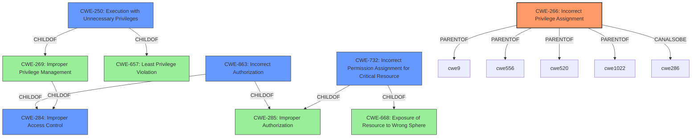

# Enhanced Analysis for CVE-2022-29501

# Summary
| CWE ID | CWE Name | Confidence | CWE Abstraction Level | CWE Vulnerability Mapping Label | CWE-Vulnerability Mapping Notes |
|---|---|---|---|---|---|
| CWE-266 | Incorrect Privilege Assignment | 0.8 | Base | Allowed | Primary CWE |
| CWE-250 | Execution with Unnecessary Privileges | 0.6 | Base | Allowed | Secondary Candidate |
| CWE-284 | Improper Access Control | 0.4 | Pillar | Discouraged | Secondary Candidate |
| CWE-863 | Incorrect Authorization | 0.4 | Class | Allowed-with-Review | Secondary Candidate |
| CWE-732 | Incorrect Permission Assignment for Critical Resource | 0.4 | Class | Allowed-with-Review | Secondary Candidate |

## Evidence and Confidence

*   **Confidence Score:** 0.8
*   **Evidence Strength:** HIGH

## Relationship Analysis
The primary CWE is CWE-266, Incorrect Privilege Assignment. The hierarchy shows that it is a Base level CWE, which is a preferred level of abstraction. It is related to other CWEs through parent-child relationships and peer relationships, but none of those relationships change the assessment that this is the most accurate CWE. CWE-250, Execution with Unnecessary Privileges, is a child of CWE-269, Improper Privilege Management, and CWE-657, Least Privilege Violation. CWE-284, Improper Access Control, is a high-level Pillar, making it less specific than CWE-266. CWE-863, Incorrect Authorization, and CWE-732, Incorrect Permission Assignment for Critical Resource, are both children of CWE-284, but they are not as directly related to the **rootcause** as CWE-266.



## Vulnerability Chain
The vulnerability chain starts with **incorrect privilege assignment** (CWE-266), leading to unprivileged access to send arbitrary Unix socket data, which results in privilege escalation and code execution.
  - **Root Cause:** CWE-266: Incorrect Privilege Assignment
  - **Weakness:** Unprivileged access to send arbitrary Unix socket
  - **Impact:** Privilege Escalation and Code Execution

## Summary of Analysis
The initial analysis focused on the **rootcause** of the vulnerability, which is **incorrect access control**. The evidence provided in the CVE Reference Links Content Summary states: "The core issue is that an unprivileged user can exploit the way Slurm handles Unix sockets to send arbitrary data as root. This implies a lack of proper privilege checks when sending data to these sockets."

The Retriever Results provided several candidate CWEs, including CWE-284 (Improper Access Control), CWE-732 (Incorrect Permission Assignment for Critical Resource), CWE-269 (Improper Privilege Management), CWE-362 (Concurrent Execution using Shared Resource with Improper Synchronization ('Race Condition')), CWE-863 (Incorrect Authorization), CWE-250 (Execution with Unnecessary Privileges), CWE-476 (NULL Pointer Dereference), CWE-287 (Improper Authentication), CWE-755 (Improper Handling of Exceptional Conditions), and CWE-119 (Improper Restriction of Operations within the Bounds of a Memory Buffer).

CWE-284 is a Pillar, making it too high-level. CWE-732, CWE-269, CWE-863, CWE-287, and CWE-755 are Classes, meaning they might have more specific Base-level children. CWE-362, CWE-476, and CWE-119 do not fit the vulnerability description.

CWE-266 (Incorrect Privilege Assignment) is the most appropriate CWE because the **rootcause** involves an **incorrect assignment of privileges**, allowing an unprivileged user to perform actions as root. The description of CWE-266, "CWE-266: Incorrect Privilege Assignment," aligns directly with the vulnerability.

CWE-250 (Execution with Unnecessary Privileges) is a possible secondary CWE because the vulnerability allows execution with root privileges when it is unnecessary.

The final selection of CWE-266 is at the optimal level of specificity because it directly addresses the **incorrect privilege assignment** that leads to the vulnerability.


## CWE Relationship Analysis

Current CWEs represent these abstraction levels: .


### Vulnerability Chain Analysis

**Chain starting from CWE-362:**
- 362 (Concurrent Execution using Shared Resource with Improper Synchronization ('Race Condition')) - ROOT


**Chain starting from CWE-266:**
- 266 (Incorrect Privilege Assignment) - ROOT


### CWE Relationship Diagram

```mermaid
graph TD
    classDef primary fill:#f96,stroke:#333,stroke-width:2px
    classDef secondary fill:#69f,stroke:#333
    classDef tertiary fill:#9e9,stroke:#333
```