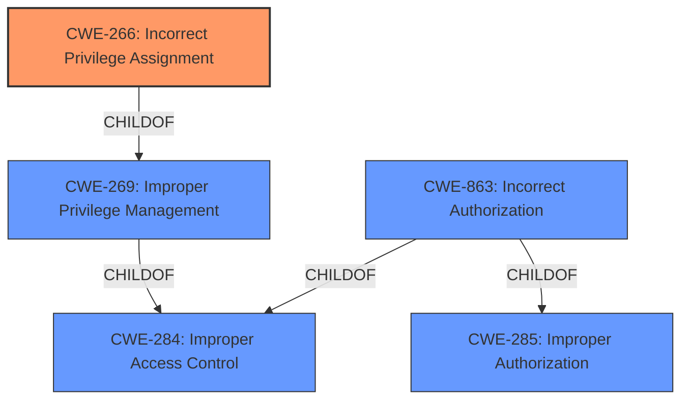

# Raw Analyzer Response for CVE-2022-29502

# Summary
| CWE ID | CWE Name | Confidence | CWE Abstraction Level | CWE Vulnerability Mapping Label | CWE-Vulnerability Mapping Notes |
|---|---|---|---|---|---|
| CWE-266 | Incorrect Privilege Assignment | 0.9 | Base | Allowed | Primary CWE |
| CWE-269 | Improper Privilege Management | 0.7 | Class | Discouraged | Secondary Candidate |
| CWE-284 | Improper Access Control | 0.6 | Pillar | Discouraged | Secondary Candidate |
| CWE-863 | Incorrect Authorization | 0.6 | Class | Allowed-with-Review | Secondary Candidate |

## Evidence and Confidence

*   **Confidence Score:** 0.9
*   **Evidence Strength:** HIGH

## Relationship Analysis
The primary CWE selected is CWE-266, which is a Base level CWE and a child of CWE-269. CWE-269 itself is a child of the Pillar CWE-284. CWE-863 is a Class level CWE that is a child of CWE-285 and CWE-284.
The decision was made to select the most specific CWE, which is CWE-266, as it directly relates to the **incorrect privilege assignment**.

## Vulnerability Chain
The vulnerability chain starts with an **incorrect access control**, specifically an **incorrect privilege assignment**, which then leads to the impact of **escalation of privileges**.

## Summary of Analysis
The initial analysis focused on the **incorrect access control** and **escalation of privileges**. The retriever results suggested CWE-284, CWE-732, CWE-269, CWE-287, and CWE-863. After reviewing the details, CWE-266 "Incorrect Privilege Assignment" was determined to be the most accurate representation of the vulnerability because the vulnerability lies in the **insufficient validation of I/O keys**, leading to **incorrect privilege assignment**.
The selection of CWE-266 is based on the evidence of **incorrect access control** leading to **privilege escalation**. The other CWEs were considered but were deemed less specific than CWE-266. The graph relationships also influenced the decision to select the lowest level of abstraction that accurately represents the weakness.
The vulnerability description and CVE Reference Links Content Summary both support the finding of **incorrect access control**, specifically through **insufficient validation of I/O keys**. This directly relates to the **incorrect privilege assignment**, making CWE-266 the optimal choice.

Relevant CWE Information:

# Enhanced Context (25 CWEs)

## CWE-266: Incorrect Privilege Assignment
**CWE-266 Incorrect Privilege Assignment**
*   **How the Vulnerability's Details Match:** The vulnerability specifically involves an **incorrect privilege assignment** due to insufficient validation of I/O keys.
*   **Security Implications and Potential Impact:** An attacker can intercept communication, leading to **escalation of privileges**.
*   **Parent-Child Relationships or Chain Patterns:** CWE-266 is a child of CWE-269 (Improper Privilege Management).
*   **Whether the Weakness is Primary or Secondary:** The weakness is primary.
*   **How the Official MITRE Mapping Guidance Influenced Your Decision:** The mapping guidance states that CWE-266 is at the Base level of abstraction, which is a preferred level.

## CWE-269: Improper Privilege Management
**CWE-269 Improper Privilege Management**
*   **How the Vulnerability's Details Match:** CWE-269 is a more general case of privilege management issues, where privileges are not properly assigned, modified, tracked, or checked. While applicable, it's less specific than CWE-266.
*   **Security Implications and Potential Impact:** The potential impact includes an unintended sphere of control for an actor.
*   **Parent-Child Relationships or Chain Patterns:** CWE-269 is a child of CWE-284 (Improper Access Control).
*   **Whether the Weakness is Primary or Secondary:** The weakness is secondary.
*   **How the Official MITRE Mapping Guidance Influenced Your Decision:** The mapping guidance discourages its use because it's frequently misused.

## CWE-284: Improper Access Control
**CWE-284 Improper Access Control**
*   **How the Vulnerability's Details Match:** The vulnerability involves **incorrect access control**, but this is a very broad description.
*   **Security Implications and Potential Impact:** Attackers can compromise the security of the product by gaining privileges.
*   **Parent-Child Relationships or Chain Patterns:** CWE-284 is a Pillar, making it very high-level.
*   **Whether the Weakness is Primary or Secondary:** The weakness is secondary.
*   **How the Official MITRE Mapping Guidance Influenced Your Decision:** The mapping guidance discourages its use because it's extremely high-level.

## CWE-863: Incorrect Authorization
**CWE-863 Incorrect Authorization**
*   **How the Vulnerability's Details Match:** The product performs an authorization check, but it's done incorrectly. In this case, the authorization is based on validation of I/O keys.
*   **Security Implications and Potential Impact:** This can lead to privilege escalation.
*   **Parent-Child Relationships or Chain Patterns:** CWE-863 is a child of CWE-285 (Improper Authorization) and CWE-284 (Improper Access Control).
*   **Whether the Weakness is Primary or Secondary:** The weakness is secondary.
*   **How the Official MITRE Mapping Guidance Influenced Your Decision:** The mapping guidance suggests examining children of this entry to see if there is a better fit.