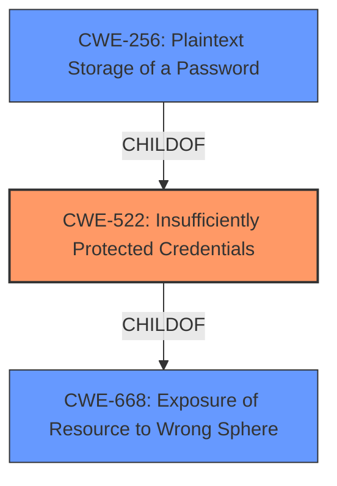

# Raw Analyzer Response for CVE-2022-29507

# Summary
| CWE ID | CWE Name | Confidence | CWE Abstraction Level | CWE Vulnerability Mapping Label | CWE-Vulnerability Mapping Notes |
|---|---|---|---|---|---|
| CWE-522 | Insufficiently Protected Credentials | 0.9 | Class | Allowed-with-Review | Primary CWE |
| CWE-256 | Plaintext Storage of a Password | 0.6 | Base | Allowed | Secondary Candidate |
| CWE-668 | Exposure of Resource to Wrong Sphere | 0.5 | Class | Discouraged | Secondary Candidate |

## Evidence and Confidence

*   **Confidence Score:** 0.9
*   **Evidence Strength:** HIGH

## Relationship Analysis
The primary CWE, CWE-522, is a Class-level weakness. It is related to CWE-256 (Plaintext Storage of a Password) via a ChildOf relationship, meaning CWE-256 is a more specific type of CWE-522. CWE-522 is also a ChildOf CWE-668 Exposure of Resource to Wrong Sphere.

## Vulnerability Chain
The vulnerability chain starts with **insufficiently protected credentials**, leading to potential information disclosure via local access.
  - **Root Cause:** **Insufficiently protected credentials** (CWE-522)
  - **Impact:** Information Disclosure

## Summary of Analysis
The initial assessment identifies CWE-522 as the primary weakness, due to the vulnerability description stating "**Insufficiently protected credentials**". The CVE Reference Links Content Summary also explicitly mentions "Insufficiently protected credentials" as the root cause and weakness.

CWE-522 (Insufficiently Protected Credentials) is chosen as the primary CWE because the vulnerability description explicitly mentions "**Insufficiently protected credentials**" as the root cause. The description states: "**Insufficiently protected credentials** in the Intel(R) Team Blue mobile application in all versions may allow an authenticated user to potentially enable information disclosure via local access."
The summary of the CVE also mentions: "Insufficiently protected credentials in the Intel(R) Team Blue mobile application" as the root cause. The retriever results also list CWE-522 as the top combined result.

CWE-256 (Plaintext Storage of a Password) was considered because storing a password in plaintext would qualify as insufficiently protected credentials. However, there isn't enough information in the provided description to confirm that the credentials are being stored in plaintext, so it's a possible but unconfirmed root cause.

CWE-668 (Exposure of Resource to Wrong Sphere) was considered since insufficiently protected credentials could lead to exposing resources to the wrong sphere. However, this is a higher-level classification, and CWE-522 is more specific to the identified weakness.

The selection of CWE-522 is at the optimal level of specificity, as it directly addresses the **root cause** described in the vulnerability.

Relevant CWE Information:

# Enhanced Context (25 CWEs)

## CWE-522: Insufficiently Protected Credentials
**Abstraction:** Class
**Status:** Incomplete

### Description
The product transmits or stores authentication credentials, but it uses an insecure method that is susceptible to unauthorized interception and/or retrieval.

### Extended Description
Not provided

### Alternative Terms
None

### Relationships
ChildOf -> CWE-1390
ChildOf -> CWE-287
ChildOf -> CWE-668

### Mapping Guidance
**Usage:** Allowed-with-Review
**Rationale:** This CWE entry is a Class and might have Base-level children that would be more appropriate
**Comments:** Examine children of this entry to see if there is a better fit
**Reasons:**
- Abstraction

### Observed Examples
- **CVE-2022-30018:** A messaging platform serializes all elements of User/Group objects, making private information available to adversaries
- **CVE-2022-29959:** Initialization file contains credentials that can be decoded using a "simple string transformation"
- **CVE-2022-35411:** Python-based RPC framework enables pickle functionality by default, allowing clients to unpickle untrusted data.