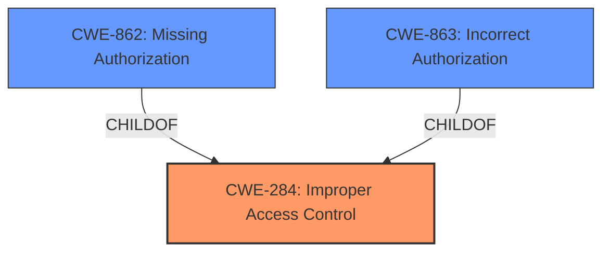

# Analysis for CVE-2022-29514

# Summary
| CWE ID | CWE Name | Confidence | CWE Abstraction Level | CWE Vulnerability Mapping Label | CWE-Vulnerability Mapping Notes |
|---|---|---|---|---|---|
| CWE-284 | Improper Access Control | 0.9 | Pillar | Allowed-with-Review | Primary CWE |
| CWE-862 | Missing Authorization | 0.7 | Base | Allowed | Secondary Candidate |
| CWE-863 | Incorrect Authorization | 0.7 | Class | Allowed-with-Review | Secondary Candidate |

## Evidence and Confidence

*   **Confidence Score:** 0.9
*   **Evidence Strength:** HIGH

## Relationship Analysis
The primary CWE selected is CWE-284, which is a Pillar-level CWE. While it is generally discouraged to map to Pillar-level CWEs, the vulnerability description explicitly mentions "**Improper access control**" as the root cause, making it a direct match. However, CWE-284 has children such as CWE-862 (Missing Authorization) and CWE-863 (Incorrect Authorization), which could be more specific. Since the description doesn't provide enough detail to definitively choose between missing or incorrect authorization, CWE-284 is retained as the primary, and CWE-862 and CWE-863 are added as secondary candidates.

## Vulnerability Chain
The vulnerability chain starts with **improper access control**, which leads to privilege escalation.
  - The root cause is the **improper access control** (CWE-284).
  - The impact is that an unauthenticated user can escalate privileges.

## Summary of Analysis
The initial analysis identified CWE-284 as the primary weakness due to the explicit mention of "**Improper access control**" in the vulnerability description and CVE Reference Links Content Summary. The vulnerability description key phrases also highlight "**Improper access control**" as the root cause. The retriever results also list CWE-284, albeit with a discouraged usage as it's a Pillar. Despite this, the direct match justifies its selection. However, the lack of specific details about whether the access control is missing or incorrect prompts the inclusion of CWE-862 and CWE-863 as secondary candidates, which are children of CWE-284. This approach balances the need for a direct match with the desire for specificity. The evidence supporting the primary CWE is strong, resulting in a high confidence score.

Relevant CWE Information:

# Enhanced Context (25 CWEs)

## CWE-1289: Improper Validation of Unsafe Equivalence in Input
**Abstraction Level**: Base
**Similarity Score**: 0.79
**Source**: dense

**Description**:
The product receives an input value that is used as a resource identifier or other type of reference, but it does not validate or incorrectly validates that the input is equivalent to a potentially-unsafe value.
**Justification for not using**: This CWE is not applicable because the vulnerability is not related to input validation.

## CWE-807: Reliance on Untrusted Inputs in a Security Decision
**Abstraction Level**: Base
**Similarity Score**: 0.77
**Source**: dense

**Description**:
The product uses a protection mechanism that relies on the existence or values of an input, but the input can be modified by an untrusted actor in a way that bypasses the protection mechanism.
**Justification for not using**: This CWE is not applicable because the vulnerability is not specifically about relying on untrusted inputs, but rather about **improper access control**.

## CWE-691: Insufficient Control Flow Management
**Abstraction Level**: Pillar
**Similarity Score**: 0.76
**Source**: dense

**Description**:
The code does not sufficiently manage its control flow during execution, creating conditions in which the control flow can be modified in unexpected ways.
**Justification for not using**: This CWE is too general and doesn't directly relate to **improper access control**.

## CWE-183: Permissive List of Allowed Inputs
**Abstraction Level**: Base
**Similarity Score**: 0.76
**Source**: dense

**Description**:
The product implements a protection mechanism that relies on a list of inputs (or properties of inputs) that are explicitly allowed by policy because the inputs are assumed to be safe, but the list is too permissive - that is, it allows an input that is unsafe, leading to resultant weaknesses.
**Justification for not using**: This CWE is not applicable because there's no evidence of a permissive list of allowed inputs.

## CWE-1288: Improper Validation of Consistency within Input
**Abstraction Level**: Base
**Similarity Score**: 0.76
**Source**: dense

**Description**:
The product receives a complex input with multiple elements or fields that must be consistent with each other, but it does not validate or incorrectly validates that the input is actually consistent.
**Justification for not using**: This CWE is not applicable because the vulnerability is not related to input validation consistency.

## CWE-1173: Improper Use of Validation Framework
**Abstraction Level**: Base
**Similarity Score**: 0.75
**Source**: dense

**Description**:
The product does not use, or incorrectly uses, an input validation framework that is provided by the source language or an independent library.
**Justification for not using**: This CWE is not applicable because the vulnerability is not related to input validation frameworks.

## CWE-184: Incomplete List of Disallowed Inputs
**Abstraction Level**: Base
**Similarity Score**: 0.75
**Source**: dense

**Description**:
The product implements a protection mechanism that relies on a list of inputs (or properties of inputs) that are not allowed by policy or otherwise require other action to neutralize before additional processing takes place, but the list is incomplete.
**Justification for not using**: This CWE is not applicable because there's no evidence of an incomplete list of disallowed inputs.

## CWE-653: Improper Isolation or Compartmentalization
**Abstraction Level**: Class
**Similarity Score**: 0.75
**Source**: dense

**Description**:
The product does not properly compartmentalize or isolate functionality, processes, or resources that require different privilege levels, rights, or permissions.
**Justification for not using**: While privilege escalation is involved, the root cause is specifically **improper access control**, not a lack of isolation.

## CWE-274: Improper Handling of Insufficient Privileges
**Abstraction Level**: Base
**Similarity Score**: 0.75
**Source**: dense

**Description**:
The product does not handle or incorrectly handles when it has insufficient privileges to perform an operation, leading to resultant weaknesses.
**Justification for not using**: The description indicates that the issue is related to assigning privileges to unauthenticated users to begin with.

## CWE-703: Improper Check or Handling of Exceptional Conditions
**Abstraction Level**: Pillar
**Similarity Score**: 0.75
**Source**: dense

**Description**:
The product does not properly anticipate or handle exceptional conditions that rarely occur during normal operation of the product.
**Justification for not using**: This CWE is too general and doesn't directly relate to **improper access control**.

## CWE-119: Improper Restriction of Operations within the Bounds of a Memory Buffer
**Abstraction Level**: Class
**Similarity Score**: 5780.76
**Source**: sparse

**Description**:
The product performs operations on a memory buffer, but it reads from or writes to a memory location outside the buffer's intended boundary. This may result in read or write operations on unexpected memory locations that could be linked to other variables, data structures, or internal program data.
**Justification for not using**: This CWE is not applicable as the vulnerability is related to **improper access control** and privilege escalation, not memory buffer issues.

## CWE-863: Incorrect Authorization
**Abstraction Level**: Class
**Similarity Score**: 5756.60
**Source**: sparse

**Description**:
The product performs an authorization check when an actor attempts to access a resource or perform an action, but it does not correctly perform the check.
**Justification for using**: This is a possible secondary candidate, since it is a child of CWE-284.

## CWE-639: Authorization Bypass Through User-Controlled Key
**Abstraction Level**: Base
**Similarity Score**: 5738.54
**Source**: sparse

**Description**:
The system's authorization functionality does not prevent one user from gaining access to another user's data or record by modifying the key value identifying the data.
**Justification for not using**: This is not applicable since there is no evidence the