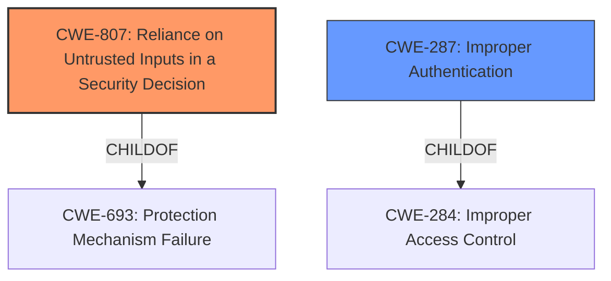

# Analysis for CVE-2022-29518

# Summary
| CWE ID | CWE Name | Confidence | CWE Abstraction Level | CWE Vulnerability Mapping Label | CWE-Vulnerability Mapping Notes |
|---|---|---|---|---|---|
| CWE-807 | Reliance on Untrusted Inputs in a Security Decision | 0.9 | Base | Primary | Allowed |
| CWE-287 | Improper Authentication | 0.7 | Class | Secondary | Discouraged, but chosen because a more specific CWE is not apparent from the description |

## Evidence and Confidence

*   **Confidence Score:** 0.8
*   **Evidence Strength:** MEDIUM

## Relationship Analysis
The primary CWE selected is CWE-807, which is a Base level CWE. CWE-807 is a child of CWE-693. CWE-287 is a class level CWE and is a child of CWE-284. The relationship between CWE-287 and its parent, CWE-284, and related CWEs such as CWE-306 and CWE-1390 were considered. However, CWE-807 was selected as the primary CWE due to the reliance on an improperly checked input in a security decision (authentication).

## Vulnerability Chain
The vulnerability chain starts with the **improper check for the Remote control settings account names** (the root cause), leading to an authentication bypass. This then allows an attacker to perform arbitrary operations on the HMI, potentially leading to information disclosure, data alteration, or illegal operation of equipment.

CWE-807 (Root Cause) -> CWE-287 (Improper Authentication) -> Impact (Information Disclosure, Data Alteration, Illegal Operation)

## Summary of Analysis
The initial analysis focused on identifying the root cause of the vulnerability, which is the **improper check for the Remote control settings account names**. This directly leads to an authentication bypass, allowing attackers to perform unauthorized actions.

The primary CWE identified is CWE-807 (Reliance on Untrusted Inputs in a Security Decision). This is based on the fact that the vulnerability stems from the software's reliance on an input (account names in remote control settings) that is not properly validated, allowing an attacker to bypass authentication. The CVE Reference Links Content Summary specifically mentions **CWE-807**, stating that it relates to "Improperly controlled modification of dynamically-determined values. This means that the software isn't correctly validating the access control configuration, allowing an attacker to potentially bypass authentication."

CWE-287 (Improper Authentication) was considered as a secondary CWE because it represents the direct consequence of the root cause. However, it is a more general classification, and CWE-807 more accurately captures the specific mechanism by which the authentication is bypassed (reliance on an untrusted input).

The graph relationships influenced the selection by highlighting the hierarchical structure of CWEs related to access control and authentication. However, the direct evidence from the vulnerability description and the CVE Reference Links Content Summary strongly supported the selection of CWE-807 as the primary CWE.

The selected CWEs are at the optimal level of specificity because CWE-807 is a Base level CWE that accurately describes the root cause of the vulnerability. While more specific variants might exist, the available information does not provide sufficient detail to justify selecting a variant over the base. CWE-287 is included as a secondary CWE to represent the immediate impact of the root cause, but it is recognized as a more general classification.

Relevant CWE Information:

# Enhanced Context (25 CWEs)

## CWE-807: Reliance on Untrusted Inputs in a Security Decision
**Abstraction Level**: Base
**Similarity Score**: 0.77
**Source**: dense

**Description**:
The product uses a protection mechanism that relies on the existence or values of an input, but the input can be modified by an untrusted actor in a way that bypasses the protection mechanism.

**Mapping Guidance**:
- Usage: Allowed
- Rationale: This CWE entry is at the Base level of abstraction, which is a preferred level of abstraction for mapping to the root causes of vulnerabilities.

## CWE-287: Improper Authentication
**Abstraction Level**: Class
**Similarity Score**: 0.76
**Source**: dense

**Description**:
When an actor claims to have a given identity, the product does not prove or insufficiently proves that the claim is correct.

**Mapping Guidance**:
- Usage: Discouraged
- Rationale: This CWE entry might be misused when lower-level CWE entries are likely to be applicable. It is a level-1 Class (i.e., a child of a Pillar).
- Comments: Consider children or descendants, beginning with CWE-1390: Weak Authentication or CWE-306: Missing Authentication for Critical Function.
- Reasons:
  - Frequent Misuse
- Suggested Alternatives:
  - CWE-1390: Weak Authentication
  - CWE-306: Missing Authentication for Critical Function