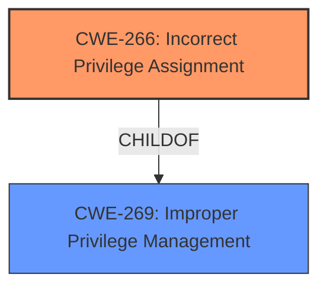

# Analysis for CVE-2022-29526

# Summary
| CWE ID | CWE Name | Confidence | CWE Abstraction Level | CWE Vulnerability Mapping Label | CWE-Vulnerability Mapping Notes |
|---|---|---|---|---|---|
| CWE-266 | Incorrect Privilege Assignment | 0.9 | Base | Allowed | Primary CWE. The Go `syscall.Faccessat` function uses the process's group ID instead of the file's group ID, leading to **incorrect privilege assignment**. |

## Evidence and Confidence

*   **Confidence Score:** 0.9
*   **Evidence Strength:** HIGH

## Relationship Analysis
The primary CWE is CWE-266 (Incorrect Privilege Assignment), which is a base-level CWE. It is a child of CWE-269 (Improper Privilege Management), which is a class-level CWE. While CWE-269 is related, it's a more general category, and CWE-266 more accurately describes the specific **incorrect privilege assignment** vulnerability.

## Vulnerability Chain
The vulnerability chain starts with the **incorrect privilege assignment** in the `syscall.Faccessat` function. This leads to the potential impact of a process gaining access to a file it shouldn't have, if the process's group matches the file's group.

## Summary of Analysis
The initial analysis identified CWE-266 as the most relevant CWE due to the explicit mention of "**incorrect privilege assignment**" in both the vulnerability description key phrases and CVE reference content summary. The CVE content summary also details how `syscall.Faccessat` function within the Go programming language's standard library incorrectly checks group permissions when determining if a process has access to a file. The confidence in this assessment is high because the provided evidence strongly supports this classification.

The relationship graph shows that CWE-266 is a child of the more general CWE-269 (Improper Privilege Management). However, selecting CWE-266 provides a more specific and accurate representation of the vulnerability. The retriever results also list CWE-266 as the top candidate with a sparse score of 0.304, which further supports the decision.

The final decision to map to CWE-266 is based on the strong evidence provided in the vulnerability description, the detailed explanation in the CVE reference links, and the guidance to choose the most specific CWE available.

Relevant CWE Information:

# Enhanced Context (25 CWEs)
The following CWEs were identified as potentially relevant to this vulnerability:

## CWE-274: Improper Handling of Insufficient Privileges
**Abstraction Level**: Base
**Similarity Score**: 0.79
**Source**: dense
**Description**: The product does not handle or incorrectly handles when it has insufficient privileges to perform an operation, leading to resultant weaknesses.
**Mapping Guidance**: Usage: Discouraged. Rationale: This CWE entry could be deprecated in a future version of CWE.
*Rejected:* The vulnerability is about **incorrectly assigning** privileges, not handling insufficient privileges.

## CWE-280: Improper Handling of Insufficient Permissions or Privileges 
**Abstraction Level**: Base
**Similarity Score**: 0.78
**Source**: dense
**Description**: The product does not handle or incorrectly handles when it has insufficient privileges to access resources or functionality as specified by their permissions. This may cause it to follow unexpected code paths that may leave the product in an invalid state.
**Mapping Guidance**: Usage: Allowed. Rationale: This CWE entry is at the Base level of abstraction, which is a preferred level of abstraction for mapping to the root causes of vulnerabilities.
*Rejected:* Similar to CWE-274, this is about handling insufficient privileges, not assigning them.

## CWE-266: Incorrect Privilege Assignment
**Abstraction Level**: Base
**Similarity Score**: 0.77
**Source**: dense
**Description**: A product incorrectly assigns a privilege to a particular actor, creating an unintended sphere of control for that actor.
**Mapping Guidance**: Usage: Allowed. Rationale: This CWE entry is at the Base level of abstraction, which is a preferred level of abstraction for mapping to the root causes of vulnerabilities.
*Accepted:* **Primary CWE.** This directly matches the vulnerability description key phrases and CVE reference content summary.

## CWE-1289: Improper Validation of Unsafe Equivalence in Input
**Abstraction Level**: Base
**Similarity Score**: 0.77
**Source**: dense
**Description**: The product receives an input value that is used as a resource identifier or other type of reference, but it does not validate or incorrectly validates that the input is equivalent to a potentially-unsafe value.
**Mapping Guidance**: Usage: Allowed. Rationale: This CWE entry is at the Base level of abstraction, which is a preferred level of abstraction for mapping to the root causes of vulnerabilities.
*Rejected:* This CWE focuses on input validation, which is not the primary issue in this case. The problem is with how file accessibility is reported, not with validating input values.

## CWE-668: Exposure of Resource to Wrong Sphere
**Abstraction Level**: Class
**Similarity Score**: 0.77
**Source**: dense
**Description**: The product exposes a resource to the wrong control sphere, providing unintended actors with inappropriate access to the resource.
**Mapping Guidance**: Usage: Discouraged. Rationale: CWE-668 is high-level and is often misused as a catch-all when lower-level CWE IDs might be applicable. It is sometimes used for low-information vulnerability reports [REF-1287]. It is a level-1 Class (i.e., a child of a Pillar). It is not useful for trend analysis.
*Rejected:* This is too high-level and doesn't accurately reflect the **incorrect privilege assignment**.

## CWE-754: Improper Check for Unusual or Exceptional Conditions
**Abstraction Level**: Class
**Similarity Score**: 0.76
**Source**: dense
**Description**: The product does not check or incorrectly checks for unusual or exceptional conditions that are not expected to occur frequently during day to day operation of the product.
**Mapping Guidance**: Usage: Allowed-with-Review. Rationale: This CWE entry is a Class and might have Base-level children that would be more appropriate
*Rejected:* The vulnerability is more specific than this. It's not about general checks for unusual conditions, but specifically about **incorrect privilege assignment**.

## CWE-653: Improper Isolation or Compartmentalization
**Abstraction Level**: Class
**Similarity Score**: 0.76
**Source**: dense
**Description**: The product does not properly compartmentalize or isolate functionality, processes, or resources that require different privilege levels, rights, or permissions.
**Mapping Guidance**: Usage: Allowed. Rationale: This CWE entry is at the Base level of abstraction, which is a preferred level of abstraction for mapping to the root causes of vulnerabilities.
*Rejected:* The vulnerability is about **incorrect privilege assignment**, not the lack of isolation or compartmentalization.

## CWE-404: Improper Resource Shutdown or Release
**Abstraction Level**: Class
**Similarity Score**: 0.76
**Source**: dense
**Description**: The product does not release or incorrectly releases a resource before it is made available for re-use.
**Mapping Guidance**: Usage: Allowed-with-Review. Rationale: This CWE entry is a Class and might have Base-level children that would be more appropriate
*Rejected:* This CWE is not relevant to the reported vulnerability, which is focused on **incorrect privilege assignment**, not resource management.

## CWE-267: Privilege Defined With Unsafe Actions
**Abstraction Level**: Base
**Similarity Score**: 0.76
**Source**: dense
**Description**: A particular privilege, role, capability, or right can be used to perform unsafe actions that were not intended, even when it is assigned to the correct entity.
**Mapping Guidance**: Usage: Allowed. Rationale: This CWE entry is at the Base level of abstraction, which is a preferred level of abstraction for mapping to the root causes of vulnerabilities.
*Rejected:* The issue isn't that the privilege itself is unsafe, but that it's being **incorrectly assigned**.

## CWE-703: Improper Check or Handling of Exceptional Conditions
**Abstraction Level**: Pillar
**Similarity Score**: 0.76
**Source**: dense
**Description**: The product does not properly anticipate or handle exceptional conditions that rarely occur during normal operation of the product.
**Mapping Guidance**: Usage: Discouraged. Rationale: This CWE entry is extremely high-level, a Pillar.
*Rejected:* This is too high-level and doesn't accurately reflect the **incorrect privilege assignment**.

## CWE-770: Allocation of Resources Without Limits or Throttling
**Abstraction Level**: Base
**Similarity Score**: 5478.23
**Source**: sparse
**Description**: The product allocates a reusable resource or group of resources on behalf of an actor without imposing any restrictions on the size or number of resources that can be allocated, in