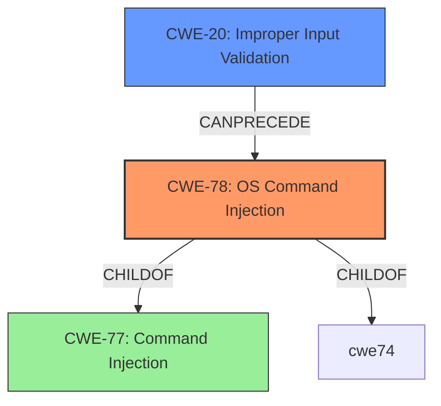

# Analysis for CVE-2022-29539

# Summary
| CWE ID | CWE Name | Confidence | CWE Abstraction Level | CWE Vulnerability Mapping Label | CWE-Vulnerability Mapping Notes |
|---|---|---|---|---|---|
| CWE-78 | Improper Neutralization of Special Elements used in an OS Command ('OS Command Injection') | 1.0 | Base | Primary | Allowed |
| CWE-20 | Improper Input Validation | 0.7 | Class | Secondary | Discouraged |

## Evidence and Confidence

*   **Confidence Score:** 0.9
*   **Evidence Strength:** HIGH

## Relationship Analysis
The primary CWE is CWE-78, which is a base-level CWE and a child of CWE-77 (a class). CWE-78 represents the specific case of command injection involving OS commands. CWE-20 is a more general class-level CWE representing improper input validation, which can often be a contributing factor to command injection vulnerabilities. The relationship between these CWEs is that CWE-20 can precede CWE-78 in a vulnerability chain.

## Vulnerability Chain
The vulnerability chain starts with **lack of validation of user input** (CWE-20). This **weakness** allows an attacker to inject arbitrary system commands (CWE-78). The impact is that an unauthenticated attacker can bypass intended syntax and execute commands with the privileges of the application user.

## Summary of Analysis
The analysis is based on the provided evidence, which includes the vulnerability description and CVE reference links.

The vulnerability description explicitly mentions the **lack of validation of user input** as the root cause and **command injection** as the weakness. The CVE reference links content summary for CVE-2022-29539 confirms this, stating the root cause as "Improper Neutralization of Special Elements used in an OS Command ('OS Command Injection')."

The graph relationships influenced the selection by highlighting the relationship between CWE-20 and CWE-78. While CWE-20 is a general weakness, the description clearly indicates that the specific impact is OS command injection. Therefore, CWE-78 is the most specific and appropriate primary CWE.

The selected CWEs are at the optimal level of specificity. CWE-78 is a base-level CWE, providing a clear description of the vulnerability. CWE-20, while a class-level CWE, is included as a secondary CWE to highlight the contributing factor of improper input validation.

Relevant CWE Information:
*   "Vulnerability Description Key Phrases":
    *   **rootcause:** **lack of validation of user input**
    *   **weakness:** **command injection**
*   "CVE Reference Links Content Summary":
    *   "root_cause": "Improper Neutralization of Special Elements used in an OS Command ('OS Command Injection')"
    *   "vulnerabilities": ["OS Command Injection"]

CWEs considered but not used:

*   CWE-77: Improper Neutralization of Special Elements used in a Command ('Command Injection'). While CWE-77 is the parent of CWE-78, the description explicitly mentions OS commands, making CWE-78 the more specific and appropriate choice.
*   CWE-138: Improper Neutralization of Special Elements. This is a class-level CWE and less specific than CWE-78.
*   CWE-116: Improper Encoding or Escaping of Output. While encoding/escaping is a potential mitigation, the root cause is the **lack of input validation**, making CWE-20 and CWE-78 more relevant.
*   CWE-150: Improper Neutralization of Escape, Meta, or Control Sequences. This is a more specific variant of CWE-138, but CWE-78 directly addresses the OS command injection.
*   CWE-94: Improper Control of Generation of Code ('Code Injection'). This is a more general form of injection related to constructing code segments, while CWE-78 is specific to OS commands.
*   CWE-1286: Improper Validation of Syntactic Correctness of Input. This is a more specific child of CWE-20 but does not capture the command injection aspect, so it's not selected as a primary CWE.