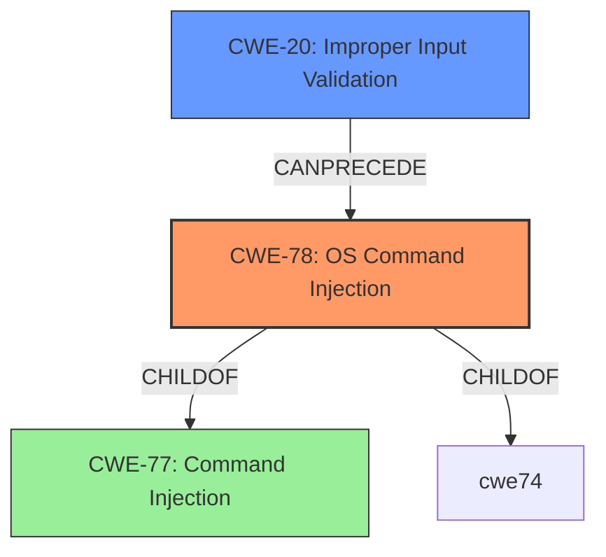

# Analysis for CVE-2022-29539

# Summary
| CWE ID | CWE Name | Confidence | CWE Abstraction Level | CWE Vulnerability Mapping Label | CWE-Vulnerability Mapping Notes |
|---|---|---|---|---|---|
| CWE-78 | Improper Neutralization of Special Elements used in an OS Command ('OS Command Injection') | 1.0 | Base | Primary | Allowed |
| CWE-20 | Improper Input Validation | 0.7 | Class | Secondary | Discouraged |

## Evidence and Confidence

*   **Confidence Score:** 0.9
*   **Evidence Strength:** HIGH

## Relationship Analysis
The primary CWE is CWE-78, which is a base-level CWE and a child of CWE-77 (a class). CWE-78 represents the specific case of command injection involving OS commands. CWE-20 is a more general class-level CWE representing improper input validation, which can often be a contributing factor to command injection vulnerabilities. The relationship between these CWEs is that CWE-20 can precede CWE-78 in a vulnerability chain.



## Vulnerability Chain
The vulnerability chain starts with **lack of validation of user input** (CWE-20). This **weakness** allows an attacker to inject arbitrary system commands (CWE-78). The impact is that an unauthenticated attacker can bypass intended syntax and execute commands with the privileges of the application user.

## Summary of Analysis
The analysis is based on the provided evidence, which includes the vulnerability description and CVE reference links.

The vulnerability description explicitly mentions the **lack of validation of user input** as the root cause and **command injection** as the weakness. The CVE reference links content summary for CVE-2022-29539 confirms this, stating the root cause as "Improper Neutralization of Special Elements used in an OS Command ('OS Command Injection')."

The graph relationships influenced the selection by highlighting the relationship between CWE-20 and CWE-78. While CWE-20 is a general weakness, the description clearly indicates that the specific impact is OS command injection. Therefore, CWE-78 is the most specific and appropriate primary CWE.

The selected CWEs are at the optimal level of specificity. CWE-78 is a base-level CWE, providing a clear description of the vulnerability. CWE-20, while a class-level CWE, is included as a secondary CWE to highlight the contributing factor of improper input validation.

Relevant CWE Information:
*   "Vulnerability Description Key Phrases":
    *   **rootcause:** **lack of validation of user input**
    *   **weakness:** **command injection**
*   "CVE Reference Links Content Summary":
    *   "root_cause": "Improper Neutralization of Special Elements used in an OS Command ('OS Command Injection')"
    *   "vulnerabilities": ["OS Command Injection"]

CWEs considered but not used:

*   CWE-77: Improper Neutralization of Special Elements used in a Command ('Command Injection'). While CWE-77 is the parent of CWE-78, the description explicitly mentions OS commands, making CWE-78 the more specific and appropriate choice.
*   CWE-138: Improper Neutralization of Special Elements. This is a class-level CWE and less specific than CWE-78.
*   CWE-116: Improper Encoding or Escaping of Output. While encoding/escaping is a potential mitigation, the root cause is the **lack of input validation**, making CWE-20 and CWE-78 more relevant.
*   CWE-150: Improper Neutralization of Escape, Meta, or Control Sequences. This is a more specific variant of CWE-138, but CWE-78 directly addresses the OS command injection.
*   CWE-94: Improper Control of Generation of Code ('Code Injection'). This is a more general form of injection related to constructing code segments, while CWE-78 is specific to OS commands.
*   CWE-1286: Improper Validation of Syntactic Correctness of Input. This is a more specific child of CWE-20 but does not capture the command injection aspect, so it's not selected as a primary CWE.

# Enhanced Query for CVE-2022-29539

## Vulnerability Description
resi-calltrace in RESI Gemini-Net 4.2 is affected by OS Command Injection. It does not properly check the parameters sent as input before they are processed on the server. Due to the **lack of validation of user input**, an unauthenticated attacker can bypass the syntax intended by the software (e.g., concatenate `&|\r\ commands) and inject arbitrary system commands with the privileges of the application user.

### Vulnerability Description Key Phrases
- **rootcause:** **lack of validation of user input**
- **weakness:** **command injection**
- **impact:** arbitrary system commands
- **attacker:** unauthenticated attacker
- **product:** resi-calltrace in RESI Gemini-Net
- **version:** 4.2

## CVE Reference Links Content Summary
```
{
  "CVE-2022-29539": {
    "status": "relevant",
    "details": {
      "root_cause": "Improper Neutralization of Special Elements used in an OS Command ('OS Command Injection')",
      "vulnerabilities": [
        "OS Command Injection"
      ],
      "impact": "An unauthenticated attacker can bypass the syntax intended by the software and inject arbitrary system commands with the privileges of the application user.",
       "attack_vectors": [
        "HTTP POST parameter manipulation"
       ],
       "attacker_capabilities": "Unauthenticated access"
    }
  },
    "CVE-2024-52949": {
        "status": "relevant",
        "details": {
            "root_cause": "Stack-based buffer overflow due to missing size control in `strcpy` function.",
            "vulnerabilities": [
                "Stack-based Buffer Overflow",
                "CWE-121"
            ],
           "impact": "An attacker can use a malicious configuration file to execute arbitrary code on the victim's program with root privilege.",
           "attack_vectors": [
               "Malicious configuration file"
            ],
           "attacker_capabilities": "Ability to provide a crafted configuration file as input."
        }
    },
    "CVE-2024-49351": {
        "status": "relevant",
        "details": {
            "root_cause": "Improper storage of a password in plaintext.",
             "vulnerabilities": [
                "Plaintext Storage of a Password",
                 "CWE-256"
             ],
            "impact": "Attackers who obtain this information can gain unauthorized access to sensitive systems, potentially escalating privileges and compromising data. This exposure can further enable lateral movement within the network, increasing the attack surface. Ultimately, it undermines the integrity of the entire system, leading to potential data breaches and reputational damage.",
             "attack_vectors": [
                "Access to the connection properties panel."
            ],
             "attacker_capabilities": "Authenticated remote attackers with administrator privileges."
        }
    },
    "CVE-2024-9329": {
        "status": "relevant",
        "details": {
            "root_cause": "Improper handling of parameters leads to open redirect vulnerability.",
             "vulnerabilities": [
                "Open Redirect",
                 "CWE-233"
            ],
             "impact": "An attacker can construct a URL within the application that causes a redirection to an arbitrary external domain. This behavior can be leveraged to facilitate phishing attacks against users of the application. The ability to use an authentic application URL, targeting the correct domain and with a valid SSL certificate (if SSL is used), lends credibility to the phishing attack because many users, even if they verify these features, will not notice the subsequent redirection to a different domain.",
             "attack_vectors": [
                "Manipulating the Host HTTP parameter during a GET request to `/management/domain`"
             ],
            "attacker_capabilities": "Unauthenticated access to the application."
        }
    },
    "CVE-2024-9054": {
        "status": "relevant",
        "details": {
            "root_cause": "Insufficient sanitization of parameters in the configuration file leads to command execution.",
            "vulnerabilities": [
                 "Remote Code Execution",
                "CWE-78"
            ],
            "impact": "A malicious user with the access to the web GUI of the device could insert a bash command to construct a reverse shell to the device and to control it. Another situation could be represented by a malicious user that reaches the device network and knows the structure of the configuration file, that, through social engineering techniques, forces a user with access to the web GUI to load the infected file and to reach the same objective reported above.",
            "attack_vectors": [
                "Uploading a configuration file containing malicious bash commands in the `secret_key` parameter.",
                "Manipulation of XML Parameter: secret_key in configuration file"
             ],
           "attacker_capabilities": "Access to the device's web GUI or knowledge of the configuration file structure and social engineering."
       }
    },
    "CVE-2024-7801": {
        "status": "relevant",
        "details": {
            "root_cause": "Improper sanitization of user input in SQL queries leads to SQL Injection.",
             "vulnerabilities": [
                "Unauthenticated SQL Injection",
                "CWE-89"
             ],
            "impact": "A malicious user connected to the LAN of the device without privileges could access sensitive information in the Database of the device itself.",
             "attack_vectors": [
                "Manipulating the `channelId` parameter in a POST request to `/get_chart_data`"
             ],
           "attacker_capabilities": "Unauthenticated access to the device's LAN."
        }
    },
    "CVE-2024-6360": {
        "status": "relevant",
        "details": {
          "root_cause": "Hard-coded plaintext keys used for authorization",
            "vulnerabilities": [
                "Incorrect Permission Assignment for Critical Resource",
                "CWE-732"
            ],
            "impact": "Privilege Abuse and result in unauthorized access or privileges to Vertica agent apikey.",
            "attack_vectors": [
              "Access to hard-coded keys"
            ],
            "attacker_capabilities": "An attacker able to obtain the keys"
        }
    },
    "CVE-2024-5532": {
        "status": "relevant",
        "details": {
            "root_cause": "Stored Cross-site scripting vulnerability due to lack of proper input sanitization in agent configuration parameter CORE_ID.",
            "vulnerabilities": [
                "Cross Site Scripting Stored",
                "CWE-79"
             ],
            "impact": "An attacker is able to compromise the interactions that users have with the vulnerable application.",
             "attack_vectors": [
                "Modification of the agent configuration file parameter `CORE_ID` with malicious payload"
             ],
           "attacker_capabilities": "Remote user with permission to modify the agent configuration file."
       }
    },
    "CVE-2024-43687": {
        "status": "relevant",
        "details": {
            "root_cause": "Improper input sanitization in banner configuration leading to stored XSS.",
            "vulnerabilities": [
                "Stored Cross-site Scripting",
                "CWE-79"
           ],
            "impact": "By using malicious javascript code the attacker may be able to perform privileged operations on behalf of the user or gain access to sensitive data belonging to the user. The attacker could: transfer private information from the victim's machine to the attacker, send malicious requests to a web site on behalf of the victim.",
            "attack_vectors": [
                 "Inserting javascript code in the banner configuration field `txtcustom`."
            ],
            "attacker_capabilities": "Authenticated user access to the web application."
        }
    },
    "CVE-2024-43686": {
        "status": "relevant",
        "details": {
            "root_cause": "Improper input sanitization leads to reflected XSS in the `channelId` parameter.",
            "vulnerabilities": [
                "Reflected Cross-site Scripting",
                "CWE-79"
            ],
            "impact": "By using malicious javascript code the attacker may be able to perform privileged operations on behalf of the user or gain access to sensitive data belonging to the user. The attacker could: transfer private information from the victim's machine to the attacker, send malicious requests to a web site on behalf of the victim.",
             "attack_vectors": [
                "Inserting URL encoded javascript code in the `channelId` parameter in a POST request to `/get_chart_data`."
             ],
           "attacker_capabilities": "Unauthenticated access to the device's network."
        }
    },
    "CVE-2024-43685": {
        "status": "relevant",
        "details": {
            "root_cause": "The device provides a new session cookie before login, which can be used for session hijacking.",
            "vulnerabilities": [
                "Session Fixation",
                "CWE-287"
            ],
            "impact": "The Session Fixation attack fixes an established session on the victim’s browser, so the attack starts before the user logs in. As matter of fact an attacker could access and use the web application without knowing the credentials.",
            "attack_vectors": [
                 "Obtaining the session token before the login or creating a cookie with a chosen value.",
                 "Inducing a user to authenticate himself with that session token"
            ],
            "attacker_capabilities": "Ability to intercept network traffic and knowledge of session token creation mechanism"
         }
    },
    "CVE-2024-43684": {
        "status": "relevant",
        "details": {
            "root_cause": "Lack of Anti-CSRF token implementation",
             "vulnerabilities": [
                "Cross-Site Request Forgery",
                 "CWE-352"
             ],
            "impact": "An attacker could effectively perform any operations as the victim. These may include: obtaining complete control over the web application, deleting or stealing data. Because the attacker has the identity of the victim, the scope of CSRF is limited only by the victim's privileges.",
             "attack_vectors": [
                "Tricking the user into making an unintentional request to the web server"
            ],
           "attacker_capabilities": "Ability to craft a malicious webpage."
        }
    },
    "CVE-2024-43683": {
        "status": "relevant",
        "details": {
           "root_cause": "Lack of proper validation of the `Host` header field.",
             "vulnerabilities": [
                "Open Redirect",
                "CWE-601"
           ],
             "impact": "A user could be redirected to malicious website and the attacker could steal sensitive information such user credentials.",
            "attack_vectors": [
              "Modifying the `Host` header in GET/POST requests"
             ],
            "attacker_capabilities": "Unauthenticated access to device's network"
       }
    },
        "CVE-2024-34399": {
        "status": "relevant",
        "details": {
          "root_cause": "Improper Authentication. It does not validate user credentials.",
            "vulnerabilities": [
                "Improper Authentication",
                "CWE-287"
            ],
             "impact": "By exploiting this vulnerability, an unauthenticated remote attacker can access any user account without using any password.",
            "attack_vectors": [
              "Sending unauthenticated request"
            ],
            "attacker_capabilities": "Unauthenticated remote attacker."
        }
   },
     "CVE-2024-31847": {
        "status": "relevant",
        "details": {
            "root_cause": "Lack of sanitization for user input in HTTP GET parameters leads to stored XSS.",
           "vulnerabilities": [
                 "Stored Cross-site Scripting",
                 "CWE-79"
           ],
           "impact": "Successful attacks of this vulnerability can result in unauthorized access to critical data or complete account takeover.",
            "attack_vectors": [
                "Injecting arbitrary HTML or javascript code into HTTP/GET parameter `/supervoip/api/v1/logTrace/buttonViewLogTrace`"
            ],
            "attacker_capabilities": "Authenticated or unauthenticated remote attacker."
        }
    },
    "CVE-2024-31846": {
        "status": "relevant",
        "details": {
           "root_cause": "Improper access control leading to unauthorized data access",
           "vulnerabilities": [
                "Improper Access Control",
                 "CWE-284"
            ],
             "impact": "By exploiting this vulnerability on the web application, it was possible to have unauthorized access to personal information about registered clients.",
           "attack_vectors": [
                "Sending unauthenticated GET requests to `/supervoip/api/v1/register` endpoint"
             ],
            "attacker_capabilities": "Unauthenticated remote access"
       }
    },
    "CVE-2024-31845": {
        "status": "relevant",
         "details": {
            "root_cause": "Improper output neutralization for logs",
             "vulnerabilities": [
                "Improper Output Neutralization for Logs",
                 "CWE-117"
             ],
            "impact": "An attacker can insert fake log entries and execute malicious actions that will be attributed to other users.",
             "attack_vectors": [
                "Modifying a GET query string parameter that is written to logs."
            ],
            "attacker_capabilities": "Unauthenticated access."
         }
     },
     "CVE-2024-31844": {
        "status": "relevant",
        "details": {
             "root_cause": "Improper error handling leads to information disclosure.",
             "vulnerabilities": [
                "Generation of Error Message Containing Sensitive Information",
                "CWE-209"
             ],
            "impact": "An attacker can gather information about the system to perform additional attacks.",
            "attack_vectors": [
              "Crafting specific malformed JSON requests to the `/supervoip/api/v1/auth/login` endpoint to generate an error with sensitive information."
           ],
            "attacker_capabilities": "Unauthenticated remote access"
        }
    },
    "CVE-2024-31843": {
        "status": "relevant",
         "details": {
            "root_cause": "Lack of proper input validation leading to OS command injection.",
            "vulnerabilities": [
                 "OS Command Injection",
                 "CWE-78"
             ],
            "impact": "By exploiting the lack of validation mechanisms in the Web app, it was possible to execute arbitrary OS commands on the server.",
           "attack_vectors": [
                "Injecting arbitrary system commands into the URL `/supervoip/api/v1/removeBackup`"
             ],
            "attacker_capabilities": "Authenticated user."
        }
    },
    "CVE-2024-31842": {
        "status": "relevant",
         "details": {
            "root_cause": "Access token is included in GET requests in the query string.",
            "vulnerabilities": [
                "Use of GET Request Method With Sensitive Query Strings",
                "CWE-598"
             ],
            "impact": "An attacker that is able to read the token could access the web application as another user.",
            "attack_vectors": [
                "Reading access token from GET request URLs which may be saved in browser history or web logs."
             ],
           "attacker_capabilities": "An attacker that is able to read the token."
        }
     },
      "CVE-2024-31841": {
        "status": "relevant",
        "details": {
             "root_cause": "Relative path traversal vulnerability due to lack of sanitization of the filename parameter.",
            "vulnerabilities": [
                "Relative Path Traversal",
                 "CWE-23"
            ],
             "impact": "By exploiting this vulnerability on the web portal, it was possible to read arbitrary files on the filesystem.",
            "attack_vectors": [
                "Manipulating the `filename` parameter in POST requests to various endpoints like `/supervoip/api/v1/reportTraceBCCAS/buttonViewReportTraceBCCAS`"
            ],
            "attacker_capabilities": "Unauthenticated access."
        }
   },
   "CVE-2024-31840": {
        "status": "relevant",
         "details": {
            "root_cause": "Plaintext passwords are included in HTML source code.",
             "vulnerabilities": [
                "Insufficiently Protected Credentials",
                "CWE-522"
             ],
             "impact": "By exploiting this vulnerability, it is possible for an attacker to read the password of the mail server.",
           "attack_vectors": [
              "Accessing the email server configuration page where the password is included in the source code."
             ],
             "attacker_capabilities": "Authenticated user."
        }
   },
      "CVE-2024-28806": {
        "status": "relevant",
        "details": {
          "root_cause": "Absolute path traversal vulnerability due to lack of sanitization of the uploadDir parameter",
            "vulnerabilities": [
                "Absolute Path Traversal",
                "CWE-36"
             ],
             "impact": "By exploiting this vulnerability on the web portal it was possible to upload files in an arbitrary path on the filesystem.",
           "attack_vectors": [
              "Manipulating the `uploadDir` parameter in a POST request."
            ],
           "attacker_capabilities": "Unauthenticated remote access."
        }
     },
    "CVE-2024-28805": {
        "status": "relevant",
         "details": {
             "root_cause": "Improper access control leading to unauthorized access to functionalities and data.",
             "vulnerabilities": [
                "Improper Access Control",
                 "CWE-284"
            ],
              "impact": "By exploiting this vulnerability on the web application it was possible to have unauthorized access to critical information and functionalities.",
             "attack_vectors": [
              "Accessing restricted pages via the URL, such as `/IMCSCI-WebGui/advanced-settings.jsp` and `/IMCSCI-WebGui/SaveFileUploader`"
             ],
           "attacker_capabilities": "Authenticated user."
       }
   },
    "CVE-2024-28804": {
        "status": "relevant",
        "details": {
          "root_cause": "Stored XSS vulnerability due to lack of sanitization of the `j_username` parameter.",
            "vulnerabilities": [
                "Stored Cross-site Scripting",
                "CWE-79"
            ],
             "impact": "Successful attacks of this vulnerability can result in unauthorized access to critical data or complete account takeover.",
            "attack_vectors": [
              "Injecting malicious javascript into the `j_username` parameter in a POST request to `/IMCSCI-WebGui/j_security_check`"
           ],
           "attacker_capabilities": "Unauthenticated access."
        }
    },
    "CVE-2024-25007": {
        "status": "relevant",
         "details": {
            "root_cause": "Improper Neutralization of Formula Elements in a CSV File",
             "vulnerabilities": [
                "CSV Injection",
                "CWE-1236"
             ],
             "impact": "Improper Neutralization of Formula Elements in a CSV File can lead to code execution or information disclosure. There is limited impact to integrity and availability.",
            "attack_vectors": [
               "Maliciously crafted CSV File"
            ],
             "attacker_capabilities": "Attacker on the adjacent network with administration access."
        }
     },
    "CVE-2024-22063": {
        "status": "relevant",
        "details": {
             "root_cause": "Lack of neutralization of user supplied information in excel files.",
           "vulnerabilities": [
                "XLSX Injection",
                 "CWE-1236"
            ],
             "impact": "By exploiting this issue an attacker is able to inject arbitrary formulas into XLSX files. This can potentially lead to remote code execution at client side (DDE) or to data leakage via maliciously injected hyperlinks.",
           "attack_vectors": [
                "Injection in neId parameter and download of infected excel file."
            ],
           "attacker_capabilities": "Remote user authenticated to the web application."
        }
    },
    "CVE-2024-20906": {
        "status": "relevant",
        "details": {
            "root_cause": "Reflected Cross Site Scripting.",
            "vulnerabilities": [
                 "Reflected Cross-site Scripting",
                 "CWE-79"
           ],
             "impact": "Successful attacks of this vulnerability can result in unauthorized update, insert or delete access to some of Integrated Lights Out Manager (ILOM) accessible data as well as unauthorized read access to a subset of Integrated Lights Out Manager (ILOM) accessible data.",
             "attack_vectors": [
                "High privileged attacker with network access via ICMP."
            ],
            "attacker_capabilities": "High privileged attacker with network access via ICMP and human interaction from a person other than the attacker."
        }
    },
    "CVE-2023-7248": {
        "status": "relevant",
         "details": {
            "root_cause": "Improper Input Validation, crafted requests can bypass authentication",
            "vulnerabilities": [
                 "Improper Input Validation",
                 "CWE-20"
            ],
            "impact": "The vulnerability would affect one of Vertica’s authentication functionalities by allowing specially crafted requests and sequences.",
             "attack_vectors": [
              "Crafted HTTP Requests"
            ],
            "attacker_capabilities": "Specially crafted requests and sequences."
        }
     },
        "CVE-2023-50811": {
        "status": "relevant",
        "details": {
           "root_cause": "Authorization Bypass Through User-Controlled Key",
            "vulnerabilities": [
                "Authorization Bypass Through User-Controlled Key",
                "CWE-639"
             ],
            "impact": "Iterating that parameter, it has been possible to access to the application and take control of many other receptions in addition the assigned one.",
           "attack_vectors": [
                "Modifying the 'computer' POST parameter to access other receptions"
           ],
           "attacker_capabilities": "A remote user, authenticated as receptionist role to the web application"
        }
     },
       "CVE-2023-49328": {
        "status": "relevant",
         "details": {
           "root_cause": "Improper Neutralization of Argument Delimiters in a Command ('Argument Injection')",
           "vulnerabilities": [
                 "Argument Injection"
             ],
            "impact": "During the authentication phase, a validate system user was potentially able to carry out a “remote code execution (RCE)” attack by exploiting a vulnerability in a “server-to-server” communication module.",
            "attack_vectors": [
             "Exploiting a vulnerability in a 'server-to-server' communication module during authentication phase"
            ],
            "attacker_capabilities": "A validate system user on the B.POINT server."
       }
   },
    "CVE-2023-39909": {
        "status": "relevant",
        "details": {
           "root_cause": "Improper Access Control allows unauthenticated users with low privilege to access the NCM application.",
             "vulnerabilities": [
                "Improper Access Control",
                "CWE-284"
            ],
            "impact": "Improper Access Control can lead to unauthenticated users with low privilege to access the NCM application.",
             "attack_vectors": [
                "Access to the NCM application with low privileges"
             ],
           "attacker_capabilities": "Unauthenticated users with low privilege"
       }
   },
    "CVE-2023-38328": {
        "status": "relevant",
         "details": {
            "root_cause": "Plaintext Storage of a Password",
           "vulnerabilities": [
                "Plaintext Storage of a Password",
                 "CWE-256"
            ],
             "impact": "By exploiting this vulnerability, it is possible to access the web application’s data stored into the database.",
             "attack_vectors": [
                "Access to the eGroupWare setup panel."
            ],
           "attacker_capabilities": "Authenticated remote attackers with administrator credentials."
        }
     },
     "CVE-2023-26071": {
        "status": "relevant",
         "details": {
           "root_cause": "Observable Response Discrepancy in login web page",
             "vulnerabilities": [
                "Observable Response Discrepancy",
                 "CWE-204"
            ],
            "impact": "The web application provides different responses to incoming requests in a way that reveals internal state information to an unauthorized actor. That allow an unauthorized actor to perform User Enumeration attacks.",
           "attack_vectors": [
               "Crafted HTTP requests to the login web page."
             ],
           "attacker_capabilities": "Unauthorized actor"
        }
    },
     "CVE-2023-26062": {
        "status": "relevant",
        "details": {
            "root_cause": "Improper Access Control",
             "vulnerabilities": [
                "Improper Access Control",
                "CWE-284"
            ],
              "impact": "By exploiting the this vulnerability an attacker can access admin’s functionality with a unprivileged user.",
             "attack_vectors": [
               "Tampering HTTP response from login request and change fields from  \"profile\":“BTSRead” to \"profile\":“Nemuadmin” and “readOnlyAccess”: true to “readOnlyAccess”: false"
             ],
            "attacker_capabilities": "An unprivileged user logged in."
        }
    },
    "CVE-2022-47531": {
        "status": "relevant",
        "details": {
            "root_cause": "Missing Input Validation that leads to users to bypass system CLI and execute commands directly in the UNIX shell.",
             "vulnerabilities": [
                 "Improper Privilege Management",
                 "CWE-269"
             ],
            "impact": "This vulnerability if exploited can lead to limited loss of confidentiality and/or low impact to integrity and availability of the system.",
            "attack_vectors": [
              "Bypassing system CLI"
             ],
           "attacker_capabilities": "Authenticated users."
        }
    },
   "CVE-2022-46408": {
        "status": "relevant",
         "details": {
            "root_cause": "Improper Neutralization of Formula Elements in a CSV File",
             "vulnerabilities": [
                 "CSV Injection",
                "CWE-1236"
            ],
            "impact": "Improper Neutralization of Formula Elements in a CSV File can lead to remote code execution or data leakage via maliciously injected hyperlinks.",
             "attack_vectors": [
               "Maliciously crafted CSV File"
             ],
           "attacker_capabilities": "Attacker with admin/elevated access."
        }
   },
    "CVE-2022-46407": {
        "status": "relevant",
         "details": {
            "root_cause": "Open Redirect HTTP Header Injection vulnerability.",
            "vulnerabilities": [
                "Open Redirect",
                 "CWE-601"
           ],
            "impact": "Open Redirect HTTP Header Injection can lead to redirection of the submitted request to domain out of control of ENM deployment.",
           "attack_vectors": [
             "Modifying 'editprofile' REST endpoint and using an Open Redirect HTTP Header Injection"
             ],
           "attacker_capabilities": "Attacker with admin/elevated access."
       }
   },
  "CVE-2022-45180": {
        "status": "relevant",
         "details": {
            "root_cause": "Broken Access Control exists under the `/api/v1/vdesk_{DOMAIN}/export` endpoint.",
            "vulnerabilities": [
                "Improper Access Control",
                "CWE-284"
            ],
            "impact": "This vulnerability would allow an attacker, authenticated as guest, to export the data of all the users registered in the system.",
            "attack_vectors": [
                "Using the API `/api/v1/vdesk_{DOMAIN}/export`"
             ],
           "attacker_capabilities": "A malicious user, authenticated to the product without any specific privilege."
        }
   },
    "CVE-2022-45179": {
        "status": "relevant",
         "details": {
            "root_cause": "Improper Neutralization of Script-Related HTML Tags in a Web Page (Basic XSS) through vShare functionality section",
           "vulnerabilities": [
                "Improper Neutralization of Script-Related HTML Tags in a Web Page (Basic XSS)",
                 "CWE-80"
            ],
             "impact": "An authenticated attacker can store arbitrary HTML code in order to corrupt the web page, for example by creating phishing sections to redirect victim users to redirect victim users to malicious sites or fill them with notifications or exploit other attacks within vDesk in addition to image damage.",
           "attack_vectors": [
                "Storing arbitrary HTML code in the reminder section title."
             ],
            "attacker_capabilities": "Authenticated attacker."
        }
   },
   "CVE-2022-45178": {
        "status": "relevant",
        "details": {
          "root_cause": "Broken Access Control exists under multiple endpoints.",
           "vulnerabilities": [
                "Improper Access Control",
                 "CWE-284"
            ],
            "impact": "A malicious user (already logged in as a SAML User) is able to achieve privilege escalation from a low-privilege user (FGM user) to an administrative user (GGU user), including the administrator, or create new users even without an admin role.",
             "attack_vectors": [
               "Manipulating API endpoints such as `/api/v1/vdeskintegration/saml/user/createorupdate`"
             ],
            "attacker_capabilities": "A malicious user logged in as SAML User."
        }
    },
   "CVE-2022-45177": {
        "status": "relevant",
        "details": {
           "root_cause": "Observable Response Discrepancy",
             "vulnerabilities": [
                "Observable Response Discrepancy",
                "CWE-204"
             ],
             "impact": "A user can gain access to confidential information such as the presence of all users on the system by facilitating the password bruteforce phase or by exploiting other vulnerabilities such as \"Multiple Broken Access Control\".",
             "attack_vectors": [
                "Exploiting user enumeration vulnerability through endpoints like `/api/v1/vdeskintegration/user/isenableuser` or `/api/v1/sharedsearch`."
             ],
            "attacker_capabilities": "Unauthenticated user."
        }
   },
     "CVE-2022-45176": {
        "status": "relevant",
        "details": {
             "root_cause": "Improper Neutralization of Input During Web Page Generation ('Stored Cross-site Scripting') through vShare functionality section.",
             "vulnerabilities": [
                "Stored Cross-site Scripting",
                "CWE-79"
             ],
             "impact": "By exploiting this issue an attacker is able to target administrator users who are able to access the plugin configuration page within the browser with several type of direct or indirect impacts such as stealing cookies (if the HttpOnly flag is missing from the session cookies), modifying a web page, capturing clipboard contents, keylogging, port scanning, dynamic downloads and other attacks. This type of XSS does require user interaction.",
            "attack_vectors": [
                "Uploading a malicious file or a malicious png via vShare functionality"
            ],
           "attacker_capabilities": "Authenticated user."
       }
    },
    "CVE-2022-45175": {
        "status": "relevant",
         "details": {
             "root_cause": "Insecure Direct Object Reference for Cached Files. An Insecure Direct Object Reference can occur under the 5.6.5-3/doc/{ID-FILE]/c/{N]/{C]/websocket endpoint.",
             "vulnerabilities": [
                "Insecure Direct Object Reference",
                "CWE-639"
            ],
            "impact": "Malicious users can access files in cache of other users if they guess the target OnlyOffice’s file ID.",
            "attack_vectors": [
               "Manipulating websocket requests to access cached files"
             ],
           "attacker_capabilities": "Unauthenticated user."
       }
    },
    "CVE-2022-45174": {
        "status": "relevant",
         "details": {
            "root_cause": "Bypass of Two-Factor Authentication for SAML Users due to bad backup code check. The correctness of the TOTP is not checked properly, and can be bypassed by passing any string as the backup code.",
            "vulnerabilities": [
                 "Improper Authentication",
                "CWE-287"
            ],
             "impact": "By exploiting the lack of validation of the backup code on SAML users, the two-factor authentication can by bypassed by an attacker",
            "attack_vectors": [
                 "Using the backup code option during login"
            ],
            "attacker_capabilities": "SAML user."
        }
     },
  "CVE-2022-45173": {
        "status": "relevant",
        "details": {
            "root_cause": "Bypass of Two-Factor Authentication due to lack of server-side validation. Because only the client-side verifies whether a check was successful, an attacker can modify the response, and fool the application into concluding that the TOTP was correct.",
            "vulnerabilities": [
                "Improper Authentication",
                "CWE-287"
           ],
             "impact": "By exploiting the lack of validation of the backup code on SAML users, the two-factor authentication can by bypassed by an attacker",
           "attack_vectors": [
                "Intercepting and modifying the response from the `/api/v1/vdeskintegration/challenge` endpoint."
            ],
           "attacker_capabilities": "Ability to modify HTTP responses."
        }
    },
    "CVE-2022-45172": {
        "status": "relevant",
         "details": {
             "root_cause": "Multiple Improper Access Control. The web application is affected by flaws in authorization logic.",
             "vulnerabilities": [
                "Improper Access Control",
                 "CWE-284"
            ],
            "impact": "A malicious user without authentication is able to steal the accounts of other users, including the administrator, or create new users even with admin roles.",
            "attack_vectors": [
                "Accessing the endpoints `/api/v1/registration/validateEmail`, `/api/

## Retriever Results

### Top Combined Results

| Rank | CWE ID | Name | Abstraction | Usage  | Retrievers | Individual Scores |
|------|--------|------|-------------|-------|------------|-------------------|
| 1 | 77 | Improper Neutralization of Special Elements used in a Command ('Command Injection') | Class | Allowed-with-Review | alternate_terms | 1.000 |
| 2 | 78 | Improper Neutralization of Special Elements used in an OS Command ('OS Command Injection') | Base | Allowed | alternate_terms | 0.700 |
| 3 | 138 | Improper Neutralization of Special Elements | Class | Discouraged | sparse | 0.462 |
| 4 | 20 | Improper Input Validation | Class | Discouraged | sparse | 0.462 |
| 5 | 116 | Improper Encoding or Escaping of Output | Class | Allowed-with-Review | sparse | 0.453 |
| 6 | 150 | Improper Neutralization of Escape, Meta, or Control Sequences | Variant | Allowed | dense | 0.547 |
| 7 | 117 | Improper Output Neutralization for Logs | Base | Allowed | graph | 0.003 |
| 8 | 93 | Improper Neutralization of CRLF Sequences ('CRLF Injection') | Base | Allowed | sparse | 0.432 |
| 9 | 94 | Improper Control of Generation of Code ('Code Injection') | Base | Allowed-with-Review | sparse | 0.430 |
| 10 | 1286 | Improper Validation of Syntactic Correctness of Input | Base | Allowed | sparse | 0.429 |


# Complete CWE Specifications


## CWE-77: Improper Neutralization of Special Elements used in a Command ('Command Injection')
**Abstraction:** Class
**Status:** Draft

### Description
The product constructs all or part of a command using externally-influenced input from an upstream component, but it does not neutralize or incorrectly neutralizes special elements that could modify the intended command when it is sent to a downstream component.

### Extended Description


Many protocols and products have their own custom command language. While OS or shell command strings are frequently discovered and targeted, developers may not realize that these other command languages might also be vulnerable to attacks.


### Alternative Terms
Command injection: an attack-oriented phrase for this weakness. Note: often used when "OS command injection" (CWE-78) was intended.

### Relationships
ChildOf -> CWE-74
ChildOf -> CWE-74

### Mapping Guidance
**Usage:** Allowed-with-Review
**Rationale:** CWE-77 is often misused when OS command injection (CWE-78) was intended instead [REF-1287].
**Comments:** Ensure that the analysis focuses on the root-cause error that allows the execution of commands, as there are many weaknesses that can lead to this consequence. See Terminology Notes. If the weakness involves a command language besides OS shell invocation, then CWE-77 could be used.
**Reasons:**
- Frequent Misuse
**Suggested Alternatives:**
- CWE-78: OS Command Injection


### Additional Notes
**[Terminology]** 

The "command injection" phrase carries different meanings, either as an attack or as a technical impact. The most common usage of "command injection" refers to the more-accurate OS command injection (CWE-78), but there are many command languages.


In vulnerability-focused analysis, the phrase may refer to any situation in which the adversary can execute commands of their own choosing, i.e., the focus is on the risk and/or technical impact of exploitation. Many proof-of-concept exploits focus on the ability to execute commands and may emphasize "command injection." However, there are dozens of weaknesses that can allow execution of commands. That is, the ability to execute commands could be resultant from another weakness.


To some, "command injection" can include cases in which the functionality intentionally allows the user to specify an entire command, which is then executed. In this case, the root cause weakness might be related to missing or incorrect authorization, since an adversary should not be able to specify arbitrary commands, but some users or admins are allowed.


CWE-77 and its descendants are specifically focused on behaviors in which the product is intentionally building a command to execute, and the adversary can inject separators into the command or otherwise change the command being executed.


**[Other]** 

Command injection is a common problem with wrapper programs.


### Observed Examples
- **CVE-2022-1509:** injection of sed script syntax ("sed injection")
- **CVE-2024-5184:** API service using a large generative AI model allows direct prompt injection to leak hard-coded system prompts or execute other prompts.
- **CVE-2020-11698:** anti-spam product allows injection of SNMP commands into confiuration file


## CWE-78: Improper Neutralization of Special Elements used in an OS Command ('OS Command Injection')
**Abstraction:** Base
**Status:** Stable

### Description
The product constructs all or part of an OS command using externally-influenced input from an upstream component, but it does not neutralize or incorrectly neutralizes special elements that could modify the intended OS command when it is sent to a downstream component.

### Extended Description


This weakness can lead to a vulnerability in environments in which the attacker does not have direct access to the operating system, such as in web applications. Alternately, if the weakness occurs in a privileged program, it could allow the attacker to specify commands that normally would not be accessible, or to call alternate commands with privileges that the attacker does not have. The problem is exacerbated if the compromised process does not follow the principle of least privilege, because the attacker-controlled commands may run with special system privileges that increases the amount of damage.


There are at least two subtypes of OS command injection:


  - The application intends to execute a single, fixed program that is under its own control. It intends to use externally-supplied inputs as arguments to that program. For example, the program might use system("nslookup [HOSTNAME]") to run nslookup and allow the user to supply a HOSTNAME, which is used as an argument. Attackers cannot prevent nslookup from executing. However, if the program does not remove command separators from the HOSTNAME argument, attackers could place the separators into the arguments, which allows them to execute their own program after nslookup has finished executing.

  - The application accepts an input that it uses to fully select which program to run, as well as which commands to use. The application simply redirects this entire command to the operating system. For example, the program might use "exec([COMMAND])" to execute the [COMMAND] that was supplied by the user. If the COMMAND is under attacker control, then the attacker can execute arbitrary commands or programs. If the command is being executed using functions like exec() and CreateProcess(), the attacker might not be able to combine multiple commands together in the same line.

From a weakness standpoint, these variants represent distinct programmer errors. In the first variant, the programmer clearly intends that input from untrusted parties will be part of the arguments in the command to be executed. In the second variant, the programmer does not intend for the command to be accessible to any untrusted party, but the programmer probably has not accounted for alternate ways in which malicious attackers can provide input.

### Alternative Terms
Shell injection
Shell metacharacters
OS Command Injection

### Relationships
ChildOf -> CWE-77
ChildOf -> CWE-74
ChildOf -> CWE-77
ChildOf -> CWE-77
CanAlsoBe -> CWE-88

### Mapping Guidance
**Usage:** Allowed
**Rationale:** This CWE entry is at the Base level of abstraction, which is a preferred level of abstraction for mapping to the root causes of vulnerabilities.
**Comments:** Carefully read both the name and description to ensure that this mapping is an appropriate fit. Do not try to 'force' a mapping to a lower-level Base/Variant simply to comply with this preferred level of abstraction.
**Reasons:**
- Acceptable-Use


### Additional Notes
**[Terminology]** The "OS command injection" phrase carries different meanings to different people. For some people, it only refers to cases in which the attacker injects command separators into arguments for an application-controlled program that is being invoked. For some people, it refers to any type of attack that can allow the attacker to execute OS commands of their own choosing. This usage could include untrusted search path weaknesses (CWE-426) that cause the application to find and execute an attacker-controlled program. Further complicating the issue is the case when argument injection (CWE-88) allows alternate command-line switches or options to be inserted into the command line, such as an "-exec" switch whose purpose may be to execute the subsequent argument as a command (this -exec switch exists in the UNIX "find" command, for example). In this latter case, however, CWE-88 could be regarded as the primary weakness in a chain with CWE-78.

**[Research Gap]** More investigation is needed into the distinction between the OS command injection variants, including the role with argument injection (CWE-88). Equivalent distinctions may exist in other injection-related problems such as SQL injection.


### Observed Examples
- **CVE-2020-10987:** OS command injection in Wi-Fi router, as exploited in the wild per CISA KEV.
- **CVE-2020-10221:** Template functionality in network configuration management tool allows OS command injection, as exploited in the wild per CISA KEV.
- **CVE-2020-9054:** Chain: improper input validation (CWE-20) in username parameter, leading to OS command injection (CWE-78), as exploited in the wild per CISA KEV.


## CWE-138: Improper Neutralization of Special Elements
**Abstraction:** Class
**Status:** Draft

### Description
The product receives input from an upstream component, but it does not neutralize or incorrectly neutralizes special elements that could be interpreted as control elements or syntactic markers when they are sent to a downstream component.

### Extended Description
Most languages and protocols have their own special elements such as characters and reserved words. These special elements can carry control implications. If product does not prevent external control or influence over the inclusion of such special elements, the control flow of the program may be altered from what was intended. For example, both Unix and Windows interpret the symbol < ("less than") as meaning "read input from a file".

### Alternative Terms
None

### Relationships
ChildOf -> CWE-707

### Mapping Guidance
**Usage:** Discouraged
**Rationale:** This CWE entry is a level-1 Class (i.e., a child of a Pillar). It might have lower-level children that would be more appropriate
**Comments:** Examine children of this entry to see if there is a better fit
**Reasons:**
- Abstraction


### Additional Notes
**[Relationship]** This weakness can be related to interpretation conflicts or interaction errors in intermediaries (such as proxies or application firewalls) when the intermediary's model of an endpoint does not account for protocol-specific special elements.

**[Relationship]** See this entry's children for different types of special elements that have been observed at one point or another. However, it can be difficult to find suitable CVE examples. In an attempt to be complete, CWE includes some types that do not have any associated observed example.

**[Research Gap]** This weakness is probably under-studied for proprietary or custom formats. It is likely that these issues are fairly common in applications that use their own custom format for configuration files, logs, meta-data, messaging, etc. They would only be found by accident or with a focused effort based on an understanding of the format.


### Observed Examples
- **CVE-2001-0677:** Read arbitrary files from mail client by providing a special MIME header that is internally used to store pathnames for attachments.
- **CVE-2000-0703:** Setuid program does not cleanse special escape sequence before sending data to a mail program, causing the mail program to process those sequences.
- **CVE-2003-0020:** Multi-channel issue. Terminal escape sequences not filtered from log files.


## CWE-20: Improper Input Validation
**Abstraction:** Class
**Status:** Stable

### Description
The product receives input or data, but it does
        not validate or incorrectly validates that the input has the
        properties that are required to process the data safely and
        correctly.

### Extended Description


Input validation is a frequently-used technique for checking potentially dangerous inputs in order to ensure that the inputs are safe for processing within the code, or when communicating with other components. When software does not validate input properly, an attacker is able to craft the input in a form that is not expected by the rest of the application. This will lead to parts of the system receiving unintended input, which may result in altered control flow, arbitrary control of a resource, or arbitrary code execution.


Input validation is not the only technique for processing input, however. Other techniques attempt to transform potentially-dangerous input into something safe, such as filtering (CWE-790) - which attempts to remove dangerous inputs - or encoding/escaping (CWE-116), which attempts to ensure that the input is not misinterpreted when it is included in output to another component. Other techniques exist as well (see CWE-138 for more examples.)


Input validation can be applied to:


  - raw data - strings, numbers, parameters, file contents, etc.

  - metadata - information about the raw data, such as headers or size

Data can be simple or structured. Structured data can be composed of many nested layers, composed of combinations of metadata and raw data, with other simple or structured data.

Many properties of raw data or metadata may need to be validated upon entry into the code, such as:


  - specified quantities such as size, length, frequency, price, rate, number of operations, time, etc.

  - implied or derived quantities, such as the actual size of a file instead of a specified size

  - indexes, offsets, or positions into more complex data structures

  - symbolic keys or other elements into hash tables, associative arrays, etc.

  - well-formedness, i.e. syntactic correctness - compliance with expected syntax 

  - lexical token correctness - compliance with rules for what is treated as a token

  - specified or derived type - the actual type of the input (or what the input appears to be)

  - consistency - between individual data elements, between raw data and metadata, between references, etc.

  - conformance to domain-specific rules, e.g. business logic 

  - equivalence - ensuring that equivalent inputs are treated the same

  - authenticity, ownership, or other attestations about the input, e.g. a cryptographic signature to prove the source of the data

Implied or derived properties of data must often be calculated or inferred by the code itself. Errors in deriving properties may be considered a contributing factor to improper input validation. 

Note that "input validation" has very different meanings to different people, or within different classification schemes. Caution must be used when referencing this CWE entry or mapping to it. For example, some weaknesses might involve inadvertently giving control to an attacker over an input when they should not be able to provide an input at all, but sometimes this is referred to as input validation.


Finally, it is important to emphasize that the distinctions between input validation and output escaping are often blurred, and developers must be careful to understand the difference, including how input validation is not always sufficient to prevent vulnerabilities, especially when less stringent data types must be supported, such as free-form text. Consider a SQL injection scenario in which a person's last name is inserted into a query. The name "O'Reilly" would likely pass the validation step since it is a common last name in the English language. However, this valid name cannot be directly inserted into the database because it contains the "'" apostrophe character, which would need to be escaped or otherwise transformed. In this case, removing the apostrophe might reduce the risk of SQL injection, but it would produce incorrect behavior because the wrong name would be recorded.


### Alternative Terms
None

### Relationships
ChildOf -> CWE-707
PeerOf -> CWE-345
CanPrecede -> CWE-22
CanPrecede -> CWE-41
CanPrecede -> CWE-74
CanPrecede -> CWE-119
CanPrecede -> CWE-770

### Mapping Guidance
**Usage:** Discouraged
**Rationale:** CWE-20 is commonly misused in low-information vulnerability reports when lower-level CWEs could be used instead, or when more details about the vulnerability are available [REF-1287]. It is not useful for trend analysis. It is also a level-1 Class (i.e., a child of a Pillar).
**Comments:** Consider lower-level children such as Improper Use of Validation Framework (CWE-1173) or improper validation involving specific types or properties of input such as Specified Quantity (CWE-1284); Specified Index, Position, or Offset (CWE-1285); Syntactic Correctness (CWE-1286); Specified Type (CWE-1287); Consistency within Input (CWE-1288); or Unsafe Equivalence (CWE-1289).
**Reasons:**
- Frequent Misuse
**Suggested Alternatives:**
- CWE-1284: Specified Quantity
- CWE-1285: Specified Index, Position, or Offset
- CWE-1286: Syntactic Correctness
- CWE-1287: Specified Type
- CWE-1288: Consistency within Input
- CWE-1289: Unsafe Equivalence
- CWE-116: Improper Encoding or Escaping of Output


### Additional Notes
**[Relationship]** 

CWE-116 and CWE-20 have a close association because, depending on the nature of the structured message, proper input validation can indirectly prevent special characters from changing the meaning of a structured message. For example, by validating that a numeric ID field should only contain the 0-9 characters, the programmer effectively prevents injection attacks.


**[Maintenance]** As of 2020, this entry is used more often than preferred, and it is a source of frequent confusion. It is being actively modified for CWE 4.1 and subsequent versions.

**[Maintenance]** Concepts such as validation, data transformation, and neutralization are being refined, so relationships between CWE-20 and other entries such as CWE-707 may change in future versions, along with an update to the Vulnerability Theory document.

**[Maintenance]** Input validation - whether missing or incorrect - is such an essential and widespread part of secure development that it is implicit in many different weaknesses. Traditionally, problems such as buffer overflows and XSS have been classified as input validation problems by many security professionals. However, input validation is not necessarily the only protection mechanism available for avoiding such problems, and in some cases it is not even sufficient. The CWE team has begun capturing these subtleties in chains within the Research Concepts view (CWE-1000), but more work is needed.

**[Terminology]** 

The "input validation" term is extremely common, but it is used in many different ways. In some cases its usage can obscure the real underlying weakness or otherwise hide chaining and composite relationships.


Some people use "input validation" as a general term that covers many different neutralization techniques for ensuring that input is appropriate, such as filtering, canonicalization, and escaping. Others use the term in a more narrow context to simply mean "checking if an input conforms to expectations without changing it." CWE uses this more narrow interpretation.


### Observed Examples
- **CVE-2024-37032:** Large language model (LLM) management tool does not validate the format of a digest value (CWE-1287) from a private, untrusted model registry, enabling relative path traversal (CWE-23), a.k.a. Probllama
- **CVE-2022-45918:** Chain: a learning management tool debugger uses external input to locate previous session logs (CWE-73) and does not properly validate the given path (CWE-20), allowing for filesystem path traversal using "../" sequences (CWE-24)
- **CVE-2021-30860:** Chain: improper input validation (CWE-20) leads to integer overflow (CWE-190) in mobile OS, as exploited in the wild per CISA KEV.


## CWE-116: Improper Encoding or Escaping of Output
**Abstraction:** Class
**Status:** Draft

### Description
The product prepares a structured message for communication with another component, but encoding or escaping of the data is either missing or done incorrectly. As a result, the intended structure of the message is not preserved.

### Extended Description


Improper encoding or escaping can allow attackers to change the commands that are sent to another component, inserting malicious commands instead.


Most products follow a certain protocol that uses structured messages for communication between components, such as queries or commands. These structured messages can contain raw data interspersed with metadata or control information. For example, "GET /index.html HTTP/1.1" is a structured message containing a command ("GET") with a single argument ("/index.html") and metadata about which protocol version is being used ("HTTP/1.1").


If an application uses attacker-supplied inputs to construct a structured message without properly encoding or escaping, then the attacker could insert special characters that will cause the data to be interpreted as control information or metadata. Consequently, the component that receives the output will perform the wrong operations, or otherwise interpret the data incorrectly.


### Alternative Terms
Output Sanitization
Output Validation
Output Encoding

### Relationships
ChildOf -> CWE-707
CanPrecede -> CWE-74

### Mapping Guidance
**Usage:** Allowed-with-Review
**Rationale:** This CWE entry is a Class and might have Base-level children that would be more appropriate
**Comments:** Examine children of this entry to see if there is a better fit
**Reasons:**
- Abstraction


### Additional Notes
**[Relationship]** This weakness is primary to all weaknesses related to injection (CWE-74) since the inherent nature of injection involves the violation of structured messages.

**[Relationship]** 

CWE-116 and CWE-20 have a close association because, depending on the nature of the structured message, proper input validation can indirectly prevent special characters from changing the meaning of a structured message. For example, by validating that a numeric ID field should only contain the 0-9 characters, the programmer effectively prevents injection attacks.


However, input validation is not always sufficient, especially when less stringent data types must be supported, such as free-form text. Consider a SQL injection scenario in which a last name is inserted into a query. The name "O'Reilly" would likely pass the validation step since it is a common last name in the English language. However, it cannot be directly inserted into the database because it contains the "'" apostrophe character, which would need to be escaped or otherwise neutralized. In this case, stripping the apostrophe might reduce the risk of SQL injection, but it would produce incorrect behavior because the wrong name would be recorded.


**[Terminology]** The usage of the "encoding" and "escaping" terms varies widely. For example, in some programming languages, the terms are used interchangeably, while other languages provide APIs that use both terms for different tasks. This overlapping usage extends to the Web, such as the "escape" JavaScript function whose purpose is stated to be encoding. The concepts of encoding and escaping predate the Web by decades. Given such a context, it is difficult for CWE to adopt a consistent vocabulary that will not be misinterpreted by some constituency.

**[Theoretical]** This is a data/directive boundary error in which data boundaries are not sufficiently enforced before it is sent to a different control sphere.

**[Research Gap]** While many published vulnerabilities are related to insufficient output encoding, there is such an emphasis on input validation as a protection mechanism that the underlying causes are rarely described. Within CVE, the focus is primarily on well-understood issues like cross-site scripting and SQL injection. It is likely that this weakness frequently occurs in custom protocols that support multiple encodings, which are not necessarily detectable with automated techniques.


### Observed Examples
- **CVE-2021-41232:** Chain: authentication routine in Go-based agile development product does not escape user name (CWE-116), allowing LDAP injection (CWE-90)
- **CVE-2008-4636:** OS command injection in backup software using shell metacharacters in a filename; correct behavior would require that this filename could not be changed.
- **CVE-2008-0769:** Web application does not set the charset when sending a page to a browser, allowing for XSS exploitation when a browser chooses an unexpected encoding.


## CWE-150: Improper Neutralization of Escape, Meta, or Control Sequences
**Abstraction:** Variant
**Status:** Incomplete

### Description
The product receives input from an upstream component, but it does not neutralize or incorrectly neutralizes special elements that could be interpreted as escape, meta, or control character sequences when they are sent to a downstream component.

### Extended Description
As data is parsed, an injected/absent/malformed delimiter may cause the process to take unexpected actions.

### Alternative Terms
None

### Relationships
ChildOf -> CWE-138

### Mapping Guidance
**Usage:** Allowed
**Rationale:** This CWE entry is at the Variant level of abstraction, which is a preferred level of abstraction for mapping to the root causes of vulnerabilities.
**Comments:** Carefully read both the name and description to ensure that this mapping is an appropriate fit. Do not try to 'force' a mapping to a lower-level Base/Variant simply to comply with this preferred level of abstraction.
**Reasons:**
- Acceptable-Use


### Observed Examples
- **CVE-2002-0542:** The mail program processes special "~" escape sequence even when not in interactive mode.
- **CVE-2000-0703:** Setuid program does not filter escape sequences before calling mail program.
- **CVE-2002-0986:** Mail function does not filter control characters from arguments, allowing mail message content to be modified.


## CWE-117: Improper Output Neutralization for Logs
**Abstraction:** Base
**Status:** Draft

### Description
The product does not neutralize or incorrectly neutralizes output that is written to logs.

### Extended Description


This can allow an attacker to forge log entries or inject malicious content into logs.


Log forging vulnerabilities occur when:


  1. Data enters an application from an untrusted source.

  1. The data is written to an application or system log file.


### Alternative Terms
None

### Relationships
ChildOf -> CWE-116
ChildOf -> CWE-20

### Mapping Guidance
**Usage:** Allowed
**Rationale:** This CWE entry is at the Base level of abstraction, which is a preferred level of abstraction for mapping to the root causes of vulnerabilities.
**Comments:** Carefully read both the name and description to ensure that this mapping is an appropriate fit. Do not try to 'force' a mapping to a lower-level Base/Variant simply to comply with this preferred level of abstraction.
**Reasons:**
- Acceptable-Use


### Observed Examples
- **CVE-2006-4624:** Chain: inject fake log entries with fake timestamps using CRLF injection


## CWE-93: Improper Neutralization of CRLF Sequences ('CRLF Injection')
**Abstraction:** Base
**Status:** Draft

### Description
The product uses CRLF (carriage return line feeds) as a special element, e.g. to separate lines or records, but it does not neutralize or incorrectly neutralizes CRLF sequences from inputs.

### Extended Description
Not provided

### Alternative Terms
None

### Relationships
ChildOf -> CWE-74
CanPrecede -> CWE-117

### Mapping Guidance
**Usage:** Allowed
**Rationale:** This CWE entry is at the Base level of abstraction, which is a preferred level of abstraction for mapping to the root causes of vulnerabilities.
**Comments:** Carefully read both the name and description to ensure that this mapping is an appropriate fit. Do not try to 'force' a mapping to a lower-level Base/Variant simply to comply with this preferred level of abstraction.
**Reasons:**
- Acceptable-Use


### Observed Examples
- **CVE-2002-1771:** CRLF injection enables spam proxy (add mail headers) using email address or name.
- **CVE-2002-1783:** CRLF injection in API function arguments modify headers for outgoing requests.
- **CVE-2004-1513:** Spoofed entries in web server log file via carriage returns


## CWE-94: Improper Control of Generation of Code ('Code Injection')
**Abstraction:** Base
**Status:** Draft

### Description
The product constructs all or part of a code segment using externally-influenced input from an upstream component, but it does not neutralize or incorrectly neutralizes special elements that could modify the syntax or behavior of the intended code segment.

### Extended Description


When a product allows a user's input to contain code syntax, it might be possible for an attacker to craft the code in such a way that it will alter the intended control flow of the product. Such an alteration could lead to arbitrary code execution.


Injection problems encompass a wide variety of issues -- all mitigated in very different ways. For this reason, the most effective way to discuss these weaknesses is to note the distinct features which classify them as injection weaknesses. The most important issue to note is that all injection problems share one thing in common -- i.e., they allow for the injection of control plane data into the user-controlled data plane. This means that the execution of the process may be altered by sending code in through legitimate data channels, using no other mechanism. While buffer overflows, and many other flaws, involve the use of some further issue to gain execution, injection problems need only for the data to be parsed. The most classic instantiations of this category of weakness are SQL injection and format string vulnerabilities.


### Alternative Terms
None

### Relationships
ChildOf -> CWE-74
ChildOf -> CWE-74
ChildOf -> CWE-913

### Mapping Guidance
**Usage:** Allowed-with-Review
**Rationale:** This entry is frequently misused for vulnerabilities with a technical impact of "code execution," which does not by itself indicate a root cause weakness, since dozens of weaknesses can enable code execution.
**Comments:** This weakness only applies when the product's functionality intentionally constructs all or part of a code segment. It could be that executing code could be the result of other weaknesses that do not involve the construction of code segments.
**Reasons:**
- Frequent Misuse
- Frequent Misinterpretation


### Observed Examples
- **CVE-2023-29374:** Math component in an LLM framework translates user input into a Python expression that is input into the Python exec() method, allowing code execution - one variant of a "prompt injection" attack.
- **CVE-2024-5565:** Python-based library uses an LLM prompt containing user input to dynamically generate code that is then fed as input into the Python exec() method, allowing code execution - one variant of a "prompt injection" attack.
- **CVE-2024-4181:** Framework for LLM applications allows eval injection via a crafted response from a hosting provider.


## CWE-1286: Improper Validation of Syntactic Correctness of Input
**Abstraction:** Base
**Status:** Incomplete

### Description
The product receives input that is expected to be well-formed - i.e., to comply with a certain syntax - but it does not validate or incorrectly validates that the input complies with the syntax.

### Extended Description


Often, complex inputs are expected to follow a particular syntax, which is either assumed by the input itself, or declared within metadata such as headers. The syntax could be for data exchange formats, markup languages, or even programming languages. When untrusted input is not properly validated for the expected syntax, attackers could cause parsing failures, trigger unexpected errors, or expose latent vulnerabilities that might not be directly exploitable if the input had conformed to the syntax.


### Alternative Terms
None

### Relationships
ChildOf -> CWE-20

### Mapping Guidance
**Usage:** Allowed
**Rationale:** This CWE entry is at the Base level of abstraction, which is a preferred level of abstraction for mapping to the root causes of vulnerabilities.
**Comments:** Carefully read both the name and description to ensure that this mapping is an appropriate fit. Do not try to 'force' a mapping to a lower-level Base/Variant simply to comply with this preferred level of abstraction.
**Reasons:**
- Acceptable-Use


### Additional Notes
**[Maintenance]** This entry is still under development and will continue to see updates and content improvements.


### Observed Examples
- **CVE-2016-4029:** Chain: incorrect validation of intended decimal-based IP address format (CWE-1286) enables parsing of octal or hexadecimal formats (CWE-1389), allowing bypass of an SSRF protection mechanism (CWE-918).
- **CVE-2007-5893:** HTTP request with missing protocol version number leads to crash

