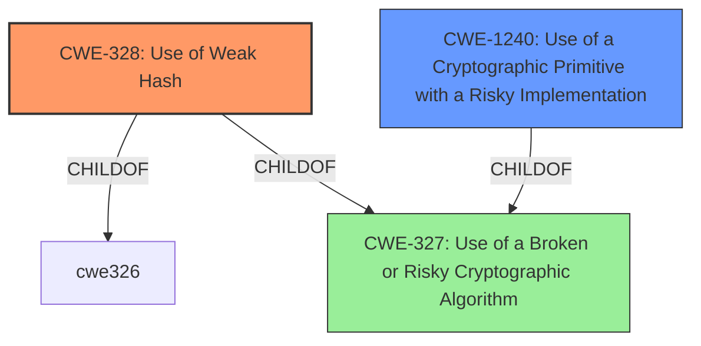

# Analysis Report for CVE-2022-29566

# Vulnerability Analysis Report: CVE-2022-29566

## Description


## Analysis (with Relationship Data)

# Summary
| CWE ID | CWE Name | Confidence | CWE Abstraction Level | CWE Vulnerability Mapping Label | CWE-Vulnerability Mapping Notes |
|---|---|---|---|---|---|
| CWE-328 | Use of Weak Hash | 0.9 | Base | Primary | Allowed |
| CWE-1240 | Use of a Cryptographic Primitive with a Risky Implementation | 0.7 | Base | Secondary | Allowed |

## Evidence and Confidence

*   **Confidence Score:** 0.8
*   **Evidence Strength:** HIGH

## Relationship Analysis
The primary CWE selected is CWE-328, which is a Base level CWE. The secondary CWE selected is CWE-1240 which is also a Base level CWE and a child of CWE-327.
The choice was driven by the vulnerability description's emphasis on the **failure to include all public values in the hash computation**, leading to a predictable challenge.



## Vulnerability Chain
The vulnerability chain starts with the **mishandling of Fiat-Shamir generation**, specifically the **failure of the hash computation to include all public values**. This leads to a **weak hash**, making the challenge predictable. Finally, this predictable challenge allows for **proof forgery**, breaking the soundness of the zero-knowledge proof system.

## Summary of Analysis
The initial assessment focused on the **weakness** described as the **hash computation failing to include all public values**. This directly aligns with CWE-328, "Use of Weak Hash," as the **hash function's design leads to predictability and potential preimage attacks**. The "CVE Reference Links Content Summary" section explicitly states, "The root cause of the vulnerability lies in insecure implementations of the Fiat-Shamir transformation within zero-knowledge proof systems... This omission allows malicious provers to predict or control the challenge value, thus enabling them to forge proofs for random statements."

The relationship analysis further solidified the choice of CWE-328. While other CWEs like CWE-330 ("Use of Insufficiently Random Values") were considered, they were deemed less specific. CWE-328 directly addresses the algorithmic **weakness of the hash function**, whereas CWE-330 is a broader class.

Additionally, CWE-1240 ("Use of a Cryptographic Primitive with a Risky Implementation") was considered, as the **mishandling of Fiat-Shamir generation** could be seen as using a **risky implementation of a cryptographic primitive**. However, this is a more general characterization compared to the specific issue of a **weak hash** due to the **omission of public values**. Therefore, it was determined to be a secondary candidate.

The final decision was based on the evidence directly pointing to the **algorithmic weakness of the hash function** due to the **omission of all public values**, aligning perfectly with the description of CWE-328. This choice is also supported by the MITRE mapping guidance, which allows for the use of Base-level CWEs when they accurately represent the root cause.

**CWEs Considered But Not Used:**

*   **CWE-330 (Use of Insufficiently Random Values):** While the predictable challenge could be seen as related to randomness, the root cause is more specifically about the **hash function's flawed design**, not a general lack of randomness.
*   **CWE-759 (Use of a One-Way Hash without a Salt):** While related to hashing, this CWE focuses on the absence of a salt, which is not the primary issue in this vulnerability. The core problem is the omission of certain public values in the hash computation.


## CWE Relationship Analysis

Current CWEs represent these abstraction levels: .


### Vulnerability Chain Analysis

**Chain starting from CWE-327:**
- 327 (Use of a Broken or Risky Cryptographic Algorithm) - ROOT


**Chain starting from CWE-330:**
- 330 (Use of Insufficiently Random Values) - ROOT


### CWE Relationship Diagram

```mermaid
graph TD
    classDef primary fill:#f96,stroke:#333,stroke-width:2px
    classDef secondary fill:#69f,stroke:#333
    classDef tertiary fill:#9e9,stroke:#333
```


*Report generated on 2025-03-30 17:54:04*
