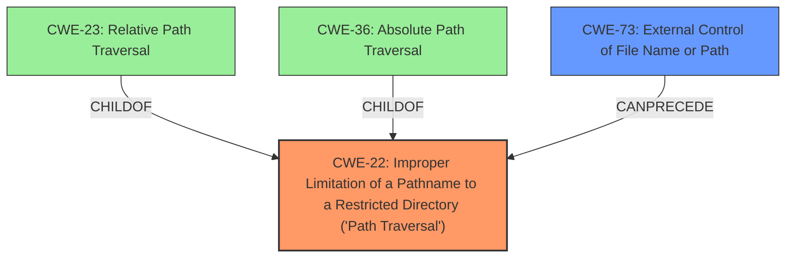

# Enhanced Analysis for CVE-2022-29580

# Summary
| CWE ID | CWE Name | Confidence | CWE Abstraction Level | CWE Vulnerability Mapping Label | CWE-Vulnerability Mapping Notes |
|---|---|---|---|---|---|
| CWE-22 | Improper Limitation of a Pathname to a Restricted Directory ('Path Traversal') | 1.0 | Base | Allowed | Primary CWE |
| CWE-73 | External Control of File Name or Path | 0.7 | Base | Allowed | Secondary Candidate |

## Evidence and Confidence

*   **Confidence Score:** 0.9
*   **Evidence Strength:** HIGH

## Relationship Analysis
The primary CWE is CWE-22, which has child CWEs like CWE-23 (Relative Path Traversal) and CWE-36 (Absolute Path Traversal). The retriever results and vulnerability description both strongly suggest path traversal. CWE-73 (External Control of File Name or Path) can precede CWE-22 in a vulnerability chain, where external control leads to path traversal.



## Vulnerability Chain
The vulnerability chain starts with **incorrect usage of uri.getLastPathSegment**, leading to **path traversal**, which can then lead to code execution.

## Summary of Analysis
The initial analysis strongly suggests CWE-22 due to the **path traversal** vulnerability and **incorrect usage of uri.getLastPathSegment**. The CVE Reference Links Content Summary confirms the **lack of sanitization of user-supplied paths** which is a key indicator of Path Traversal. The retriever results also rank CWE-22 as the top candidate.

The description states "There exists a **path traversal** vulnerability in the Android Google Search app. This is caused by the **incorrect usage of uri.getLastPathSegment**. A symbolic encoded string can bypass the path logic to get access to unintended directories."

The CWE-22 description states: "The product uses external input to construct a pathname that is intended to identify a file or directory that is located underneath a restricted parent directory, but the product does not properly neutralize special elements within the pathname that can cause the pathname to resolve to a location that is outside of the restricted directory."

The relationship graph and retriever results helped solidify this selection.

Relevant CWE Information:

# Enhanced Context (25 CWEs)
The following CWEs were identified as potentially relevant to this vulnerability:

## CWE-22: Improper Limitation of a Pathname to a Restricted Directory ('Path Traversal')
**Technical Explanation:**
The vulnerability description clearly states a "path traversal" vulnerability due to the **incorrect usage of uri.getLastPathSegment**. This directly aligns with CWE-22, where external input is used to construct a pathname without proper neutralization of special elements.
**Security Implications:**
An attacker can access files or directories outside the intended restricted area, potentially leading to sensitive information disclosure or code execution.
**Relationships:**
CWE-22 is a base-level CWE, making it a good fit for direct mapping. Its children, such as CWE-23 (Relative Path Traversal) and CWE-36 (Absolute Path Traversal), are more specific types of path traversal. However, the provided information does not specify the exact type, so CWE-22 is the most appropriate.
**Mapping Guidance:**
The MITRE mapping guidance allows the use of CWE-22, as it is at the Base level of abstraction.
**Confidence:** 1.0

## CWE-73: External Control of File Name or Path
**Technical Explanation:**
The vulnerability stems from the **incorrect usage of uri.getLastPathSegment**, which suggests that the file name or path is being influenced by external input without proper validation. This aligns with CWE-73.
**Security Implications:**
An attacker could control the paths or filenames used in filesystem operations, potentially accessing or modifying critical files.
**Relationships:**
CWE-73 can precede CWE-22, as external control over the filename can lead to path traversal vulnerabilities.
**Mapping Guidance:**
The MITRE mapping guidance allows the use of CWE-73, as it is at the Base level of abstraction.
**Confidence:** 0.7

## Other Considered CWEs:
*   **CWE-59 (Improper Link Resolution Before File Access ('Link Following'))**: This was considered due to the possibility of symbolic links being involved in the path traversal. However, the vulnerability description does not explicitly mention symlinks, making CWE-22 a better fit.
*   **CWE-639 (Authorization Bypass Through User-Controlled Key)**: While the vulnerability involves URI parameters, it's primarily related to path traversal rather than authorization bypass. Thus, CWE-22 is more appropriate.
*   **CWE-426 (Untrusted Search Path)** and **CWE-427 (Uncontrolled Search Path Element)**: These are related to search paths, which are not directly relevant to the described vulnerability.
*   **CWE-98 (Improper Control of Filename for Include/Require Statement in PHP Program ('PHP Remote File Inclusion'))**: This is specific to PHP programs and file inclusion, which is not relevant to the Android Google Search app vulnerability.
*   **CWE-863 (Incorrect Authorization)**: The vulnerability is about path traversal and not about an authorization that is incorrect.


## CWE Relationship Analysis

Current CWEs represent these abstraction levels: .


### Vulnerability Chain Analysis

**Chain starting from CWE-98:**
- 98 (Improper Control of Filename for Include/Require Statement in PHP Program ('PHP Remote File Inclusion')) - ROOT


**Chain starting from CWE-36:**
- 36 (Absolute Path Traversal) - ROOT


### CWE Relationship Diagram

```mermaid
graph TD
    classDef primary fill:#f96,stroke:#333,stroke-width:2px
    classDef secondary fill:#69f,stroke:#333
    classDef tertiary fill:#9e9,stroke:#333
```