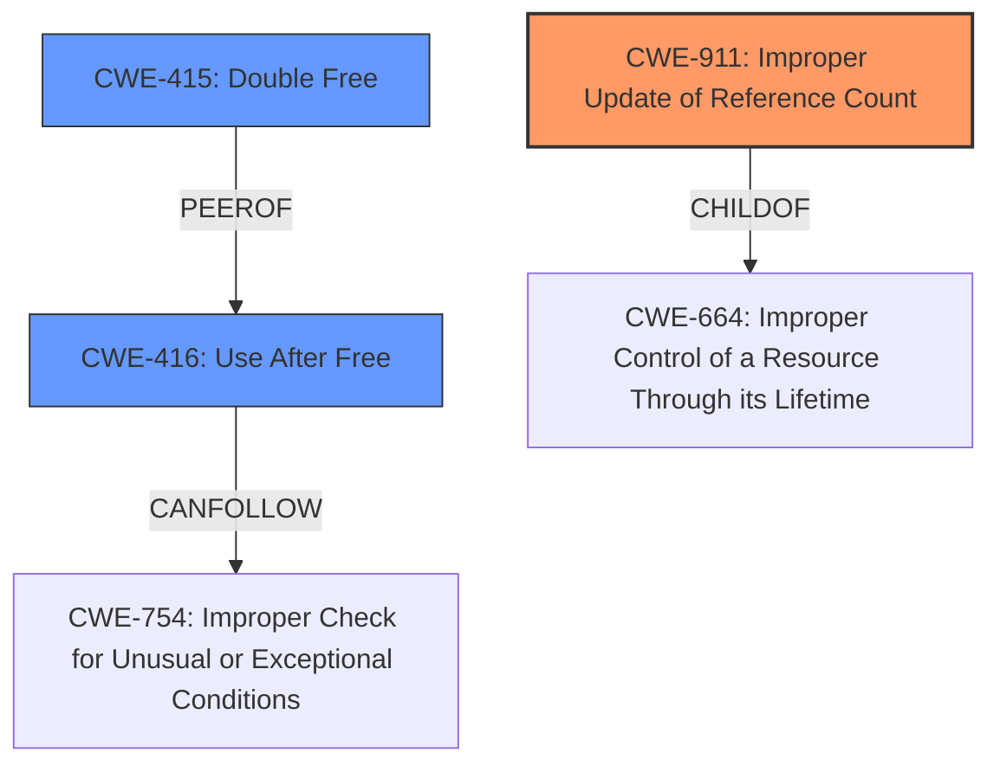

# Raw Analyzer Response for CVE-2022-29581

# Summary
| CWE ID | CWE Name | Confidence | CWE Abstraction Level | CWE Vulnerability Mapping Label | CWE-Vulnerability Mapping Notes |
|---|---|---|---|---|---|
| CWE-911 | Improper Update of Reference Count | 1.0 | Base | Allowed | Primary CWE |
| CWE-416 | Use After Free | 0.8 | Variant | Allowed | Secondary Candidate |
| CWE-415 | Double Free | 0.6 | Variant | Allowed | Secondary Candidate |

## Evidence and Confidence

*   **Confidence Score:** 0.9
*   **Evidence Strength:** HIGH

## Relationship Analysis
The primary CWE selected is CWE-911 (**Improper Update of Reference Count**), which is a base-level CWE. It is related to CWE-664 (**Improper Control of a Resource Through its Lifetime**). The CVE description points to an incorrect decrement of the reference count, which leads to a **use-after-free** condition. Therefore, CWE-416 (**Use After Free**) is considered a secondary candidate. Also, **double free** is a potential consequence of **improper update of reference count**, which makes CWE-415 a lower confidence secondary candidate.

## Vulnerability Chain
The vulnerability chain starts with **Improper Update of Reference Count** (CWE-911) in the `u32_change` function, which leads to a **Use-After-Free** (CWE-416) condition because the `struct net` data structure is freed while still in use. The incorrect decrementing of the network namespace reference count is the root cause.

## Summary of Analysis
The initial analysis focused on the provided information, particularly the "Vulnerability Description Key Phrases" and "CVE Reference Links Content Summary." The **rootcause** was explicitly stated as "**Improper Update of Reference Count**," making CWE-911 the primary candidate. The "CVE Reference Links Content Summary" confirmed that the vulnerability stems from a reference counting bug in the `cls_u32` network classifier within the Linux kernel. Specifically, the `u32_change` function incorrectly decrements the reference count of the network namespace (`struct net`) under certain error conditions. This leads to a **use-after-free** vulnerability.

The graph relationships influenced the selection by highlighting how CWE-911 relates to other resource management issues. CWE-416 (Use After Free) and CWE-415 (Double Free) were considered as potential consequences, but CWE-911 was ultimately chosen as the most specific root cause.

The selected CWEs are at the optimal level of specificity because CWE-911 directly addresses the **incorrect** reference count management, while CWE-416 and CWE-415 are potential consequences.

Relevant CWE Information:

# Enhanced Context (25 CWEs)
The following CWEs were identified as potentially relevant to this vulnerability:

## CWE-667: Improper Locking
**Abstraction Level**: Class
**Similarity Score**: 0.78
**Source**: dense

**Description**:
The product does not properly acquire or release a lock on a resource, leading to unexpected resource state changes and behaviors.

**Mapping Guidance**:
- Usage: Allowed-with-Review
- Rationale: This CWE entry is a Class and might have Base-level children that would be more appropriate

*Not Selected*: While locking issues can sometimes relate to resource management, the core of this vulnerability is about reference counting, not locking mechanisms.

## CWE-703: Improper Check or Handling of Exceptional Conditions
**Abstraction Level**: Pillar
**Similarity Score**: 0.77
**Source**: dense

**Description**:
The product does not properly anticipate or handle exceptional conditions that rarely occur during normal operation of the product.

**Mapping Guidance**:
- Usage: Discouraged
- Rationale: This CWE entry is extremely high-level, a Pillar.

*Not Selected*: This CWE is too high-level and doesn't accurately describe the **rootcause** of the vulnerability.

## CWE-754: Improper Check for Unusual or Exceptional Conditions
**Abstraction Level**: Class
**Similarity Score**: 0.76
**Source**: dense

**Description**:
The product does not check or incorrectly checks for unusual or exceptional conditions that are not expected to occur frequently during day to day operation of the product.

**Mapping Guidance**:
- Usage: Allowed-with-Review
- Rationale: This CWE entry is a Class and might have Base-level children that would be more appropriate

*Not Selected*: Similar to CWE-703, this CWE is too general and does not specifically address the reference counting issue.

## CWE-404: Improper Resource Shutdown or Release
**Abstraction Level**: Class
**Similarity Score**: 0.76
**Source**: dense

**Description**:
The product does not release or incorrectly releases a resource before it is made available for re-use.

**Mapping Guidance**:
- Usage: Allowed-with-Review
- Rationale: This CWE entry is a Class and might have Base-level children that would be more appropriate

*Not Selected*: While resource release is related, the **improper update of the reference count** is a more precise description of the vulnerability's root cause.

## CWE-662: Improper Synchronization
**Abstraction Level**: Class
**Similarity Score**: 0.76
**Source**: dense

**Description**:
The product utilizes multiple threads or processes to allow temporary access to a shared resource that can only be exclusive to one process at a time, but it does not properly synchronize these actions, which might cause simultaneous accesses of this resource by multiple threads or processes.

**Mapping Guidance**:
- Usage: Discouraged
- Rationale: This CWE entry is a level-1 Class (i.e., a child of a Pillar). It might have lower-level children that would be more appropriate

*Not Selected*: This is about synchronization issues; the root cause is about reference counting.

## CWE-226: Sensitive Information in Resource Not Removed Before Reuse
**Abstraction Level**: Base
**Similarity Score**: 0.75
**Source**: dense

**Description**:
The product releases a resource such as memory or a file so that it can be made available for reuse, but it does not clear or "zeroize" the information contained in the resource before the product performs a critical state transition or makes the resource available for reuse by other entities.

**Mapping Guidance**:
- Usage: Allowed
- Rationale: This CWE entry is at the Base level of abstraction, which is a preferred level of abstraction for mapping to the root causes of vulnerabilities.

*Not Selected*: Irrelevant to this vulnerability.

## CWE-362: Concurrent Execution using Shared Resource with Improper Synchronization ('Race Condition')
**Abstraction Level**: Class
**Similarity Score**: 0.75
**Source**: dense

**Description**:
The product contains a concurrent code sequence that requires temporary, exclusive access to a shared resource, but a timing window exists in which the shared resource can be modified by another code sequence operating concurrently.

**Mapping Guidance**:
- Usage: Allowed-with-Review
- Rationale: This CWE entry is a Class and might have Base-level children that would be more appropriate

*Not Selected*: While concurrency might be a factor in triggering the vulnerability, the root cause is the **improper reference count update**, not a race condition directly.

## CWE-653: Improper Isolation or Compartmentalization
**Abstraction Level**: Class
**Similarity Score**: 0.75
**Source**: dense

**Description**:
The product does not properly compartmentalize or isolate functionality, processes, or resources that require different privilege levels, rights, or permissions.

**Mapping Guidance**:
- Usage: Allowed
- Rationale: This CWE entry is at the Base level of abstraction, which is a preferred level of abstraction for mapping to the root causes of vulnerabilities.

*Not Selected*: Irrelevant to this vulnerability.

## CWE-274: Improper Handling of Insufficient Privileges
**Abstraction Level**: Base
**Similarity Score**: 0.74
**Source**: dense

**Description**:
The product does not handle or incorrectly handles when it has insufficient privileges to perform an operation, leading to resultant weaknesses.

**Mapping Guidance**:
- Usage: Discouraged
- Rationale: This CWE entry could be deprecated in a future version of CWE.

*Not Selected