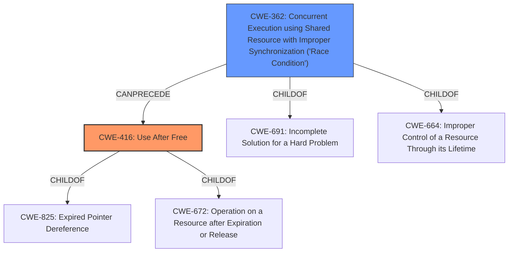

# Raw Analyzer Response for CVE-2022-29582

# Summary
| CWE ID | CWE Name | Confidence | CWE Abstraction Level | CWE Vulnerability Mapping Label | CWE-Vulnerability Mapping Notes |
|---|---|---|---|---|---|
| CWE-416 | Use After Free | 1.0 | Variant | Allowed | Primary CWE |
| CWE-362 | Concurrent Execution using Shared Resource with Improper Synchronization ('Race Condition') | 1.0 | Class | Allowed-with-Review | Secondary CWE |

## Evidence and Confidence

*   **Confidence Score:** 1.0
*   **Evidence Strength:** HIGH

## Relationship Analysis
The primary weakness is CWE-416 Use After Free which occurs because of CWE-362 Concurrent Execution using Shared Resource with Improper Synchronization ('Race Condition'). CWE-416 is a variant and CWE-362 is a class. CWE-362 can precede CWE-416, which aligns with the vulnerability description.

## Vulnerability Chain
The vulnerability chain starts with **CWE-362 Concurrent Execution using Shared Resource with Improper Synchronization ('Race Condition')**, which then leads to **CWE-416 Use After Free**.

## Summary of Analysis
The vulnerability is a **use-after-free** due to a **race condition** in io_uring timeouts. The CVE Reference Links Content Summary confirms the root cause as a race condition and the weakness as a use-after-free. The summary states, "A use-after-free vulnerability exists due to a **race condition** between the timeout flush and removal in the Linux kernel's io_uring subsystem."

The Retriever Results list CWE-362 and CWE-416 as the top candidates, with high individual scores. The relationship between these CWEs, as well as the vulnerability description, support the selection of CWE-416 as the primary CWE and CWE-362 as the secondary CWE.

CWE-416 Use After Free: The product reuses or references memory after it has been freed. The vulnerability description clearly states a "use-after-free" condition. The CVE Reference Links Content Summary confirms the "Use-after-free" weakness, further solidifying this choice. Confidence: 1.0

CWE-362 Concurrent Execution using Shared Resource with Improper Synchronization ('Race Condition'): The product contains a concurrent code sequence that requires temporary, exclusive access to a shared resource, but a timing window exists in which the shared resource can be modified by another code sequence operating concurrently. The vulnerability description mentions a "race condition" in io_uring timeouts. The CVE Reference Links Content Summary identifies "Race condition" as a contributing factor. Confidence: 1.0

CWE-667 Improper Locking, CWE-367 Time-of-check Time-of-use (TOCTOU) Race Condition, CWE-364 Signal Handler Race Condition, CWE-366 Race Condition within a Thread, CWE-609 Double-Checked Locking, CWE-662 Improper Synchronization, CWE-911 Improper Update of Reference Count, CWE-833 Deadlock: These CWEs were considered, but they were not selected because they do not accurately represent the specific vulnerability described, which involves a use-after-free condition triggered by a race condition. While some of these CWEs relate to concurrency issues, they do not directly address the memory management aspect of the vulnerability.