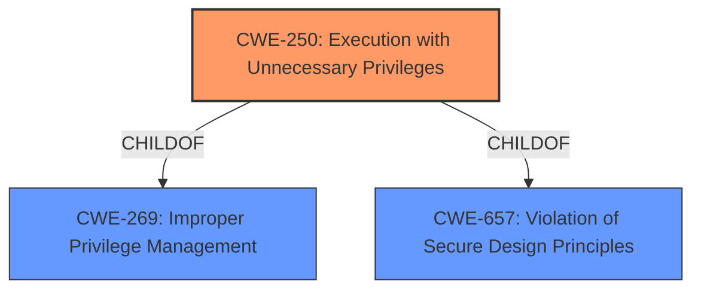

# Analysis for CVE-2022-29587

# Summary
| CWE ID | CWE Name | Confidence | CWE Abstraction Level | CWE Vulnerability Mapping Label | CWE-Vulnerability Mapping Notes |
|---|---|---|---|---|---|
| CWE-250 | Execution with Unnecessary Privileges | 0.9 | Base | Primary | Allowed |
| CWE-269 | Improper Privilege Management | 0.7 | Class | Secondary | Discouraged |

## Evidence and Confidence

*   **Confidence Score:** 0.8
*   **Evidence Strength:** HIGH

## Relationship Analysis
The primary CWE selected is CWE-250 (Execution with Unnecessary Privileges), which is a child of both CWE-269 (Improper Privilege Management) and CWE-657 (Violation of Secure Design Principles). This indicates a hierarchical relationship where CWE-250 is a more specific instance of the broader privilege management issue.

## Vulnerability Chain
The vulnerability chain starts with the **root cause** of the Chromium browser executing with root privileges (CWE-250). This unnecessary privilege leads to the **impact** where an attacker can exploit a sandbox escape in the browser to gain full access to the printer's operating system and sensitive data.

## Summary of Analysis
Initially, several CWEs were considered based on the vulnerability description and retriever results, including CWE-250, CWE-693, CWE-200, and CWE-269. The primary focus was on identifying the root cause of the vulnerability, which is the **execution of the Chromium browser with unnecessary root privileges**.

*   **CWE-250 (Execution with Unnecessary Privileges)** was selected as the primary CWE because it directly addresses the root cause where the browser operates at a higher privilege level than required. The evidence from the "CVE Reference Links Content Summary" states: "The printer's user interface (UI) and the Chromium browser, which are used for displaying help menus and other functions, are running with root privileges." This aligns with CWE-250's description: "The product performs an operation at a privilege level that is higher than the minimum level required."
*   **CWE-269 (Improper Privilege Management)** was considered as a secondary CWE because it represents a broader class of privilege-related issues. However, CWE-250 is more specific and accurately reflects the vulnerability's root cause. While CWE-269 is a parent of CWE-250, the mapping guidance discourages its use due to frequent misuse and recommends considering its children for more specific cases.
*   **CWE-693 (Protection Mechanism Failure)** was considered but rejected because it is a high-level "Pillar" and does not provide specific details about the vulnerability.
*   **CWE-200 (Exposure of Sensitive Information to an Unauthorized Actor)** was considered but rejected because it focuses on the impact (information disclosure) rather than the root cause (unnecessary privileges). The vulnerability leads to potential exposure of sensitive data, but the primary weakness is the excessive privileges granted to the browser.

The final decision to use CWE-250 is based on the specific evidence of the Chromium browser running with root privileges, which directly matches the CWE's description. This is further supported by the mapping guidance that allows the use of CWE-250 and the fact that it is at the Base level of abstraction, which is preferred. The relationship analysis confirms that CWE-250 is a more specific instance of the broader privilege management issue represented by CWE-269, making it the most appropriate choice.