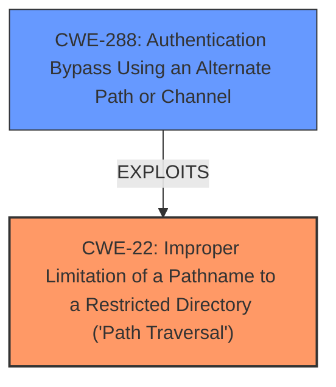

# Analysis Report for CVE-2022-29596

# Vulnerability Analysis Report: CVE-2022-29596

## Description


## Analysis (with Relationship Data)

# Summary
| CWE ID | CWE Name | Confidence | CWE Abstraction Level | CWE Vulnerability Mapping Label | CWE-Vulnerability Mapping Notes |
|---|---|---|---|---|---|
| CWE-22 | Improper Limitation of a Pathname to a Restricted Directory ('Path Traversal') | 1 | Base | Allowed | Primary CWE: The core issue is the ability to traverse directories outside the intended restricted area. |
| CWE-288 | Authentication Bypass Using an Alternate Path or Channel | 0.9 | Base | Allowed | Secondary CWE: The path traversal leads to authentication bypass. |

## Evidence and Confidence

*   **Confidence Score:** 0.95
*   **Evidence Strength:** HIGH

## Relationship Analysis
The primary weakness is **CWE-22 (Improper Limitation of a Pathname to a Restricted Directory ('Path Traversal'))**, which allows an attacker to access unintended files or directories. This can then lead to a secondary weakness, **CWE-288 (Authentication Bypass Using an Alternate Path or Channel)**, where the attacker bypasses authentication mechanisms due to the path traversal vulnerability. CWE-22 is a base-level CWE that describes the root cause, while CWE-288 explains how the path traversal is exploited to bypass authentication.



## Vulnerability Chain
The vulnerability chain starts with **improper input validation**, leading to **CWE-22 (Path Traversal)**, and ultimately results in **CWE-288 (Authentication Bypass)**.

Improper Input Validation -> CWE-22 (Path Traversal) -> CWE-288 (Authentication Bypass)

## Summary of Analysis
The primary **weakness** is the **path traversal** (**CWE-22**), which is then exploited to bypass authentication (**CWE-288**). The vulnerability description and the CVE reference content summary clearly indicate the presence of both weaknesses.

The vulnerability description states: "MicroStrategy Enterprise Manager 2022 allows **authentication bypass** by triggering a login failure and then entering the Uid=/../../../../../../../../../../../windows/win.ini%00.jpg&Pwd=_any_password_&ConnMode=1&3054=Login substring for directory traversal."

The CVE reference states "The vulnerability is caused by **insufficient input validation** in the login process. Specifically, the application is vulnerable to **path traversal** via the `UID` parameter."

The Retriever Results also show that **CWE-22** and **CWE-288** are highly relevant. The graph relationships helped confirm that CWE-288 can be a consequence of CWE-22. I chose these CWEs because they are the most specific and accurate representations of the vulnerability, providing a clear understanding of the root cause and its impact.

Relevant CWE Information:

# Enhanced Context (25 CWEs)
The following CWEs were identified as potentially relevant to this vulnerability:

## CWE-23: Relative Path Traversal
**Abstraction Level**: Base
**Similarity Score**: 0.82
**Source**: dense

**Description**:
The product uses external input to construct a pathname that should be within a restricted directory, but it does not properly neutralize sequences such as ".." that can resolve to a location that is outside of that directory.

**Mapping Guidance**:
- Usage: Allowed
- Rationale: This CWE entry is at the Base level of abstraction, which is a preferred level of abstraction for mapping to the root causes of vulnerabilities.

## CWE-22: Improper Limitation of a Pathname to a Restricted Directory ('Path Traversal')
**Abstraction Level**: Base
**Similarity Score**: 5794.52
**Source**: sparse

**Description**:
The product uses external input to construct a pathname that is intended to identify a file or directory that is located underneath a restricted parent directory, but the product does not properly neutralize special elements within the pathname that can cause the pathname to resolve to a location that is outside of the restricted directory.

**Mapping Guidance**:
- Usage: Allowed
- Rationale: This CWE entry is at the Base level of abstraction, which is a preferred level of abstraction for mapping to the root causes of vulnerabilities.

## CWE-288: Authentication Bypass Using an Alternate Path or Channel
**Abstraction Level**: Base
**Similarity Score**: 0.597
**Source**: dense

**Description**:
The product requires authentication, but the product has an alternate path or channel that does not require authentication.

**Mapping Guidance**:
- Usage: Allowed
- Rationale: This CWE entry is at the Base level of abstraction, which is a preferred level of abstraction for mapping to the root causes of vulnerabilities.

### CWE Considerations:
- **CWE-23 (Relative Path Traversal)**: Considered but determined to be a more specific instance of CWE-22, which is a more general description of the **path traversal** vulnerability.
- **CWE-287 (Improper Authentication)**: Considered but deemed too general; CWE-288 more accurately describes the authentication bypass achieved through an alternate path.
- **CWE-306 (Missing Authentication for Critical Function)**: Considered, but the application does have an authentication mechanism, which is being bypassed, making CWE-288 a better fit.
- **CWE-732 (Incorrect Permission Assignment for Critical Resource)**: Not applicable as the vulnerability isn't about incorrect permission assignments.
- **CWE-178 (Improper Handling of Case Sensitivity)**: Not applicable as the vulnerability is about path traversal, not case sensitivity.
- **CWE-302 (Authentication Bypass by Assumed-Immutable Data)**: Not applicable, as the bypass is not related to assumed immutable data.
- **CWE-90 (Improper Neutralization of Special Elements used in an LDAP Query ('LDAP Injection'))**: Not applicable, as the vulnerability is not related to LDAP injection.


## CWE Relationship Analysis

Current CWEs represent these abstraction levels: .


### Vulnerability Chain Analysis

**Chain starting from CWE-178:**
- 178 (Improper Handling of Case Sensitivity) - ROOT


**Chain starting from CWE-732:**
- 732 (Incorrect Permission Assignment for Critical Resource) - ROOT


### CWE Relationship Diagram

```mermaid
graph TD
    classDef primary fill:#f96,stroke:#333,stroke-width:2px
    classDef secondary fill:#69f,stroke:#333
    classDef tertiary fill:#9e9,stroke:#333
```


*Report generated on 2025-03-30 11:47:09*
