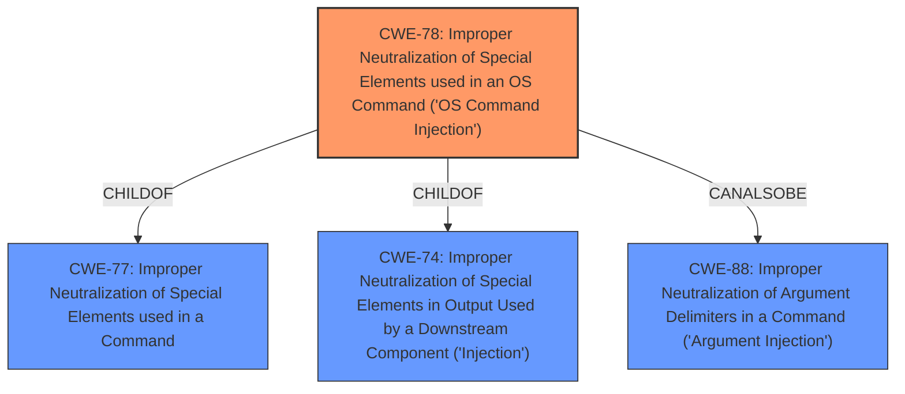

# Analysis for CVE-2022-29599

# Summary
| CWE ID | CWE Name | Confidence | CWE Abstraction Level | CWE Vulnerability Mapping Label | CWE-Vulnerability Mapping Notes |
|---|---|---|---|---|---|
| CWE-78 | Improper Neutralization of Special Elements used in an OS Command ('OS Command Injection') | 1.0 | Base | Primary | Allowed |

## Evidence and Confidence

*   **Confidence Score:** 1.0
*   **Evidence Strength:** HIGH

## Relationship Analysis
The primary relationship that impacted my decision was the ChildOf relationship between CWE-78 and CWE-77, as well as the CanAlsoBe relationship with CWE-88. While CWE-77 (Improper Neutralization of Special Elements used in a Command) is a parent, CWE-78 is a more specific case related to OS commands, which aligns with the vulnerability description. The CanAlsoBe relationship with CWE-88 (Improper Neutralization of Argument Delimiters in a Command) was considered, but the core issue here is the overall command construction, not just the argument delimiters. The base level of abstraction for CWE-78 is appropriate as it directly represents the weakness.

## Vulnerability Chain
The vulnerability chain consists of the following:
1.  **Root Cause:** **Improper escaping of double-quoted strings** in the `Commandline` class (CWE-noid)
2.  **Weakness:** Allows **shell injection** (CWE-78)
3.  **Impact:** Arbitrary code execution.

## Summary of Analysis
The analysis is based on the provided evidence from the vulnerability description and CVE reference links. The key phrases and content summary clearly point to a **shell injection** vulnerability due to **improper escaping of double-quoted strings**.

The vulnerability description states: "In Apache Maven maven-shared-utils prior to version 3.3.3, the Commandline class can emit double-quoted strings without proper escaping, allowing **shell injection** attacks." The CVE Reference Links Content Summary further confirms this, stating: "The `Commandline` class in `maven-shared-utils` library does not properly escape double-quoted strings when emitting them, which allows for shell injection vulnerabilities."

The retriever results also strongly suggest CWE-78 (Improper Neutralization of Special Elements used in an OS Command ('OS Command Injection')) as the primary candidate, with a score of 1.0.

The selected CWE, CWE-78, is at the optimal level of specificity, as it directly addresses the OS command injection issue. While other CWEs like CWE-116 (Improper Encoding or Escaping of Output) and CWE-74 (Improper Neutralization of Special Elements in Output Used by a Downstream Component ('Injection')) are related, they are more general. CWE-78 accurately captures the specific type of injection occurring in this case.

Relevant CWE Information:

# Enhanced Context (25 CWEs)
The following CWEs were identified as potentially relevant to this vulnerability:

## CWE-74: Improper Neutralization of Special Elements in Output Used by a Downstream Component ('Injection')
**Abstraction Level**: Class
**Similarity Score**: 0.78
**Source**: dense

**Description**:
The product constructs all or part of a command, data structure, or record using externally-influenced input from an upstream component, but it does not neutralize or incorrectly neutralizes special elements that could modify how it is parsed or interpreted when it is sent to a downstream component.

**Mapping Guidance**:
- Usage: Discouraged
- Rationale: CWE-74 is high-level and often misused when lower-level weaknesses are more appropriate.

*Reason for not selecting:* CWE-74 is too general, CWE-78 is a more specific child.

## CWE-113: Improper Neutralization of CRLF Sequences in HTTP Headers ('HTTP Request/Response Splitting')
**Abstraction Level**: Variant
**Similarity Score**: 0.77
**Source**: dense

**Description**:
The product receives data from an HTTP agent/component (e.g., web server, proxy, browser, etc.), but it does not neutralize or incorrectly neutralizes CR and LF characters before the data is included in outgoing HTTP headers.

**Mapping Guidance**:
- Usage: Allowed
- Rationale: This CWE entry is at the Variant level of abstraction, which is a preferred level of abstraction for mapping to the root causes of vulnerabilities.

*Reason for not selecting:* This is specific to HTTP headers and CRLF sequences which are not present in the vulnerability description.

## CWE-138: Improper Neutralization of Special Elements
**Abstraction Level**: Class
**Similarity Score**: 0.77
**Source**: dense

**Description**:
The product receives input from an upstream component, but it does not neutralize or incorrectly neutralizes special elements that could be interpreted as control elements or syntactic markers when they are sent to a downstream component.

**Mapping Guidance**:
- Usage: Discouraged
- Rationale: This CWE entry is a level-1 Class (i.e., a child of a Pillar). It might have lower-level children that would be more appropriate

*Reason for not selecting:* This is too general, CWE-78 is a more specific child.

## CWE-917: Improper Neutralization of Special Elements used in an Expression Language Statement ('Expression Language Injection')
**Abstraction Level**: Base
**Similarity Score**: 0.76
**Source**: dense

**Description**:
The product constructs all or part of an expression language (EL) statement in a framework such as a Java Server Page (JSP) using externally-influenced input from an upstream component, but it does not neutralize or incorrectly neutralizes special elements that could modify the intended EL statement before it is executed.

**Mapping Guidance**:
- Usage: Allowed
- Rationale: This CWE entry is at the Base level of abstraction, which is a preferred level of abstraction for mapping to the root causes of vulnerabilities.

*Reason for not selecting:* This is specific to Expression Language injection which is not present in the vulnerability description.

## CWE-184: Incomplete List of Disallowed Inputs
**Abstraction Level**: Base
**Similarity Score**: 0.76
**Source**: dense

**Description**:
The product implements a protection mechanism that relies on a list of inputs (or properties of inputs) that are not allowed by policy or otherwise require other action to neutralize before additional processing takes place, but the list is incomplete.

**Mapping Guidance**:
- Usage: Allowed
- Rationale: This CWE entry is at the Base level of abstraction, which is a preferred level of abstraction for mapping to the root causes of vulnerabilities.

*Reason for not selecting:* This is not about an incomplete list of disallowed inputs but about improper escaping, which leads to shell injection.

## CWE-41: Improper Resolution of Path Equivalence
**Abstraction Level**: Base
**Similarity Score**: 0.76
**Source**: dense

**Description**:
The product is vulnerable to file system contents disclosure through path equivalence. Path equivalence involves the use of special characters in file and directory names. The associated manipulations are intended to generate multiple names for the same object.

**Mapping Guidance**:
- Usage: Allowed
- Rationale: This CWE entry is at the Base level of abstraction, which is a preferred level of abstraction for mapping to the root causes of vulnerabilities.

*Reason for not selecting:* This is related to path equivalence issues, not shell injection.

## CWE-80: Improper Neutralization of Script-Related HTML Tags in a Web Page (Basic XSS)
**Abstraction Level**: Variant
**Similarity Score**: 0.76
**Source**: dense

**Description**:
The product receives input from an upstream component, but it does not neutralize or incorrectly neutralizes special characters such as "<", ">", and "&" that could be interpreted as web-scripting elements when they are sent to a downstream component that processes web pages.

**Mapping Guidance**:
- Usage: Allowed
- Rationale: This CWE entry is at the Variant level of abstraction, which is a preferred level of abstraction for mapping to the root causes of vulnerabilities.

*Reason for not selecting:* This is related to Cross-Site Scripting (XSS), not shell injection.

## CWE-93: Improper Neutralization of CRLF Sequences ('CRLF Injection')
**Abstraction Level**: Base
**Similarity Score**: 0.76
**Source**: dense

**Description**:
The product uses CRLF (carriage return line