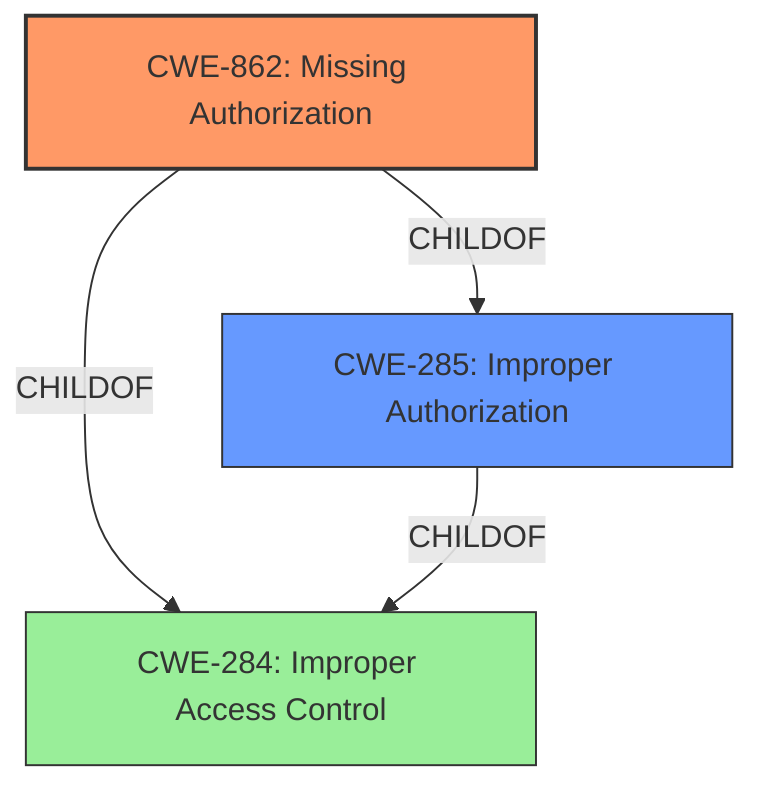

# Analysis Report for CVE-2022-29611

# Vulnerability Analysis Report: CVE-2022-29611

## Description


## Analysis (with Relationship Data)

# Summary
| CWE ID | CWE Name | Confidence | CWE Abstraction Level | CWE Vulnerability Mapping Label | CWE-Vulnerability Mapping Notes |
|---|---|---|---|---|---|
| CWE-862 | Missing Authorization | 0.9 | Class | Allowed-with-Review | Primary CWE. The application **does not perform necessary authorization checks** for an authenticated user, leading to privilege escalation. |
| CWE-285 | Improper Authorization | 0.7 | Class | Discouraged | Secondary candidate. The application might perform authorization checks, but **does not perform necessary authorization checks**. While this could be framed as "improper", the more direct cause is the missing authorization check. |
| CWE-284 | Improper Access Control | 0.5 | Pillar | Discouraged | Secondary candidate. This is a very high-level CWE, and more specific CWEs are available. |

## Evidence and Confidence

*   **Confidence Score:** 0.9
*   **Evidence Strength:** MEDIUM

## Relationship Analysis
The primary CWE is CWE-862, which is a child of both CWE-285 and CWE-284. CWE-285 is a more general case of improper authorization, while CWE-862 specifically addresses the absence of authorization checks. CWE-284 is a very high-level (Pillar) CWE. Given that the vulnerability description explicitly states that authorization checks are missing, CWE-862 is a more precise and appropriate classification than its parents.



## Vulnerability Chain
The vulnerability chain starts with the **missing authorization checks** (CWE-862), which leads to the **escalation of privileges**. The root cause is the absence of the authorization check, and the impact is privilege escalation.

## Summary of Analysis
The initial analysis pointed to CWE-862 (Missing Authorization) as the primary candidate, given the vulnerability description explicitly states that the application **does not perform necessary authorization checks**. This aligns well with the definition of CWE-862.

CWE-285 (Improper Authorization) was considered, but it's a more general case. The specific issue is the *absence* of a check, not an incorrect check.

CWE-284 (Improper Access Control) is too high-level and doesn't provide enough specific information about the weakness.

The final decision to use CWE-862 is based on the explicit statement in the vulnerability description and the CWE's definition. The evidence from the vulnerability description is: "**do not perform necessary authorization checks**". This directly supports the selection of CWE-862.

The selected CWE is at the optimal level of specificity because it directly addresses the root cause of the vulnerability. A more general CWE would not accurately represent the weakness, while a more specific CWE would require additional information not provided in the description.

Relevant CWE Information:

# Enhanced Context (25 CWEs)

## CWE-1220: Insufficient Granularity of Access Control
**Abstraction Level**: Base
**Similarity Score**: 0.79
**Source**: dense

**Description**:
The product implements access controls via a policy or other feature with the intention to disable or restrict accesses (reads and/or writes) to assets in a system from untrusted agents. However, implemented access controls lack required granularity, which renders the control policy too broad because it allows accesses from unauthorized agents to the security-sensitive assets.

**Mapping Guidance**:
- Usage: Allowed
- Rationale: This CWE entry is at the Base level of abstraction, which is a preferred level of abstraction for mapping to the root causes of vulnerabilities.

This CWE was not selected because the problem is not a lack of granularity, but a complete **lack of authorization checks**.

## CWE-807: Reliance on Untrusted Inputs in a Security Decision
**Abstraction Level**: Base
**Similarity Score**: 0.77
**Source**: dense

**Description**:
The product uses a protection mechanism that relies on the existence or values of an input, but the input can be modified by an untrusted actor in a way that bypasses the protection mechanism.

**Mapping Guidance**:
- Usage: Allowed
- Rationale: This CWE entry is at the Base level of abstraction, which is a preferred level of abstraction for mapping to the root causes of vulnerabilities.

This CWE was not selected because the description does not indicate that the access control relies on an untrusted input. The problem is a **missing authorization check**.

## CWE-274: Improper Handling of Insufficient Privileges
**Abstraction Level**: Base
**Similarity Score**: 0.76
**Source**: dense

**Description**:
The product does not handle or incorrectly handles when it has insufficient privileges to perform an operation, leading to resultant weaknesses.

**Mapping Guidance**:
- Usage: Discouraged
- Rationale: This CWE entry could be deprecated in a future version of CWE.

This CWE was not selected because the problem is not the handling of insufficient privileges, but the **absence of authorization checks** to begin with.

## CWE-653: Improper Isolation or Compartmentalization
**Abstraction Level**: Class
**Similarity Score**: 0.76
**Source**: dense

**Description**:
The product does not properly compartmentalize or isolate functionality, processes, or resources that require different privilege levels, rights, or permissions.

**Mapping Guidance**:
- Usage: Allowed
- Rationale: This CWE entry is at the Base level of abstraction, which is a preferred level of abstraction for mapping to the root causes of vulnerabilities.

This CWE was not selected because the description does not imply issues of compartmentalization or isolation, but simply that **authorization checks are missing**.

## CWE-280: Improper Handling of Insufficient Permissions or Privileges 
**Abstraction Level**: Base
**Similarity Score**: 0.75
**Source**: dense

**Description**:
The product does not handle or incorrectly handles when it has insufficient privileges to access resources or functionality as specified by their permissions. This may cause it to follow unexpected code paths that may leave the product in an invalid state.

**Mapping Guidance**:
- Usage: Allowed
- Rationale: This CWE entry is at the Base level of abstraction, which is a preferred level of abstraction for mapping to the root causes of vulnerabilities.

This CWE was not selected because the issue is not about handling insufficient permissions, but the fact that **no authorization checks are performed at all**.

## CWE-1289: Improper Validation of Unsafe Equivalence in Input
**Abstraction Level**: Base
**Similarity Score**: 0.75
**Source**: dense

**Description**:
The product receives an input value that is used as a resource identifier or other type of reference, but it does not validate or incorrectly validates that the input is equivalent to a potentially-unsafe value.

**Mapping Guidance**:
- Usage: Allowed
- Rationale: This CWE entry is at the Base level of abstraction, which is a preferred level of abstraction for mapping to the root causes of vulnerabilities.

This CWE was not selected because the problem is not related to unsafe equivalence of input, but **the complete lack of authorization checks**.

## CWE-668: Exposure of Resource to Wrong Sphere
**Abstraction Level**: Class
**Similarity Score**: 0.75
**Source**: dense

**Description**:
The product exposes a resource to the wrong control sphere, providing unintended actors with inappropriate access to the resource.

**Mapping Guidance**:
- Usage: Discouraged
- Rationale: CWE-668 is high-level and is often misused as a catch-all when lower-level CWE IDs might be applicable. It is sometimes used for low-information vulnerability reports [REF-1287]. It is a level-1 Class (i.e., a child of a Pillar). It is not useful for trend analysis.

This CWE was not selected because it is too general. The specific issue is that **authorization checks are missing**, and resources are being accessed without proper validation.

## CWE-183: Permissive List of Allowed Inputs
**Abstraction Level**: Base
**Similarity Score**: 0.75
**Source**: dense

**Description**:
The product implements a protection mechanism that relies on a list of inputs (or properties of inputs) that are explicitly allowed by policy because the inputs are assumed to be safe, but the list is too permissive - that is, it allows an input that is unsafe, leading to resultant weaknesses.

**Mapping Guidance**:
- Usage: Allowed
- Rationale: This CWE entry is at the Base level of abstraction, which is a preferred level of abstraction for mapping to the root causes of vulnerabilities.

This CWE


## CWE Relationship Analysis

Current CWEs represent these abstraction levels: .


### Vulnerability Chain Analysis

**Chain starting from CWE-862:**
- 862 (Missing Authorization) - ROOT


**Chain starting from CWE-280:**
- 280 (Improper Handling of Insufficient Permissions or Privileges ) - ROOT


### CWE Relationship Diagram

```mermaid
graph TD
    classDef primary fill:#f96,stroke:#333,stroke-width:2px
    classDef secondary fill:#69f,stroke:#333
    classDef tertiary fill:#9e9,stroke:#333
```


*Report generated on 2025-03-30 15:55:29*
