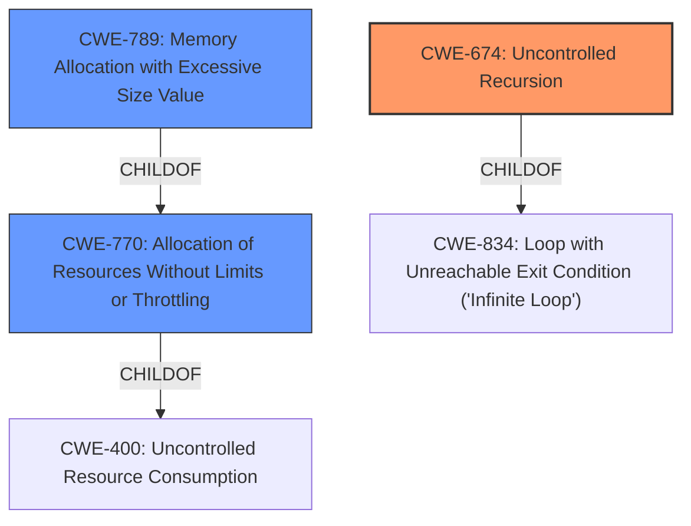

# Enhanced Analysis for CVE-2022-2962

# Summary
| CWE ID | CWE Name | Confidence | CWE Abstraction Level | CWE Vulnerability Mapping Label | CWE-Vulnerability Mapping Notes |
|---|---|---|---|---|---|
| CWE-674 | Uncontrolled Recursion | 0.9 | Class | Primary | Allowed-with-Review |
| CWE-770 | Allocation of Resources Without Limits or Throttling | 0.7 | Base | Secondary | Allowed |
| CWE-789 | Memory Allocation with Excessive Size Value | 0.6 | Variant | Secondary | Allowed |

## Evidence and Confidence

*   **Confidence Score:** 0.8
*   **Evidence Strength:** HIGH

## Relationship Analysis
The primary weakness is identified as CWE-674 (Uncontrolled Recursion), which falls under the broader category of resource management issues. This is supported by the vulnerability description highlighting **DMA reentrancy** leading to a stack overflow.

CWE-770 (Allocation of Resources Without Limits or Throttling) and CWE-789 (Memory Allocation with Excessive Size Value) are considered secondary due to the allocation potentially leading to excessive resource consumption. These are related to CWE-674 as they can be consequences of uncontrolled recursion.



## Vulnerability Chain
The vulnerability chain starts with the **DMA reentrancy** issue, where the Tulip device doesn't validate destination addresses during DMA operations. This leads to recursive MMIO handler calls, resulting in a stack or heap overflow and ultimately a denial-of-service.

1.  **Root Cause:** **DMA reentrancy** due to lack of address validation.
2.  **Weakness:** Recursive MMIO handler calls.
3.  **Impact:** Stack or Heap Overflow.
4.  **Final Impact:** Denial of Service (QEMU process crash).

## Summary of Analysis
The analysis focused on identifying the root cause and the immediate weaknesses contributing to the vulnerability. The primary selection of CWE-674 is based on the explicit mention of the **DMA reentrancy** leading to uncontrolled recursion, causing a stack overflow.

The vulnerability description clearly states that the **DMA reentrancy** issue arises because "When Tulip reads or writes to the rx/tx descriptor or copies the rx/tx frame, it doesnt check whether the destination address is its own MMIO address. This can cause the device to trigger MMIO handlers multiple times, possibly leading to a stack or heap overflow." This directly supports the identification of uncontrolled recursion as the primary weakness.

The selection of CWE-674 is further supported by the CVE Reference Links Content Summary, which highlights the "recursive call chain by writing/reading to its own MMIO region which eventually lead to stack overflow" and the fix applied which is "restricting the DMA engine to memory regions only."

CWE-674 is chosen because it represents the uncontrolled recursion leading to resource exhaustion (stack overflow). While other CWEs like CWE-770 and CWE-789 are related to resource management, CWE-674 directly addresses the recursion aspect, making it the most specific and appropriate choice. The other CWEs could be secondary effects.

The final selection is at the optimal level of specificity, focusing on the recursion as the core issue, while acknowledging the related resource management concerns.

Relevant CWE Information:

# Enhanced Context (25 CWEs)
The following CWEs were identified as potentially relevant to this vulnerability:

## CWE-191: Integer Underflow (Wrap or Wraparound)
**Abstraction Level**: Base
**Similarity Score**: 0.79
**Source**: dense
## CWE-190: Integer Overflow or Wraparound
**Abstraction Level**: Base
**Similarity Score**: 0.77
**Source**: dense
## CWE-789: Memory Allocation with Excessive Size Value
**Abstraction Level**: Variant
**Similarity Score**: 0.77
**Source**: dense
## CWE-197: Numeric Truncation Error
**Abstraction Level**: Base
**Similarity Score**: 0.76
**Source**: dense
## CWE-131: Incorrect Calculation of Buffer Size
**Abstraction Level**: Base
**Similarity Score**: 0.76
**Source**: dense
## CWE-1325: Improperly Controlled Sequential Memory Allocation
**Abstraction Level**: Base
**Similarity Score**: 0.76
**Source**: dense
## CWE-667: Improper Locking
**Abstraction Level**: Class
**Similarity Score**: 0.76
**Source**: dense
## CWE-680: Integer Overflow to Buffer Overflow
**Abstraction Level**: Compound
**Similarity Score**: 0.75
**Source**: dense
## CWE-681: Incorrect Conversion between Numeric Types
**Abstraction Level**: Base
**Similarity Score**: 0.75
**Source**: dense
## CWE-362: Concurrent Execution using Shared Resource with Improper Synchronization ('Race Condition')
**Abstraction Level**: Class
**Similarity Score**: 0.74
**Source**: dense
## CWE-190: Integer Overflow or Wraparound
**Abstraction Level**: Base
**Similarity Score**: 6619.56
**Source**: sparse
## CWE-662: Improper Synchronization
**Abstraction Level**: Class
**Similarity Score**: 6479.00
**Source**: sparse

CWE-662 (Improper Synchronization) was considered due to the possibility of concurrent execution issues, but the primary cause is the uncontrolled recursion itself. The description does not indicate multiple threads operating on shared data.

## CWE-789: Memory Allocation with Excessive Size Value
**Abstraction Level**: Variant
**Similarity Score**: 6476.58
**Source**: sparse

CWE-789 (Memory Allocation with Excessive Size Value) was considered because the recursion could lead to excessive memory allocation. While a possible consequence, the uncontrolled recursion is the more direct cause.

## CWE-770: Allocation of Resources Without Limits or Throttling
**Abstraction Level**: Base
**Similarity Score**: 6352.95
**Source**: sparse

CWE-770 (Allocation of Resources Without Limits or Throttling) was considered for similar reasons as CWE-789. The lack of limits on recursion leads to resource exhaustion.

## CWE-1284: Improper Validation of Specified Quantity in Input
**Abstraction Level**: Base
**Similarity Score**: 6267.17
**Source**: sparse
## CWE-123: Write-what-where Condition
**Abstraction Level**: base
**Similarity Score**: 4.82
**Source**: graph
## CWE-476: NULL Pointer Dereference
**Abstraction Level**: base
**Similarity Score**: 4.33
**Source**: graph
## CWE-770: Allocation of Resources Without Limits or Throttling
**Abstraction Level**: base
**Similarity Score**: 4.33
**Source**: graph
## CWE-823: Use of Out-of-range Pointer Offset
**Abstraction Level**: base
**Similarity Score**: 4.33
**Source**: graph
## CWE-1284: Improper Validation of Specified Quantity in Input
**Abstraction Level**: base
**Similarity Score**: 4.33
**Source**: graph
## CWE-416: Use After Free
**Abstraction Level**: variant
**Similarity Score**: 4.20
**Source**: graph
## CWE-1339: Insufficient Precision or Accuracy of a Real Number
**Abstraction Level**: base
**Similarity Score**: 3.57
**Source**: graph
## CWE-128: Wrap-around Error
**Abstraction Level**: base
**Similarity Score**: 3.57
**Source**: graph
## CWE-120: Buffer Copy without Checking Size of Input ('Classic Buffer Overflow')
**Abstraction Level**: base
**Similarity Score**: 3.36
**Source**: graph

CWE-120 was considered because the impact of the vulnerability is a stack or heap overflow. However, this is a result of the uncontrolled recursion, not a direct buffer copy issue.

## CWE-195: Signed to Unsigned Conversion Error
**Abstraction Level**: variant
**Similarity Score**: 3.33
**Source**: graph


## CWE Relationship Analysis

Current CWEs represent these abstraction levels: .


### Vulnerability Chain Analysis

**Chain starting from CWE-823:**
- 823 (Use of Out-of-range Pointer Offset) - ROOT


**Chain starting from CWE-123:**
- 123 (Write-what-where Condition) - ROOT


### CWE Relationship Diagram

```mermaid
graph TD
    classDef primary fill:#f96,stroke:#333,stroke-width:2px
    classDef secondary fill:#69f,stroke:#333
    classDef tertiary fill:#9e9,stroke:#333
```