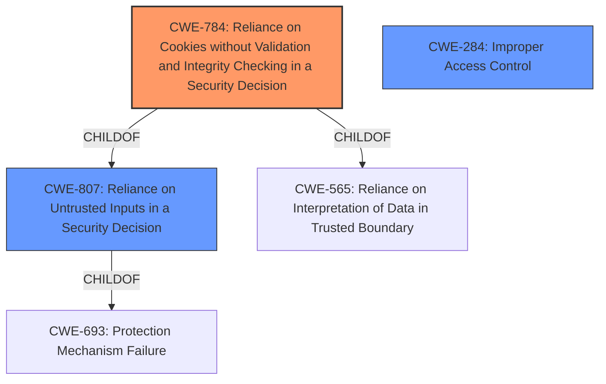

# Enhanced Analysis for CVE-2022-29633

# Summary
| CWE ID | CWE Name | Confidence | CWE Abstraction Level | CWE Vulnerability Mapping Label | CWE-Vulnerability Mapping Notes |
|---|---|---|---|---|---|
| CWE-784 | Reliance on Cookies without Validation and Integrity Checking in a Security Decision | 0.7 | Variant | Allowed | Primary CWE |
| CWE-807 | Reliance on Untrusted Inputs in a Security Decision | 0.6 | Base | Allowed | Secondary Candidate |
| CWE-284 | Improper Access Control | 0.4 | Pillar | Discouraged | Secondary Candidate |

## Evidence and Confidence

*   **Confidence Score:** 0.7
*   **Evidence Strength:** MEDIUM

## Relationship Analysis
The primary CWE, CWE-784, is a Variant of CWE-807 and CWE-565. CWE-807 is a Base CWE and a child of CWE-693. CWE-284 is a high-level Pillar CWE that is generally discouraged for use, but considered here due to the initial description of an "access control issue." The relationships indicate that the vulnerability is most specifically related to cookies and their improper handling, which can lead to broader access control issues if not correctly validated.



## Vulnerability Chain
The vulnerability chain starts with the **access control issue**, where the application **fails to validate the integrity of the crafted cookie**. This **reliance on an untrusted input (the cookie)** leads to **unauthorized access** to the application's background.

## Summary of Analysis
Initially, the vulnerability description indicates an **"access control issue"** that allows attackers to access the background of the application via a **"crafted cookie."** The key phrase highlights the role of the cookie in bypassing access controls.

The retriever results suggest several potential CWEs, including:
*   CWE-425 Direct Request ('Forced Browsing')
*   CWE-284 Improper Access Control
*   CWE-472 External Control of Assumed-Immutable Web Parameter
*   CWE-807 Reliance on Untrusted Inputs in a Security Decision
*   CWE-287 Improper Authentication

Given that the vulnerability is triggered by a **"crafted cookie"**, CWE-784 (Reliance on Cookies without Validation and Integrity Checking in a Security Decision) is the most appropriate primary CWE. It directly addresses the **weakness** of trusting cookie values without proper validation.
> CWE-784 Description: The product uses a protection mechanism that relies on the existence or values of a cookie, but it does not properly ensure that the cookie is valid for the associated user.

CWE-807 (Reliance on Untrusted Inputs in a Security Decision) is also relevant as a secondary CWE since cookies are untrusted inputs.
> CWE-807 Description: The product uses a protection mechanism that relies on the existence or values of an input, but the input can be modified by an untrusted actor in a way that bypasses the protection mechanism.

CWE-284 (Improper Access Control) is considered but deemed too general. While the vulnerability results in unauthorized access, the root cause is specifically related to the handling of cookies.

Other considered CWEs:
*   CWE-425 is less relevant because it focuses on direct requests to URLs without proper authorization, whereas this vulnerability involves manipulating cookie values.
*   CWE-472 is similar to CWE-784 and CWE-807, but less specific to cookies.
*   CWE-287 is too general, the authentication may be valid but the access control decision is not.

The selected CWEs are at the optimal level of specificity because they accurately represent the **root cause** of the vulnerability (improper cookie handling) and its potential impact (access control bypass). CWE-784 is a Variant, representing a specific type of weakness, while CWE-807 is a more general Base CWE that captures the broader concept of relying on untrusted inputs.

Relevant CWE Information:

# Enhanced Context (25 CWEs)
The following CWEs were identified as potentially relevant to this vulnerability:

## CWE-807: Reliance on Untrusted Inputs in a Security Decision
**Abstraction Level**: Base
**Similarity Score**: 0.76
**Source**: dense

**Description**:
The product uses a protection mechanism that relies on the existence or values of an input, but the input can be modified by an untrusted actor in a way that bypasses the protection mechanism.

**Mapping Guidance**:
- Usage: Allowed
- Rationale: This CWE entry is at the Base level of abstraction, which is a preferred level of abstraction for mapping to the root causes of vulnerabilities.


## CWE-668: Exposure of Resource to Wrong Sphere
**Abstraction Level**: Class
**Similarity Score**: 0.75
**Source**: dense

**Description**:
The product exposes a resource to the wrong control sphere, providing unintended actors with inappropriate access to the resource.

**Mapping Guidance**:
- Usage: Discouraged
- Rationale: CWE-668 is high-level and is often misused as a catch-all when lower-level CWE IDs might be applicable. It is sometimes used for low-information vulnerability reports [REF-1287]. It is a level-1 Class (i.e., a child of a Pillar). It is not useful for trend analysis.


## CWE-664: Improper Control of a Resource Through its Lifetime
**Abstraction Level**: Pillar
**Similarity Score**: 0.74
**Source**: dense

**Description**:
The product does not maintain or incorrectly maintains control over a resource throughout its lifetime of creation, use, and release.

**Mapping Guidance**:
- Usage: Discouraged
- Rationale: This CWE entry is high-level when lower-level children are available.


## CWE-610: Externally Controlled Reference to a Resource in Another Sphere
**Abstraction Level**: Class
**Similarity Score**: 0.73
**Source**: dense

**Description**:
The product uses an externally controlled name or reference that resolves to a resource that is outside of the intended control sphere.

**Mapping Guidance**:
- Usage: Discouraged
- Rationale: This CWE entry is a level-1 Class (i.e., a child of a Pillar). It might have lower-level children that would be more appropriate


## CWE-1220: Insufficient Granularity of Access Control
**Abstraction Level**: Base
**Similarity Score**: 0.73
**Source**: dense

**Description**:
The product implements access controls via a policy or other feature with the intention to disable or restrict accesses (reads and/or writes) to assets in a system from untrusted agents. However, implemented access controls lack required granularity, which renders the control policy too broad because it allows accesses from unauthorized agents to the security-sensitive assets.

**Mapping Guidance**:
- Usage: Allowed
- Rationale: This CWE entry is at the Base level of abstraction, which is a preferred level of abstraction for mapping to the root causes of vulnerabilities.


## CWE-552: Files or Directories Accessible to External Parties
**Abstraction Level**: Base
**Similarity Score**: 0.73
**Source**: dense

**Description**:
The product makes files or directories accessible to unauthorized actors, even though they should not be.

**Mapping Guidance**:
- Usage: Allowed
- Rationale: This CWE entry is at the Base level of abstraction, which is a preferred level of abstraction for mapping to the root causes of vulnerabilities.


## CWE-653: Improper Isolation or Compartmentalization
**Abstraction Level**: Class
**Similarity Score**: 0.73
**Source**: dense

**Description**:
The product does not properly compartmentalize or isolate functionality, processes, or resources that require different privilege levels, rights, or permissions.

**Mapping Guidance**:
- Usage: Allowed
- Rationale: This CWE entry is at the Base level of abstraction, which is a preferred level of abstraction for mapping to the root causes of vulnerabilities.


## CWE-472: External Control of Assumed-Immutable Web Parameter
**Abstraction Level**: Base
**Similarity Score**: 0.73
**Source**: dense

**Description**:
The web application does not sufficiently verify inputs that are assumed to be immutable but are actually externally controllable,


## CWE Relationship Analysis

Current CWEs represent these abstraction levels: .


### Vulnerability Chain Analysis

**Chain starting from CWE-552:**
- 552 (Files or Directories Accessible to External Parties) - ROOT


**Chain starting from CWE-425:**
- 425 (Direct Request ('Forced Browsing')) - ROOT


### CWE Relationship Diagram

```mermaid
graph TD
    classDef primary fill:#f96,stroke:#333,stroke-width:2px
    classDef secondary fill:#69f,stroke:#333
    classDef tertiary fill:#9e9,stroke:#333
```