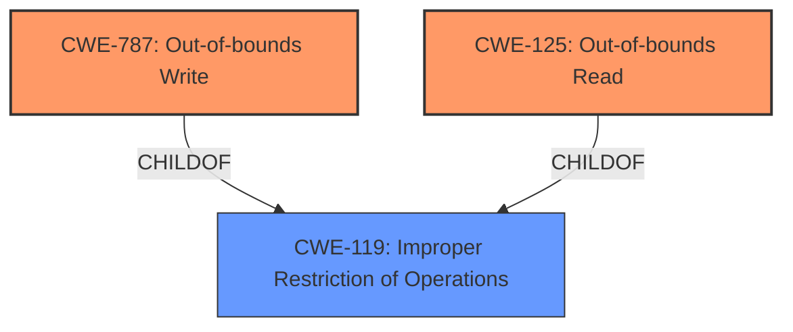

# Analysis Report for CVE-2022-2964

# Vulnerability Analysis Report: CVE-2022-2964

## Description


## Analysis (with Relationship Data)

# Summary
| CWE ID | CWE Name | Confidence | CWE Abstraction Level | CWE Vulnerability Mapping Label | CWE-Vulnerability Mapping Notes |
|---|---|---|---|---|---|
| CWE-125 | Out-of-bounds Read | 0.9 | Base | Allowed | Primary CWE |
| CWE-787 | Out-of-bounds Write | 0.9 | Base | Allowed | Primary CWE |
| CWE-119 | Improper Restriction of Operations within the Bounds of a Memory Buffer | 0.6 | Class | Discouraged | Secondary Candidate |

## Evidence and Confidence

*   **Confidence Score:** 0.9
*   **Evidence Strength:** HIGH

## Relationship Analysis
The primary CWEs selected are CWE-125 and CWE-787, both being **Base** level weaknesses and children of the **Class** level CWE-119. While CWE-119 is a relevant parent, the vulnerability description provides sufficient detail to pinpoint the specific out-of-bounds read and write issues, making CWE-125 and CWE-787 more appropriate.



## Vulnerability Chain
The vulnerability chain starts with a flaw in the `ax88179_rx_fixup()` function, leading to **multiple out-of-bounds reads and possible out-of-bounds writes**.

## Summary of Analysis
The analysis is based on the provided vulnerability description and the CVE reference summary, which explicitly state the presence of **out-of-bounds reads and possible out-of-bounds writes**.

>A flaw was found in the Linux kernels driver for the ASIX AX88179_178A-based USB 2.0/3.0 Gigabit Ethernet Devices. The vulnerability contains **multiple out-of-bounds reads and possible out-of-bounds writes**.

>The vulnerability exists in the Linux kernel's driver for ASIX AX88179\_178A-based USB 2.0/3.0 Gigabit Ethernet Devices. It involves multiple out-of-bounds reads and possible out-of-bounds writes in the `ax88179_rx_fixup()` function.

Given the explicit mention of these issues, mapping to CWE-125 and CWE-787 is most appropriate. CWE-119, while a parent, is less specific.

Relevant CWE Information:

# Enhanced Context (25 CWEs)

## CWE-125: Out-of-bounds Read
**Abstraction:** Base
**Similarity Score**: 0.75
**Source**: dense

**Description**:
The product reads data past the end, or before the beginning, of the intended buffer.

## CWE-787: Out-of-bounds Write
**Abstraction:** Base
**Similarity Score**: 4.33
**Source**: graph

**Description**:
The product writes data past the end, or before the beginning, of the intended buffer.

## CWE-119: Improper Restriction of Operations within the Bounds of a Memory Buffer
**Abstraction:** Class
**Similarity Score**: 5860.52
**Source**: sparse

**Description**:
The product performs operations on a memory buffer, but it reads from or writes to a memory location outside the buffer's intended boundary. This may result in read or write operations on unexpected memory locations that could be linked to other variables, data structures, or internal program data.


## CWE Relationship Analysis

Current CWEs represent these abstraction levels: .


### Vulnerability Chain Analysis

**Chain starting from CWE-787:**
- 787 (Out-of-bounds Write) - ROOT


**Chain starting from CWE-119:**
- 119 (Improper Restriction of Operations within the Bounds of a Memory Buffer) - ROOT


### CWE Relationship Diagram

```mermaid
graph TD
    classDef primary fill:#f96,stroke:#333,stroke-width:2px
    classDef secondary fill:#69f,stroke:#333
    classDef tertiary fill:#9e9,stroke:#333
```


*Report generated on 2025-03-31 05:46:46*
