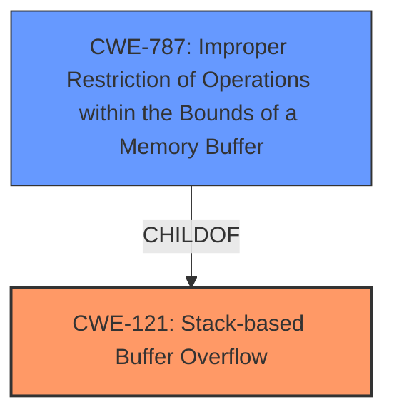

# Analysis for CVE-2022-29640

# Summary
| CWE ID | CWE Name | Confidence | CWE Abstraction Level | CWE Vulnerability Mapping Label | CWE-Vulnerability Mapping Notes |
|---|---|---|---|---|---|
| CWE-121 | Stack-based Buffer Overflow | 1.0 | Variant | Allowed | Primary CWE |

## Evidence and Confidence

*   **Confidence Score:** 1.0
*   **Evidence Strength:** HIGH

## Relationship Analysis
The primary relationship that influenced the decision was the ChildOf relationship between CWE-121 and CWE-787 (Improper Restriction of Operations within the Bounds of a Memory Buffer). CWE-121 is a variant of CWE-787, specifying that the buffer is allocated on the stack. Since the vulnerability description explicitly states "**stack overflow**," selecting CWE-121 is the more precise and appropriate choice.

## Vulnerability Chain
The vulnerability chain is relatively simple:
1.  **Root Cause:** Unvalidated input of the `comment` parameter in the `setPortForwardRules` function.
2.  **Weakness:** The `strcpy` function copies the input to a stack buffer without checking the size, leading to a **stack overflow** (CWE-121).
3.  **Impact:** Denial of Service (DoS).

## Summary of Analysis
The initial analysis correctly identified CWE-787 as a potential candidate based on the "**stack overflow**" description. However, the more specific CWE-121 (Stack-based Buffer Overflow) is the better fit, as it directly reflects the location of the buffer on the stack, which is clearly stated in the vulnerability description.

The evidence supporting this decision includes:
*   **Vulnerability Description Key Phrases:** "**weakness:** **stack overflow**"
*   **CVE Reference Links Content Summary:** "The `setPortForwardRules` function in the `firewall.so` module of the TOTOLINK A3100R router firmware is vulnerable due to a lack of input validation on the "comment" parameter. Specifically, the code uses `strcpy` to copy the user-provided "comment" into a stack buffer without checking its length."

The Retriever Results listed CWE-121 with a score of 1.0 when searching for alternate terms further supports this selection.

Based on the provided evidence and relationship analysis, CWE-121 is the most appropriate CWE for this vulnerability, and it's at the optimal level of specificity (Variant).

Relevant CWE Information:

# Enhanced Context (25 CWEs)
The following CWEs were identified as potentially relevant to this vulnerability:

## CWE-130: Improper Handling of Length Parameter Inconsistency
**Abstraction Level**: Base
**Similarity Score**: 0.79
**Source**: dense

**Description**:
The product parses a formatted message or structure, but it does not handle or incorrectly handles a length field that is inconsistent with the actual length of the associated data.

**Mapping Guidance**:
- Usage: Allowed
- Rationale: This CWE entry is at the Base level of abstraction, which is a preferred level of abstraction for mapping to the root causes of vulnerabilities.

*Analysis:* CWE-130 was considered but not selected because the primary issue is the lack of any length check *before* copying to the buffer, rather than an inconsistency in length parameters.

## CWE-789: Memory Allocation with Excessive Size Value
**Abstraction Level**: Variant
**Similarity Score**: 0.77
**Source**: dense

**Description**:
The product allocates memory based on an untrusted, large size value, but it does not ensure that the size is within expected limits, allowing arbitrary amounts of memory to be allocated.

**Mapping Guidance**:
- Usage: Allowed
- Rationale: This CWE entry is at the Variant level of abstraction, which is a preferred level of abstraction for mapping to the root causes of vulnerabilities.

*Analysis:* CWE-789 was considered but not selected because the vulnerability is not about allocating an excessive amount of memory, but about writing beyond the bounds of an *existing* stack buffer.

## CWE-191: Integer Underflow (Wrap or Wraparound)
**Abstraction Level**: Base
**Similarity Score**: 0.77
**Source**: dense

**Description**:
The product subtracts one value from another, such that the result is less than the minimum allowable integer value, which produces a value that is not equal to the correct result.

**Mapping Guidance**:
- Usage: Allowed
- Rationale: This CWE entry is at the Base level of abstraction, which is a preferred level of abstraction for mapping to the root causes of vulnerabilities.

*Analysis:* CWE-191 was considered but not selected because there is no evidence of integer underflow in the description of the vulnerability.

## CWE-226: Sensitive Information in Resource Not Removed Before Reuse
**Abstraction Level**: Base
**Similarity Score**: 0.77
**Source**: dense

**Description**:
The product releases a resource such as memory or a file so that it can be made available for reuse, but it does not clear or "zeroize" the information contained in the resource before the product performs a critical state transition or makes the resource available for reuse by other entities.

**Mapping Guidance**:
- Usage: Allowed
- Rationale: This CWE entry is at the Base level of abstraction, which is a preferred level of abstraction for mapping to the root causes of vulnerabilities.

*Analysis:* CWE-226 was considered but not selected because it does not relate to the buffer overflow issue described.

## CWE-1325: Improperly Controlled Sequential Memory Allocation
**Abstraction Level**: Base
**Similarity Score**: 0.77
**Source**: dense

**Description**:
The product manages a group of objects or resources and performs a separate memory allocation for each object, but it does not properly limit the total amount of memory that is consumed by all of the combined objects.

**Mapping Guidance**:
- Usage: Allowed
- Rationale: This CWE entry is at the Base level of abstraction, which is a preferred level of abstraction for mapping to the root causes of vulnerabilities.

*Analysis:* CWE-1325 was considered but not selected because the vulnerability is not related to allocating a sequence of memory regions without limits, but rather overflowing a single, stack-allocated buffer.

## CWE-131: Incorrect Calculation of Buffer Size
**Abstraction Level**: Base
**Similarity Score**: 0.77
**Source**: dense

**Description**:
The product does not correctly calculate the size to be used when allocating a buffer, which could lead to a buffer overflow.

**Mapping Guidance**:
- Usage: Allowed
- Rationale: This CWE entry is at the Base level of abstraction, which is a preferred level of abstraction for mapping to the root causes of vulnerabilities.

*Analysis:* CWE-131 was considered but not selected because the root cause isn't an incorrect calculation of buffer size during allocation. The buffer is likely allocated correctly, but the `strcpy` doesn't check bounds.

## CWE-404: Improper Resource Shutdown or Release
**Abstraction Level**: Class
**Similarity Score**: 0.77
**Source**: dense

**Description**:
The product does not release or incorrectly releases a resource before it is made available for re-use.

**Mapping Guidance**:
- Usage: Allowed-with-Review
- Rationale: This CWE entry is a Class and might have Base-level children that would be more appropriate

*Analysis:* CWE-404 was considered but not selected because it does not relate to the buffer overflow issue described.

## CWE-805: Buffer Access with Incorrect Length Value
**Abstraction Level**: Base
**Similarity Score**: 0.76
**Source**: dense

**Description**:
The product uses a sequential operation to read or write a buffer, but it uses an incorrect length value that causes it to access memory that is outside of the bounds of the buffer.

**Mapping Guidance**:
- Usage: Allowed
- Rationale: This CWE entry is at the Base level of abstraction, which is a preferred level of abstraction for mapping to the root causes of vulnerabilities.

*Analysis:* CWE-805 was considered but not selected because while the buffer access is incorrect, the root cause isn't an incorrect length value used for the access, but the complete *lack* of a length check before copying to the buffer.

## CWE-125: Out-of-bounds Read
**Abstraction Level**: Base
**Similarity Score**: 0.75
**Source**: dense

**Description**:
The product reads data past the end, or before the beginning, of the intended buffer.

**Mapping Guidance**:
- Usage: Allowed
- Rationale: This CWE entry is at the Base level of abstraction, which is a preferred level of abstraction for mapping to the root causes of vulnerabilities.

*Analysis:* CWE-125 was considered but not selected because the vulnerability is a write,