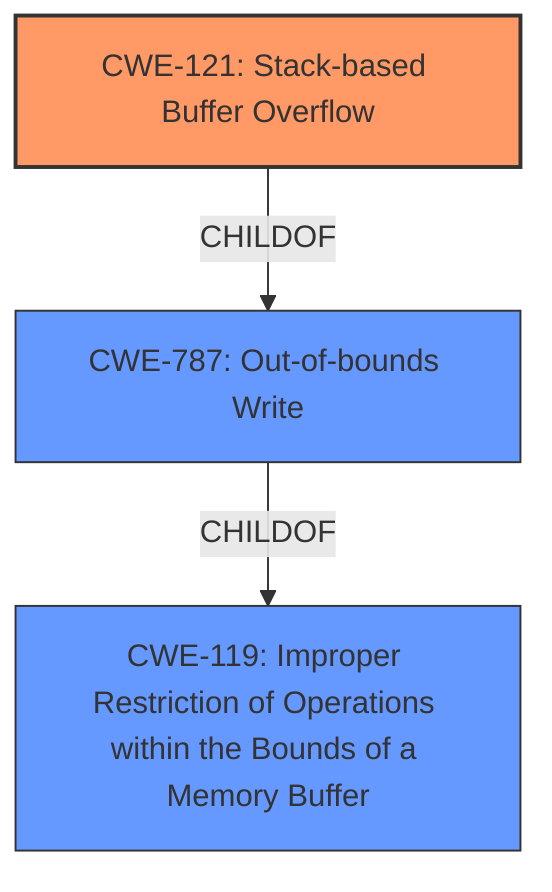

# Analysis Report for CVE-2022-29642

# Vulnerability Analysis Report: CVE-2022-29642

## Description


## Analysis (with Relationship Data)

# Summary
| CWE ID | CWE Name | Confidence | CWE Abstraction Level | CWE Vulnerability Mapping Label | CWE-Vulnerability Mapping Notes |
|---|---|---|---|---|---|
| CWE-121 | Stack-based Buffer Overflow | 1.0 | Variant | Allowed | Primary CWE |
| CWE-119 | Improper Restriction of Operations within the Bounds of a Memory Buffer | 0.7 | Class | Allowed-with-Review | Secondary Candidate |

## Evidence and Confidence

*   **Confidence Score:** 1.0
*   **Evidence Strength:** HIGH

## Relationship Analysis
The primary CWE selected is CWE-121 (Stack-based Buffer Overflow), which is a variant of CWE-787 (Out-of-bounds Write) and CWE-119 (Improper Restriction of Operations within the Bounds of a Memory Buffer). The relationship is hierarchical: CWE-121 is a specific type of buffer overflow that occurs on the stack. This specificity makes it a better fit than its more general parents. The vulnerability description clearly indicates a stack overflow, justifying the selection of CWE-121.



## Vulnerability Chain
The vulnerability chain starts with the **improper handling of the URL parameter length** within the `setUrlFilterRules` function. This leads to a **stack-based buffer overflow** because the `strcpy` function is used without proper bounds checking. The **resulting impact** is a denial of service (DoS) due to the crashing of the device/application.

## Summary of Analysis
The initial assessment and final conclusion are strongly based on the provided evidence. The "Vulnerability Description" explicitly mentions a "**stack overflow**". The "CVE Reference Links Content Summary" confirms that the `setUrlFilterRules` function "**does not properly validate the length of the 'url' parameter**" and uses `strcpy` "**without any bounds checking**", leading to a "**stack buffer overflow**". This aligns perfectly with CWE-121 (Stack-based Buffer Overflow).

The graph relationships further support this decision. CWE-121 is a variant of CWE-787 (Out-of-bounds Write), which in turn is a child of CWE-119 (Improper Restriction of Operations within the Bounds of a Memory Buffer). While CWE-787 and CWE-119 are relevant, CWE-121 is the most specific and accurate representation of the vulnerability, as it explicitly identifies the overflow occurring on the stack.

The selection of CWE-121 is at the optimal level of specificity because the evidence clearly indicates a stack-based buffer overflow, rather than a more general out-of-bounds write or memory corruption issue.

Relevant CWE Information:

# Enhanced Context (25 CWEs)
The following CWEs were identified as potentially relevant to this vulnerability:

## CWE-130: Improper Handling of Length Parameter Inconsistency
**Abstraction Level**: Base
**Similarity Score**: 0.79
**Source**: dense

**Description**:
The product parses a formatted message or structure, but it does not handle or incorrectly handles a length field that is inconsistent with the actual length of the associated data.

**Mapping Guidance**:
- Usage: Allowed
- Rationale: This CWE entry is at the Base level of abstraction, which is a preferred level of abstraction for mapping to the root causes of vulnerabilities.

## CWE-190: Integer Overflow or Wraparound
**Abstraction Level**: Base
**Similarity Score**: 6923.72
**Source**: sparse

**Description**:
The product performs a calculation that can produce an integer overflow or wraparound when the logic assumes that the resulting value will always be larger than the original value. This occurs when an integer value is incremented to a value that is too large to store in the associated representation. When this occurs, the value may become a very small or negative number.

**Mapping Guidance**:
- Usage: Allowed
- Rationale: This CWE entry is at the Base level of abstraction, which is a preferred level of abstraction for mapping to the root causes of vulnerabilities.

## CWE-259: Use of Hard-coded Password
**Abstraction Level**: variant
**Similarity Score**: 4.01
**Source**: graph

**Description**:
CWE-259: Use of Hard-coded Password

**Mapping Guidance**:
- Usage: Allowed
- Rationale: This CWE entry is at the Variant level of abstraction, which is a preferred level of abstraction for mapping to the root causes of vulnerabilities.

## CWE-770: Allocation of Resources Without Limits or Throttling
**Abstraction Level**: base
**Similarity Score**: 4.33
**Source**: graph

**Description**:
CWE-770: Allocation of Resources Without Limits or Throttling

**Mapping Guidance**:
- Usage: Allowed
- Rationale: This CWE entry is at the Base level of abstraction, which is a preferred level of abstraction for mapping to the root causes of vulnerabilities.

## CWE-78: Improper Neutralization of Special Elements used in an OS Command ('OS Command Injection')
**Abstraction Level**: Base
**Similarity Score**: 0.287
**Source**: sparse

**Description**:
The product constructs all or part of an OS command using externally-influenced input from an upstream component, but it does not neutralize or incorrectly neutralizes special elements that could modify the intended OS command when it is sent to a downstream component.

**Mapping Guidance**:
- Usage: Allowed
- Rationale: This CWE entry is at the Base level of abstraction, which is a preferred level of abstraction for mapping to the root causes of vulnerabilities.

### CWE Considerations and Rejections:

*   **CWE-130 (Improper Handling of Length Parameter Inconsistency):** While the vulnerability involves **improper handling of the URL parameter length**, the core issue is the resulting buffer overflow. CWE-130 could be considered a contributing factor, but CWE-121 directly addresses the overflow itself. Therefore, CWE-130 is not selected as the primary CWE.
*   **CWE-190 (Integer Overflow or Wraparound):** There's no evidence of integer overflow in the description; it's a straightforward buffer overflow. Therefore, CWE-190 is not applicable.
*   **CWE-259 (Use of Hard-coded Password):** This is irrelevant to the vulnerability description.
*   **CWE-770 (Allocation of Resources Without Limits or Throttling):** The issue is not related to resource allocation limits.
*   **CWE-78 (Improper Neutralization of Special Elements used in an OS Command ('OS Command Injection')):** This is not an OS command injection vulnerability. The issue is a buffer overflow due to lack of input validation.

**CWE-119 (Improper Restriction of Operations within the Bounds of a Memory Buffer):** This is a parent of the selected CWE-121, and as such could be considered a secondary candidate to capture the general class of the error. However, as we have sufficient information to specify the variant CWE-121, this is not required.


## CWE Relationship Analysis

Current CWEs represent these abstraction levels: .


### Vulnerability Chain Analysis

**Chain starting from CWE-190:**
- 190 (Integer Overflow or Wraparound) - ROOT


**Chain starting from CWE-130:**
- 130 (Improper Handling of Length Parameter Inconsistency) - ROOT


### CWE Relationship Diagram

```mermaid
graph TD
    classDef primary fill:#f96,stroke:#333,stroke-width:2px
    classDef secondary fill:#69f,stroke:#333
    classDef tertiary fill:#9e9,stroke:#333
```


*Report generated on 2025-03-31 08:34:51*
