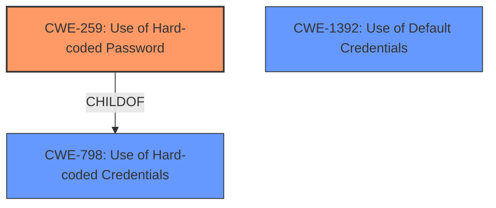

# Analysis for CVE-2022-29644

# Summary
| CWE ID | CWE Name | Confidence | CWE Abstraction Level | CWE Vulnerability Mapping Label | CWE-Vulnerability Mapping Notes |
|---|---|---|---|---|---|
| CWE-259 | Use of Hard-coded Password | 1.0 | Variant | Allowed | Primary CWE |
| CWE-798 | Use of Hard-coded Credentials | 0.8 | Base | Allowed | Secondary Candidate |
| CWE-1392 | Use of Default Credentials | 0.6 | Base | Allowed | Secondary Candidate |

## Evidence and Confidence

*   **Confidence Score:** 0.9
*   **Evidence Strength:** HIGH

## Relationship Analysis
The primary CWE is CWE-259 (Variant), which is a child of CWE-798 (Base). CWE-798 is a broader category that includes hard-coded cryptographic keys, while CWE-259 specifically focuses on hard-coded passwords. The relationship influenced the selection by choosing the more specific variant when the vulnerability is explicitly about a hard-coded password. CWE-1392 (Use of Default Credentials) was also considered but deemed less accurate because the vulnerability description specifies a *hard-coded* password, not a default one.



## Vulnerability Chain
The vulnerability chain consists of:
1.  **Root Cause:** CWE-259 (**hard coded password**) in the `/web_cste/cgi-bin/product.ini` file.
2.  **Weakness:** Insecure Telnet service enabled by default or easily activated.
3.  **Impact:** Unauthorized remote access to the router, potentially leading to full system compromise.

## Summary of Analysis
The initial analysis identified that the root cause of the vulnerability is the presence of a **hard coded password** for Telnet access. This is explicitly stated in the "Vulnerability Description Key Phrases" as "**rootcause: hard coded password**". The "CVE Reference Links Content Summary" further supports this by stating: "The root cause of the vulnerability is a hardcoded password for Telnet access found within the `/web_cste/cgi-bin/product.ini` file".

The selection of CWE-259 is primarily based on the explicit mention of a "hard-coded password." The retriever results also list CWE-259 as the top match with a high similarity score.

CWE-798 was considered as a parent, but CWE-259 is more specific and accurate. CWE-1392 was considered, but the vulnerability is specifically about a *hard-coded* password, not a *default* password, making CWE-259 the better fit.

The final decision to use CWE-259 is based on the evidence provided, the retriever results, and the hierarchical relationship analysis. The selection is at the optimal level of specificity because CWE-259 is a variant that directly addresses the use of a hard-coded password.

Relevant CWE Information:

# Enhanced Context (25 CWEs)
The following CWEs were identified as potentially relevant to this vulnerability:

## CWE-259: Use of Hard-coded Password
**Abstraction:** Variant
**Status:** Draft

### Description
The product contains a **hard-coded password**, which it uses for its own inbound authentication or for outbound communication to external components.

### Extended Description


A **hard-coded password** typically leads to a significant authentication failure that can be difficult for the system administrator to detect. Once detected, it can be difficult to fix, so the administrator may be forced into disabling the product entirely. There are two main variations:

```
		Inbound: the product contains an authentication mechanism that checks for a hard-coded password.
		Outbound: the product connects to another system or component, and it contains hard-coded password for connecting to that component.
```
In the Inbound variant, a default administration account is created, and a simple password is hard-coded into the product and associated with that account. This **hard-coded password** is the same for each installation of the product, and it usually cannot be changed or disabled by system administrators without manually modifying the program, or otherwise patching the product. If the password is ever discovered or published (a common occurrence on the Internet), then anybody with knowledge of this password can access the product. Finally, since all installations of the product will have the same password, even across different organizations, this enables massive attacks such as worms to take place.

The Outbound variant applies to front-end systems that authenticate with a back-end service. The back-end service may require a fixed password which can be easily discovered. The programmer may simply hard-code those back-end credentials into the front-end product. Any user of that program may be able to extract the password. Client-side systems with hard-coded passwords pose even more of a threat, since the extraction of a password from a binary is usually very simple.


### Alternative Terms
None

### Relationships
ChildOf -> CWE-798
ChildOf -> CWE-798
ChildOf -> CWE-798
PeerOf -> CWE-321
PeerOf -> CWE-257

### Mapping Guidance
**Usage:** Allowed
**Rationale:** This CWE entry is at the Variant level of abstraction, which is a preferred level of abstraction for mapping to the root causes of vulnerabilities.
**Comments:** Carefully read both the name and description to ensure that this mapping is an appropriate fit. Do not try to 'force' a mapping to a lower-level Base/Variant simply to comply with this preferred level of abstraction.
**Reasons:**
- Acceptable-Use


### Additional Notes
**[Maintenance]** This entry could be split into multiple variants: an inbound variant (as seen in the second demonstrative example) and an outbound variant (as seen in the first demonstrative example). These variants are likely to have different consequences, detectability, etc. More importantly, from a vulnerability theory perspective, they could be characterized as different behaviors.


### Observed Examples
- **CVE-2022-29964:** Distributed Control System (DCS) has **hard-coded passwords** for local shell access
- **CVE-2021-37555:** Telnet service for IoT feeder for dogs and cats has **hard-coded password** [REF-1288]
- **CVE-2021-35033:** Firmware for a WiFi router uses a **hard-coded password** for a BusyBox shell, allowing bypass of authentication through the UART port

## CWE-798: Use of Hard-coded Credentials
**Abstraction:** Base
**Status:** Draft

### Description
The product contains **hard-coded credentials**, such as a password or cryptographic key.

### Extended Description


There are two main variations:


  - Inbound: the product contains an authentication mechanism that checks the input credentials against a **hard-coded** set of credentials. In this variant, a default administration account is created, and a simple password is **hard-coded** into the product and associated with that account. This **hard-coded password** is the same for each installation of the product, and it usually cannot be changed or disabled by system administrators without manually modifying the program, or otherwise patching the product. It can also be difficult for the administrator to detect.

  - Outbound: the product connects to another system or component, and it contains **hard-coded credentials** for connecting to that component. This variant applies to front-end systems that authenticate with a back-end service. The back-end service may require a fixed password that can be easily discovered. The programmer may simply hard-code those back-end credentials into the front-end product.


### Alternative Terms
None

### Relationships
ChildOf -> CWE-1391
ChildOf -> CWE-287
ChildOf -> CWE-344
ChildOf -> CWE-671
PeerOf -> CWE-257

### Mapping Guidance
**Usage:** Allowed
**Rationale:** This CWE entry is at the Base level of abstraction, which is a preferred level of abstraction for mapping to the root causes of vulnerabilities.
**Comments:** Carefully read both the name and description to ensure that this mapping is an appropriate fit. Do not try to 'force' a mapping to a lower-level Base/Variant simply to comply with this preferred level of abstraction.
**Reasons:**
- Acceptable-Use


### Additional Notes
**[Maintenance]** The Taxonomy_Mappings to ISA/IEC 62443 were added in CWE 4.10, but they are still under review and might change in future CWE versions. These draft mappings were performed by members of the "Mapping CWE to 62443" subgroup of the CWE-CAPEC ICS/OT Special