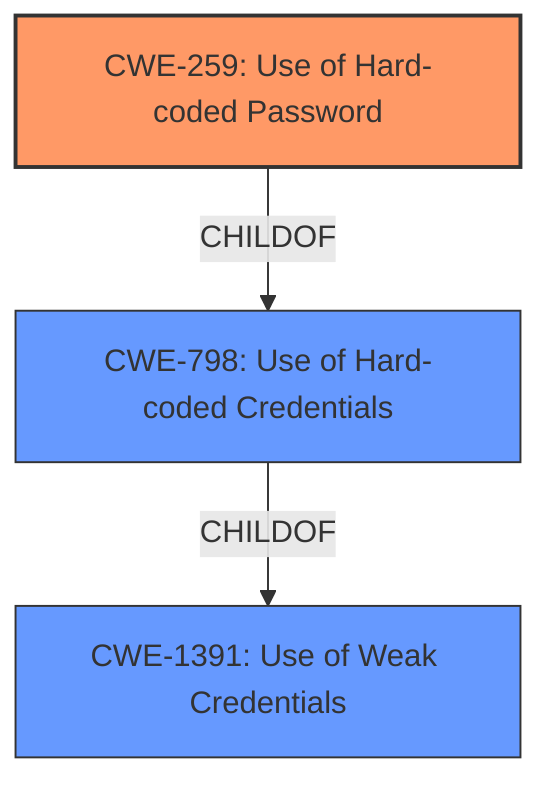

# Analysis Report for CVE-2022-29645

# Vulnerability Analysis Report: CVE-2022-29645

## Description


## Analysis (with Relationship Data)

# Summary
| CWE ID | CWE Name | Confidence | CWE Abstraction Level | CWE Vulnerability Mapping Label | CWE-Vulnerability Mapping Notes |
|---|---|---|---|---|---|
| CWE-259 | Use of Hard-coded Password | 1.0 | Variant | Allowed | Primary CWE |
| CWE-798 | Use of Hard-coded Credentials | 0.8 | Base | Allowed | Secondary Candidate |
| CWE-1391 | Use of Weak Credentials | 0.6 | Class | Allowed-with-Review | Secondary Candidate |

## Evidence and Confidence

*   **Confidence Score:** 0.9
*   **Evidence Strength:** HIGH

## Relationship Analysis
The primary relationship influencing the decision is the parent-child relationship between CWE-798 (Use of Hard-coded Credentials) and CWE-259 (Use of Hard-coded Password). CWE-259 is a variant of CWE-798, making it a more specific and accurate representation of the vulnerability. CWE-1391 (Use of Weak Credentials) is a class-level CWE that encompasses both hard-coded and default passwords, but it's less precise than CWE-259.



## Vulnerability Chain
The vulnerability chain is straightforward: a **hard coded password** exists in the `/etc/shadow.sample` file, allowing attackers to potentially gain unauthorized access to the device. The root cause is the **hard coded password**, and the impact is unauthorized access and control.

## Summary of Analysis
The analysis is based on the vulnerability description stating the TOTOLINK A3100R router firmware contains a **hard coded password** for the root user. The "CVE Reference Links Content Summary" confirms this, stating the **root cause** is the **hardcoded password**.

The retriever results also support this, with CWE-259 (Use of Hard-coded Password) and CWE-798 (Use of Hard-coded Credentials) being the top matches.

CWE-259 is chosen as the primary CWE because it is a variant-level CWE, providing more specificity than the base-level CWE-798. The vulnerability description clearly indicates a hard-coded password, not just any type of credential issue.

CWE-798 was considered and is listed as a secondary candidate because it represents the broader category of using hard-coded credentials, of which a hard-coded password is a specific case.
CWE-1391 was considered and is listed as a secondary candidate because it represents the broader category of weak credentials.

The decision is justified by the vulnerability description and supporting evidence, along with the CWE specifications and mapping guidance.

Relevant CWE Information:

# Enhanced Context (25 CWEs)

## CWE-259: Use of Hard-coded Password
**Abstraction Level**: Variant
**Similarity Score**: 7246.95
**Source**: sparse

**Description**:
The product contains a **hard-coded password**, which it uses for its own inbound authentication or for outbound communication to external components.

**Mapping Guidance**:
- Usage: Allowed
- Rationale: This CWE entry is at the Variant level of abstraction, which is a preferred level of abstraction for mapping to the root causes of vulnerabilities.

## CWE-798: Use of Hard-coded Credentials
**Abstraction Level**: Base
**Similarity Score**: 7025.48
**Source**: sparse

**Description**:
The product contains **hard-coded credentials**, such as a password or cryptographic key.

**Mapping Guidance**:
- Usage: Allowed
- Rationale: This CWE entry is at the Base level of abstraction, which is a preferred level of abstraction for mapping to the root causes of vulnerabilities.

## CWE-1391: Use of Weak Credentials
**Abstraction Level**: Class
**Similarity Score**: 6786.79
**Source**: sparse

**Description**:
The product uses **weak credentials** (such as a default key or **hard-coded password**) that can be calculated, derived, reused, or guessed by an attacker.

**Mapping Guidance**:
- Usage: Allowed-with-Review
- Rationale: This CWE entry is a Class and might have Base-level children that would be more appropriate


## CWE Relationship Analysis

Current CWEs represent these abstraction levels: .


### Vulnerability Chain Analysis

**Chain starting from CWE-259:**
- 259 (Use of Hard-coded Password) - ROOT


**Chain starting from CWE-1391:**
- 1391 (Use of Weak Credentials) - ROOT


### CWE Relationship Diagram

```mermaid
graph TD
    classDef primary fill:#f96,stroke:#333,stroke-width:2px
    classDef secondary fill:#69f,stroke:#333
    classDef tertiary fill:#9e9,stroke:#333
```


*Report generated on 2025-03-31 03:04:56*
