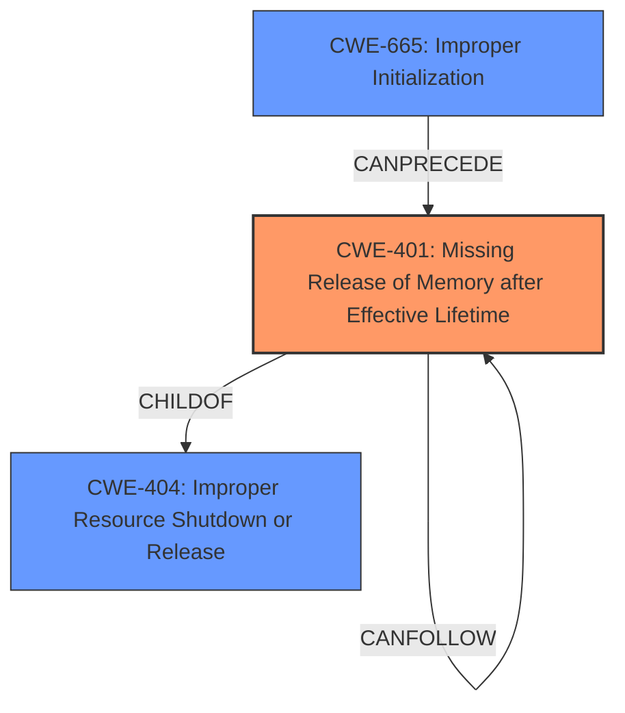

# Analysis for CVE-2022-29695

# Summary
| CWE ID | CWE Name | Confidence | CWE Abstraction Level | CWE Vulnerability Mapping Label | CWE-Vulnerability Mapping Notes |
|---|---|---|---|---|---|
| CWE-401 | Missing Release of Memory after Effective Lifetime | 0.9 | Variant | Allowed | Primary CWE |
| CWE-665 | Improper Initialization | 0.7 | Class | Discouraged | Secondary Candidate |

## Evidence and Confidence

*   **Confidence Score:** 0.8
*   **Evidence Strength:** HIGH

## Relationship Analysis
The primary CWE, CWE-401 (Missing Release of Memory after Effective Lifetime), is a variant of CWE-404 (Improper Resource Shutdown or Release). CWE-665 (Improper Initialization) is a class-level CWE, which can be a prerequisite for CWE-401 since improper initialization can lead to resources not being properly released. The hierarchical relationship between CWE-401 and CWE-404 guided the selection of the more specific variant, CWE-401, as the primary weakness.

## Vulnerability Chain
The vulnerability chain starts with an **incomplete unicorn engine initialization**, leading to a **memory leak** due to the **missing release of memory after its effective lifetime**.
  - Root Cause: Incomplete Initialization
  - Weakness: Missing Release of Memory
  - Impact: Memory Leak, Resource Exhaustion

## Summary of Analysis
The analysis is primarily based on the provided vulnerability description and the CVE Reference Links Content Summary. The vulnerability description explicitly states that the issue is a **memory leak** caused by an **incomplete unicorn engine initialization**. The CVE Reference Links Content Summary elaborates that the `uc_ctl` API, when used with an unsupported CPU architecture or mode, allocates memory during initialization but fails to release it upon `uc_close`, resulting in a memory leak.

The graph relationships influenced the selection by highlighting that CWE-401 is a variant of CWE-404, making it a more specific and appropriate choice for a memory leak due to missing resource release. CWE-665 was considered as a contributing factor due to the **incomplete initialization**, but the primary issue is the failure to release the allocated memory.

The selected CWEs are at the optimal level of specificity because CWE-401 directly addresses the **missing release of memory**, which is the core of the vulnerability. CWE-665 is a more general class and less descriptive of the actual memory leak.

Relevant CWE Information:

# Enhanced Context (25 CWEs)
The following CWEs were identified as potentially relevant to this vulnerability:

## CWE-665: Improper Initialization
**Abstraction Level**: Class
**Similarity Score**: 0.76
**Source**: dense

**Description**:
The product does not initialize or incorrectly initializes a resource, which might leave the resource in an unexpected state when it is accessed or used.

**Mapping Guidance**:
- Usage: Discouraged
- Rationale: This CWE entry is a level-1 Class (i.e., a child of a Pillar). It might have lower-level children that would be more appropriate

## CWE-401: Missing Release of Memory after Effective Lifetime
**Abstraction:** Variant

**Description:**
The product does not sufficiently track and release allocated memory after it has been used, which slowly consumes remaining memory.

**Mapping Guidance**
**Usage:** Allowed
**Rationale:** This CWE entry is at the Variant level of abstraction, which is a preferred level of abstraction for mapping to the root causes of vulnerabilities.
**Comments:** Carefully read both the name and description to ensure that this mapping is an appropriate fit. Do not try to 'force' a mapping to a lower-level Base/Variant simply to comply with this preferred level of abstraction.
**Reasons:**
- Acceptable-Use

### Detailed Analysis of Selected CWEs:

*   **CWE-401: Missing Release of Memory after Effective Lifetime**
    *   **How the vulnerability's details match the CWE's characteristics:** The vulnerability description clearly indicates that memory is allocated but not released, aligning perfectly with the definition of CWE-401. The "CVE Reference Links Content Summary" section explicitly states that when an unsupported CPU architecture or mode is specified, memory is allocated but not freed when the engine is closed.
    *   **Security implications and potential impact:** The security implication is resource exhaustion, potentially leading to a denial-of-service condition.
    *   **Parent-child relationships or chain patterns that influenced your mapping:** CWE-401 is a variant of CWE-404 (Improper Resource Shutdown or Release).
    *   **Whether the weakness is primary or secondary in the vulnerability:** This is the primary weakness.
    *   **How the official MITRE mapping guidance influenced your decision:** The MITRE mapping guidance recommends using the most specific variant when possible. Since the vulnerability is a memory leak, CWE-401 is the most appropriate choice.
    *   **Supporting Evidence:**
        *   "The vulnerability stems from incomplete initialization and resource management in the Unicorn Engine. Specifically, when the `uc_ctl` API is used to set an unsupported CPU architecture or mode, the engine allocates memory during initialization that is not subsequently released, even when `uc_close` is called, resulting in a memory leak."
        *   "**Memory Leak:** The primary vulnerability is a memory leak. If an unsupported CPU architecture or mode is specified using `uc_ctl`, memory is allocated but not freed when the engine is closed, leading to a leak."

*   **CWE-665: Improper Initialization**
    *   **How the vulnerability's details match the CWE's characteristics:** The vulnerability description mentions "incomplete unicorn engine initialization." This incomplete initialization is a contributing factor to the memory leak.
    *   **Security implications and potential impact:** Improper initialization can lead to unpredictable states and conditions, contributing to the primary vulnerability.
    *   **Parent-child relationships or chain patterns that influenced your mapping:** CWE-665 is a class-level CWE.
    *   **Whether the weakness is primary or secondary in the vulnerability:** This is a secondary weakness as it contributes to the primary weakness (CWE-401).
    *   **How the official MITRE mapping guidance influenced your decision:** The MITRE mapping guidance discourages using class-level CWEs when more specific options are available. However, it is included as a contributing factor.
    *   **Supporting Evidence:**
        *   "**rootcause:** **incomplete unicorn engine initialization**"
        *   "The vulnerability stems from **incomplete initialization** and resource management in the Unicorn Engine."

### CWEs Considered but Not Used:

*   **CWE-909: Missing Initialization of Resource**: While related to initialization, the core issue is not the missing initialization itself but the failure to release allocated memory, making CWE-401 a more accurate fit.
*   **CWE-252: Unchecked Return Value**: There's no specific mention of unchecked return values in the description, making this CWE less relevant.
*   **CWE-1284: Improper Validation of Specified Quantity in Input**: While the `uc_ctl` API could be considered to have improper input validation, the primary issue is the memory leak, not the validation itself.
*   **CWE-908: Use of Uninitialized Resource**: The issue is not about using an uninitialized resource directly, but more about the failure to release allocated memory, thus not a good fit.