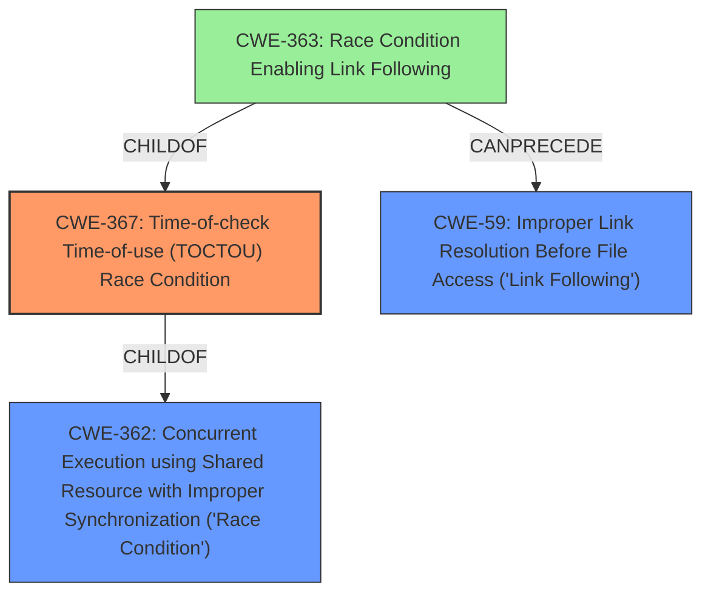

# Raw Analyzer Response for CVE-2022-29800

# Summary
| CWE ID | CWE Name | Confidence | CWE Abstraction Level | CWE Vulnerability Mapping Label | CWE-Vulnerability Mapping Notes |
|---|---|---|---|---|---|
| CWE-367 | Time-of-check Time-of-use (TOCTOU) Race Condition | 1.0 | Base | Allowed | Primary CWE |
| CWE-59 | Improper Link Resolution Before File Access ('Link Following') | 0.7 | Base | Allowed | Secondary Candidate |

## Evidence and Confidence

*   **Confidence Score:** 0.9
*   **Evidence Strength:** HIGH

## Relationship Analysis
The primary CWE, CWE-367, is a specific type of race condition that occurs when the state of a resource changes between the time it is checked and the time it is used. This is a child of CWE-362, which is a more general class of race condition. CWE-59, Improper Link Resolution Before File Access, is related to CWE-367 and can be a consequence of a TOCTOU vulnerability if an attacker replaces a legitimate file with a symbolic link during the time gap.

## Vulnerability Chain
The vulnerability chain starts with a **TOCTOU race condition** (CWE-367). In this specific case, the race condition allows an attacker to **replace scripts** that the `networkd-dispatcher` believes are owned by root with ones that are not. This can lead to **privilege escalation** and **arbitrary root code execution**. The ability to replace the scripts involves **improper link resolution** (CWE-59) if the attacker uses a symlink to point to a malicious script.

## Summary of Analysis
The initial assessment, based on the vulnerability description and key phrases, strongly points to a **time-of-check-time-of-use (TOCTOU) race condition**, which is **CWE-367**. The CVE Reference Links Content Summary provides supporting evidence by explicitly stating that the vulnerability stems from a **TOCTOU race condition** and highlights how an attacker can manipulate the file system to replace scripts.

The graph relationships show that **CWE-367** is a child of **CWE-362** (Concurrent Execution using Shared Resource with Improper Synchronization) and that **CWE-59** (Improper Link Resolution Before File Access) can be a consequence of a TOCTOU vulnerability. This indicates that while the primary issue is the race condition, the ability to exploit it involves manipulating file access.

I have selected **CWE-367** as the primary CWE because it directly reflects the root cause of the vulnerability, which is the **TOCTOU race condition**. **CWE-59** is included as a secondary CWE because the attacker exploits the race condition by replacing legitimate files with malicious symlinks, leading to improper link resolution. Both CWEs are at the Base level of abstraction, providing an appropriate level of specificity.

Relevant CWE Information:

# Enhanced Context (25 CWEs)
The following CWEs were identified as potentially relevant to this vulnerability:

## CWE-662: Improper Synchronization
**Abstraction Level**: Class
**Similarity Score**: 0.79
**Source**: dense

**Description**:
The product utilizes multiple threads or processes to allow temporary access to a shared resource that can only be exclusive to one process at a time, but it does not properly synchronize these actions, which might cause simultaneous accesses of this resource by multiple threads or processes.

**Mapping Guidance**:
- Usage: Discouraged
- Rationale: This CWE entry is a level-1 Class (i.e., a child of a Pillar). It might have lower-level children that would be more appropriate

*This CWE was considered but not selected because the vulnerability is specifically a TOCTOU race condition, which is a more specific type of synchronization issue.*

## CWE-667: Improper Locking
**Abstraction Level**: Class
**Similarity Score**: 0.79
**Source**: dense

**Description**:
The product does not properly acquire or release a lock on a resource, leading to unexpected resource state changes and behaviors.

**Mapping Guidance**:
- Usage: Allowed-with-Review
- Rationale: This CWE entry is a Class and might have Base-level children that would be more appropriate

*This CWE was considered but not selected because the vulnerability is not directly related to locking mechanisms.*

## CWE-367: Time-of-check Time-of-use (TOCTOU) Race Condition
**Abstraction Level**: Base
**Similarity Score**: 0.78
**Source**: dense

**Description**:
The product checks the state of a resource before using that resource, but the resource's state can change between the check and the use in a way that invalidates the results of the check. This can cause the product to perform invalid actions when the resource is in an unexpected state.

**Mapping Guidance**:
- Usage: Allowed
- Rationale: This CWE entry is at the Base level of abstraction, which is a preferred level of abstraction for mapping to the root causes of vulnerabilities.

*This CWE was selected as the primary CWE because it directly reflects the root cause of the vulnerability.*

## CWE-362: Concurrent Execution using Shared Resource with Improper Synchronization ('Race Condition')
**Abstraction Level**: Class
**Similarity Score**: 0.78
**Source**: dense

**Description**:
The product contains a concurrent code sequence that requires temporary, exclusive access to a shared resource, but a timing window exists in which the shared resource can be modified by another code sequence operating concurrently.

**Mapping Guidance**:
- Usage: Allowed-with-Review
- Rationale: This CWE entry is a Class and might have Base-level children that would be more appropriate

*This CWE was considered but not selected as the primary CWE because CWE-367 is a more specific type of race condition.*

## CWE-366: Race Condition within a Thread
**Abstraction Level**: Base
**Similarity Score**: 0.77
**Source**: dense

**Description**:
If two threads of execution use a resource simultaneously, there exists the possibility that resources may be used while invalid, in turn making the state of execution undefined.

**Mapping Guidance**:
- Usage: Allowed
- Rationale: This CWE entry is at the Base level of abstraction, which is a preferred level of abstraction for mapping to the root causes of vulnerabilities.

*This CWE was considered but not selected because it's more specific to multi-threaded applications and the provided context does not have enough information about that to make it a primary CWE selection.*

## CWE-59: Improper Link Resolution Before File Access ('Link Following')
**Abstraction Level**: Base
**Similarity Score**: 0.76
**Source**: dense

**Description**:
The product attempts to access a file based on the filename, but it does not properly prevent that filename from identifying a link or shortcut that resolves to an unintended resource.

**Mapping Guidance**:
- Usage: Allowed
- Rationale: This CWE entry is at the Base level of abstraction, which is a preferred level of abstraction for mapping to the root causes of vulnerabilities.

*This CWE was selected as a secondary CWE because the exploitation involves replacing legitimate files with malicious symlinks, leading to improper link resolution.*

## CWE-208: Observable Timing Discrepancy
**Abstraction Level**: Base
**Similarity Score**: 0.75
**Source**: dense

**Description**:
Two separate operations in a product require different amounts of time to complete, in a way that is observable to an actor and reveals security-relevant information about the state of the product, such as whether a particular operation was successful or not.

**Mapping Guidance**:
- Usage: Allowed
- Rationale: This CWE entry is at the Base level of abstraction, which is a preferred level of abstraction for mapping to the root causes of vulnerabilities.

*This CWE was considered but not selected because it is not directly relevant to the TOCTOU race condition.*

## CWE-404: Improper Resource Shutdown or Release
**Abstraction Level**: Class
**Similarity Score**: 0.75
**Source**: dense

**Description**:
The product does not release or incorrectly releases a resource before it is made available for re-use.

**Mapping Guidance**:
- Usage: Allowed-with-Review
- Rationale: This CWE entry is a Class and might have Base