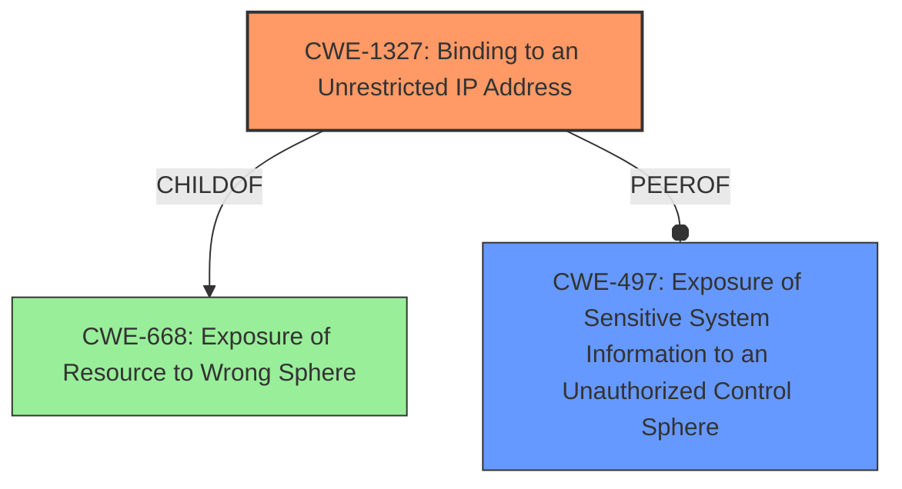

# Raw Analyzer Response for CVE-2022-29820

# Summary
| CWE ID  | CWE Name                                                        | Confidence | CWE Abstraction Level | CWE Vulnerability Mapping Label | CWE-Vulnerability Mapping Notes |
| :-------- | :-------------------------------------------------------------- | :--------- | :-------------------- | :------------------------------ | :------------------------------ |
| CWE-1327  | Binding to an Unrestricted IP Address                       | 0.9        | Base                  | Primary CWE                     | Allowed                       |
| CWE-497   | Exposure of Sensitive System Information to an Unauthorized Control Sphere | 0.6        | Base                  | Secondary Candidate             | Allowed                       |
| CWE-668   | Exposure of Resource to Wrong Sphere                          | 0.4        | Class                 | Secondary Candidate             | Discouraged                    |

## Evidence and Confidence

*   **Confidence Score:** 0.8
*   **Evidence Strength:** MEDIUM

## Relationship Analysis
The primary CWE, CWE-1327, is a child of CWE-668, indicating a more specific type of resource exposure. While CWE-668 is a broader classification, CWE-1327 is more precise in describing the vulnerability as binding to an unrestricted IP address. The analysis prioritized the most specific applicable CWE. CWE-497 is a peer which indicates that the information is system-level which might or might not be the case.

## Vulnerability Chain
The chain of events is as follows:
1.  The application **incorrectly binds to an unrestricted IP address (CWE-1327)**.
2.  This leads to the exposure of the debugger port to the internal network.
3.  Unauthorized access to the debugger port may allow attackers to perform debugging operations, potentially leading to further exploitation and **exposure of sensitive information (CWE-200)**.

## Summary of Analysis
The initial assessment focused on the **exposure** of the debugger port. The key was to identify the root cause. The retriever results pointed to several potential CWEs, but the most relevant was CWE-1327, "Binding to an Unrestricted IP Address." This CWE directly addresses the **root cause**, where the application binds to an unrestricted IP address, leading to the **exposure** of the debugger port.

The description "In JetBrains PyCharm before 2022.1 **exposure** of the debugger port to the internal network was possible" and the key phrase "**impact:** **exposure** of the debugger port to the internal network" highlight the **exposure** aspect. However, **exposure** is the impact, not the cause. The **root cause** is the **improper binding** of the debugger port. Therefore, CWE-1327 is the more appropriate choice, because it identifies the **root cause**.

CWE-497, "Exposure of Sensitive System Information to an Unauthorized Control Sphere", and CWE-668, "Exposure of Resource to Wrong Sphere", were considered but deemed less specific than CWE-1327. While the **exposure** of the debugger port does involve exposing a resource to the wrong sphere, CWE-1327 pinpoints the exact mechanism: binding to an unrestricted IP address.

The final selection is based on the provided evidence and the hierarchical relationships between the CWEs. CWE-1327 is at the optimal level of specificity, because it directly describes the **root cause** of the vulnerability.

Relevant CWE Information:

# Enhanced Context (25 CWEs)

## CWE-538: Insertion of Sensitive Information into Externally-Accessible File or Directory
**Abstraction Level**: Base
**Similarity Score**: 0.77
**Source**: dense

**Description**:
The product places sensitive information into files or directories that are accessible to actors who are allowed to have access to the files, but not to the sensitive information.

**Mapping Guidance**:
- Usage: Allowed
- Rationale: This CWE entry is at the Base level of abstraction, which is a preferred level of abstraction for mapping to the root causes of vulnerabilities.

## CWE-226: Sensitive Information in Resource Not Removed Before Reuse
**Abstraction Level**: Base
**Similarity Score**: 0.77
**Source**: dense

**Description**:
The product releases a resource such as memory or a file so that it can be made available for reuse, but it does not clear or "zeroize" the information contained in the resource before the product performs a critical state transition or makes the resource available for reuse by other entities.

**Mapping Guidance**:
- Usage: Allowed
- Rationale: This CWE entry is at the Base level of abstraction, which is a preferred level of abstraction for mapping to the root causes of vulnerabilities.

## CWE-497: Exposure of Sensitive System Information to an Unauthorized Control Sphere
**Abstraction Level**: Base
**Similarity Score**: 0.76
**Source**: dense

**Description**:
The product does not properly prevent sensitive system-level information from being accessed by unauthorized actors who do not have the same level of access to the underlying system as the product does.

**Mapping Guidance**:
- Usage: Allowed
- Rationale: This CWE entry is at the Base level of abstraction, which is a preferred level of abstraction for mapping to the root causes of vulnerabilities.

## CWE-807: Reliance on Untrusted Inputs in a Security Decision
**Abstraction Level**: Base
**Similarity Score**: 0.76
**Source**: dense

**Description**:
The product uses a protection mechanism that relies on the existence or values of an input, but the input can be modified by an untrusted actor in a way that bypasses the protection mechanism.

**Mapping Guidance**:
- Usage: Allowed
- Rationale: This CWE entry is at the Base level of abstraction, which is a preferred level of abstraction for mapping to the root causes of vulnerabilities.

## CWE-668: Exposure of Resource to Wrong Sphere
**Abstraction Level**: Class
**Similarity Score**: 0.75
**Source**: dense

**Description**:
The product exposes a resource to the wrong control sphere, providing unintended actors with inappropriate access to the resource.

**Mapping Guidance**:
- Usage: Discouraged
- Rationale: CWE-668 is high-level and is often misused as a catch-all when lower-level CWE IDs might be applicable. It is sometimes used for low-information vulnerability reports [REF-1287]. It is a level-1 Class (i.e., a child of a Pillar). It is not useful for trend analysis.

## CWE-213: Exposure of Sensitive Information Due to Incompatible Policies
**Abstraction Level**: Base
**Similarity Score**: 0.75
**Source**: dense

**Description**:
The product's intended functionality exposes information to certain actors in accordance with the developer's security policy, but this information is regarded as sensitive according to the intended security policies of other stakeholders such as the product's administrator, users, or others whose information is being processed.

**Mapping Guidance**:
- Usage: Allowed
- Rationale: This CWE entry is at the Base level of abstraction, which is a preferred level of abstraction for mapping to the root causes of vulnerabilities.

## CWE-200: Exposure of Sensitive Information to an Unauthorized Actor
**Abstraction Level**: Class
**Similarity Score**: 0.75
**Source**: dense

**Description**:
The product exposes sensitive information to an actor that is not explicitly authorized to have access to that information.

**Mapping Guidance**:
- Usage: Discouraged
- Rationale: CWE-200 is commonly misused to represent the loss of confidentiality in a vulnerability, but confidentiality loss is a technical impact - not a root cause error. As of CWE 4.9, over 400 CWE entries can lead to a loss of confidentiality. Other options are often available. [REF-1287].

## CWE-319: Cleartext Transmission of Sensitive Information
**Abstraction Level**: Base
**Similarity Score**: 0.75
**Source**: dense

**Description**:
The product transmits sensitive or security-critical data in cleartext in a communication channel that can be sniffed by unauthorized actors.

**Mapping Guidance**:
- Usage: Allowed
- Rationale: This CWE entry is at the Base level of abstraction, which is a preferred level of abstraction for mapping to the root causes of vulnerabilities.

## CWE-552: Files or Directories Accessible to External Parties
**Abstraction Level**: Base
**Similarity Score**: 0.74
**Source**: dense

**Description**:
The product makes files or directories accessible to unauthorized actors, even though they should not be.

**Mapping