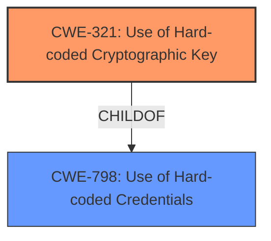

# Enhanced Analysis for CVE-2022-29830

# Summary
| CWE ID | CWE Name | Confidence | CWE Abstraction Level | CWE Vulnerability Mapping Label | CWE-Vulnerability Mapping Notes |
|---|---|---|---|---|---|
| CWE-321 | Use of Hard-coded Cryptographic Key | 1.0 | Variant | Allowed | Primary CWE |
| CWE-798 | Use of Hard-coded Credentials | 0.7 | Base | Allowed | Secondary Candidate |

## Evidence and Confidence

*   **Confidence Score:** 1.0
*   **Evidence Strength:** HIGH

## Relationship Analysis
The primary CWE is CWE-321, which is a variant of the base CWE-798. This indicates a clear hierarchical relationship where CWE-321 is a specific type of CWE-798. The relationship influences the selection by ensuring the most specific and accurate representation of the vulnerability is chosen.



## Vulnerability Chain
The vulnerability chain consists of a **hard-coded cryptographic key** (CWE-321) leading to the potential **disclosure or tampering of sensitive information**. The root cause is the hard-coded key, while the impact is information disclosure and tampering.

## Summary of Analysis
The initial analysis clearly points to the use of a **hard-coded cryptographic key** as the root cause of the vulnerability, as stated in the "Vulnerability Description Key Phrases" section. The "CVE Reference Links Content Summary" section explicitly mentions "**Root Cause of Vulnerability: Use of a hard-coded cryptographic key**" and "**Weaknesses/Vulnerabilities Present: Hard-coded cryptographic key (CWE-321) is used within the software**".

CWE-321 is the optimal level of specificity because it accurately reflects the use of a cryptographic key, as opposed to a more generic credential like a password. The evidence directly supports this classification, and the MITRE mapping guidance allows for the use of Variant-level CWEs.

CWE-798 was considered but selected as a secondary candidate since it is a more general case of **hard-coded credentials**. While applicable, it does not provide the specificity of CWE-321.

Relevant CWE Information:

# Enhanced Context (25 CWEs)

## CWE-321: Use of Hard-coded Cryptographic Key
**Abstraction Level**: Variant
**Similarity Score**: 6061.90
**Source**: sparse

**Description**:
The use of a **hard-coded cryptographic key** significantly increases the possibility that encrypted data may be recovered.

**Mapping Guidance**:
- Usage: Allowed
- Rationale: This CWE entry is at the Variant level of abstraction, which is a preferred level of abstraction for mapping to the root causes of vulnerabilities.

**Relationships**:
- CANFOLLOW -> CWE-656
- CHILDOF -> CWE-798

## CWE-798: Use of Hard-coded Credentials
**Abstraction Level**: Base
**Similarity Score**: 2.50
**Source**: graph

**Description**:
The product contains **hard-coded credentials**, such as a password or cryptographic key.

**Mapping Guidance**:
- Usage: Allowed
- Rationale: This CWE entry is at the Base level of abstraction, which is a preferred level of abstraction for mapping to the root causes of vulnerabilities.

**Relationships**:
- PARENTOF -> CWE-321
- CHILDOF -> CWE-671
- CHILDOF -> CWE-344


## CWE Relationship Analysis

Current CWEs represent these abstraction levels: .


### Vulnerability Chain Analysis

**Chain starting from CWE-671:**
- 671 (Lack of Administrator Control over Security) - ROOT


**Chain starting from CWE-344:**
- 344 (Use of Invariant Value in Dynamically Changing Context) - ROOT


### CWE Relationship Diagram

```mermaid
graph TD
    classDef primary fill:#f96,stroke:#333,stroke-width:2px
    classDef secondary fill:#69f,stroke:#333
    classDef tertiary fill:#9e9,stroke:#333
```