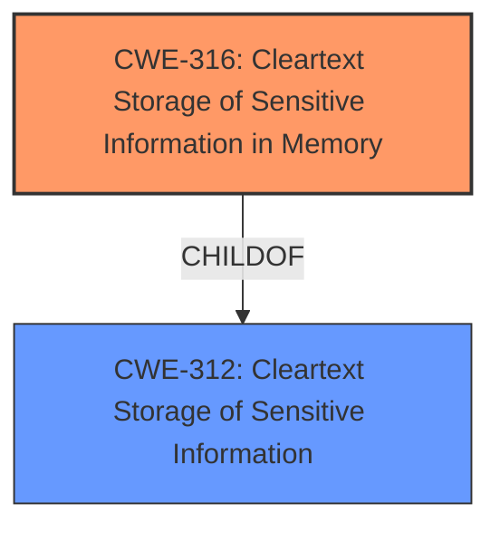

# Raw Analyzer Response for CVE-2022-29832

# Summary
| CWE ID | CWE Name | Confidence | CWE Abstraction Level | CWE Vulnerability Mapping Label | CWE-Vulnerability Mapping Notes |
|---|---|---|---|---|---|
| CWE-316 | Cleartext Storage of Sensitive Information in Memory | 1.0 | Variant | Allowed | Primary CWE |

## Evidence and Confidence

*   **Confidence Score:** 1.0
*   **Evidence Strength:** HIGH

## Relationship Analysis
The primary relationship that influenced the selection of CWE-316 is its parent relationship to CWE-312 (Cleartext Storage of Sensitive Information). Since the vulnerability description specifically mentions that the sensitive information is stored in memory, CWE-316, a variant of CWE-312, becomes a more precise and appropriate classification. The abstraction level of CWE-316 (Variant) is also preferred for vulnerability mapping.

## Vulnerability Chain
The vulnerability chain starts with the **root cause** of **cleartext storage of sensitive information in memory**. This leads directly to the **impact** of potential disclosure of sensitive project file information to remote unauthenticated attackers.

## Summary of Analysis
The initial analysis focused on identifying the **root cause** of the vulnerability, which is the **cleartext storage of sensitive information in memory**. The **Vulnerability Description Key Phrases** and **CVE Reference Links Content Summary** sections both explicitly mention this. The **Retriever Results** also listed CWE-316 (Cleartext Storage of Sensitive Information in Memory) as the top match.

The analysis considered the relationships between CWEs. Specifically, CWE-316 is a variant of CWE-312 (Cleartext Storage of Sensitive Information). Since the vulnerability clearly states that the information is stored in *memory*, the more specific variant CWE-316 was chosen over the base CWE-312.

The MITRE mapping guidance for CWE-316 indicates that its usage is "Allowed" and that it is at the preferred "Variant" level of abstraction. This further supports the selection of CWE-316 as the primary CWE.

The selected CWE is at the optimal level of specificity because it accurately reflects the **root cause** of the vulnerability (storage of sensitive information in memory without encryption) and aligns with the available evidence.

Relevant CWE Information:

# Enhanced Context (25 CWEs)

## CWE-312: Cleartext Storage of Sensitive Information
**Abstraction Level**: Base
**Similarity Score**: 0.79
**Source**: dense

**Description**:
The product stores sensitive information in cleartext within a resource that might be accessible to another control sphere.

**Mapping Guidance**:
- Usage: Allowed
- Rationale: This CWE entry is at the Base level of abstraction, which is a preferred level of abstraction for mapping to the root causes of vulnerabilities.

## CWE-316: Cleartext Storage of Sensitive Information in Memory
**Abstraction:** Variant
**Status:** Draft

### Description
The product stores sensitive information in cleartext in memory.

### Extended Description
The sensitive memory might be saved to disk, stored in a core dump, or remain uncleared if the product crashes, or if the programmer does not properly clear the memory before freeing it.

### Mapping Guidance
**Usage:** Allowed
**Rationale:** This CWE entry is at the Variant level of abstraction, which is a preferred level of abstraction for mapping to the root causes of vulnerabilities.

### Observed Examples
- **CVE-2001-1517:** Sensitive authentication information in cleartext in memory.
- **CVE-2001-0984:** Password protector leaves passwords in memory when window is minimized, even when "clear password when minimized" is set.
- **CVE-2003-0291:** SSH client does not clear credentials from memory.