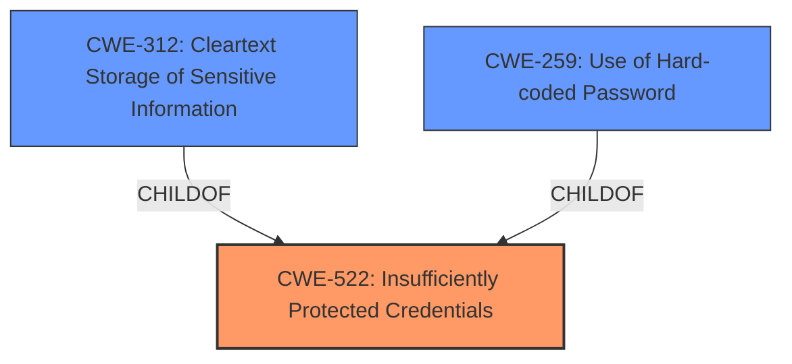

# Analysis Report for CVE-2022-29833

# Vulnerability Analysis Report: CVE-2022-29833

## Description


## Analysis (with Relationship Data)

# Summary
| CWE ID | CWE Name | Confidence | CWE Abstraction Level | CWE Vulnerability Mapping Label | CWE-Vulnerability Mapping Notes |
|---|---|---|---|---|---|
| CWE-522 | Insufficiently Protected Credentials | 0.9 | Class | Allowed-with-Review | Primary CWE |
| CWE-312 | Cleartext Storage of Sensitive Information | 0.6 | Base | Allowed | Secondary Candidate |
| CWE-259 | Use of Hard-coded Password | 0.5 | Variant | Allowed | Secondary Candidate |

## Evidence and Confidence

*   **Confidence Score:** 0.9
*   **Evidence Strength:** HIGH

## Relationship Analysis
The primary CWE, CWE-522 (Insufficiently Protected Credentials), is a class-level CWE. The analysis considered its children, specifically CWE-312 (Cleartext Storage of Sensitive Information) and CWE-259 (Use of Hard-coded Password), to determine if a more specific classification was appropriate. While the description indicates that credentials are **insufficiently protected**, lacking detail on *how* they are protected, it is not explicit that they are stored in cleartext (CWE-312) or that a hard-coded password (CWE-259) is being used. Therefore, due to the insufficient evidence of the specific weaknesses, the class-level CWE-522 is the most appropriate.



## Vulnerability Chain
The vulnerability chain begins with the **insufficiently protected credentials** (CWE-522), which allows a remote unauthenticated attacker to **disclose sensitive information**. This leads to the impact of unauthenticated users gaining access to MELSEC safety CPU modules illegally.

## Summary of Analysis
The initial analysis focused on identifying the root cause of the vulnerability. The vulnerability description and CVE reference links clearly state that the root cause is **insufficiently protected credentials**.

The Retriever Results also suggest CWE-522 (Insufficiently Protected Credentials), however, it is a Class-level CWE, prompting a review of its more specific children. Based on the provided information, it is unclear whether the credentials are in cleartext (CWE-312) or hard-coded (CWE-259). The evidence does not support a more specific CWE, so the Class-level CWE-522 is the most appropriate.

Relevant CWE Information:
- **CWE-522 (Insufficiently Protected Credentials):** The product transmits or stores authentication credentials, but it uses an insecure method that is susceptible to unauthorized interception and/or retrieval. The vulnerability description indicates that the credentials are **insufficiently protected**, which aligns with this CWE.
- **CWE-312 (Cleartext Storage of Sensitive Information):** The product stores sensitive information in cleartext within a resource that might be accessible to another control sphere. This was considered because **insufficiently protected credentials** could mean they are stored in cleartext. However, the description does not explicitly state this, so it is a secondary candidate.
- **CWE-259 (Use of Hard-coded Password):** The product contains a hard-coded password, which it uses for its own inbound authentication or for outbound communication to external components. This was also considered because **insufficiently protected credentials** could mean a hard-coded password is being used. However, the description does not explicitly state this, so it is a secondary candidate.

Other CWEs Considered and Rejected:

*   **CWE-316 (Cleartext Storage of Sensitive Information in Memory):** While this is a more specific variant of CWE-312, there is no evidence to suggest that the sensitive information is specifically stored in memory.
*   **CWE-321 (Use of Hard-coded Cryptographic Key):** This is similar to CWE-259, but specifically for cryptographic keys. The description doesn't specify keys are involved, so it is not a good fit.
*   **CWE-337 (Predictable Seed in Pseudo-Random Number Generator (PRNG)):** This CWE is related to weak random number generation, which is not relevant to the vulnerability description.
*   **CWE-836 (Use of Password Hash Instead of Password for Authentication):** This CWE relates to using password hashes improperly, but the vulnerability description does not mention password hashes, so it is not a good fit.
*   **CWE-257 (Storing Passwords in a Recoverable Format):** While related to credential protection, the description doesn't state that passwords are being stored in a recoverable format, making it a less suitable choice than CWE-522.
*   **CWE-328 (Use of Weak Hash):** This CWE relates to the use of weak hashing algorithms, but the vulnerability description does not mention hashing, so it is not a good fit.
*   **CWE-130 (Improper Handling of Length Parameter Inconsistency):** This CWE relates to inconsistent length parameters in message parsing, which is not relevant to the vulnerability description.
*   **CWE-294 (Authentication Bypass by Capture-replay):** This CWE relates to replay attacks, which is not mentioned in the vulnerability description.
*   **CWE-798 (Use of Hard-coded Credentials):** This is a broader category that encompasses CWE-259 and CWE-321. Since the description doesn't specify passwords or keys, it is too general.
*   **CWE-916 (Use of Password Hash With Insufficient Computational Effort):** This is another CWE related to password hashing, but as the vulnerability description does not mention hashing, this is not a good fit.
*   **CWE-1391 (Use of Weak Credentials):** This is a class-level CWE, and CWE-522 is a more specific child of this CWE.

The selection of CWE-522 is at the optimal level of specificity given the available evidence. While more specific CWEs exist, the provided information does not contain the necessary details to justify their use.


## CWE Relationship Analysis

Current CWEs represent these abstraction levels: .


### Vulnerability Chain Analysis

**Chain starting from CWE-916:**
- 916 (Use of Password Hash With Insufficient Computational Effort) - ROOT


**Chain starting from CWE-321:**
- 321 (Use of Hard-coded Cryptographic Key) - ROOT


### CWE Relationship Diagram

```mermaid
graph TD
    classDef primary fill:#f96,stroke:#333,stroke-width:2px
    classDef secondary fill:#69f,stroke:#333
    classDef tertiary fill:#9e9,stroke:#333
```


*Report generated on 2025-03-31 00:00:21*
