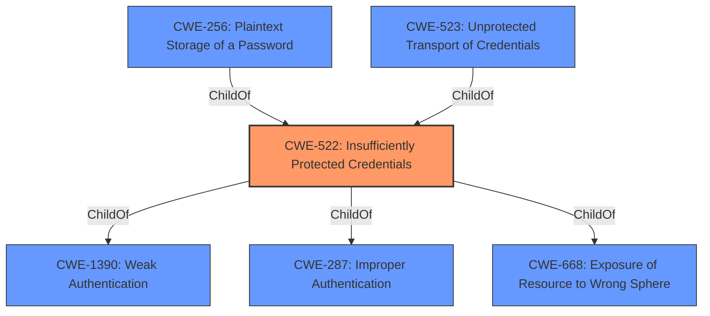

# Analysis Report for CVE-2022-29839

# Vulnerability Analysis Report: CVE-2022-29839

## Description


## Analysis (with Relationship Data)

# Summary
| CWE ID | CWE Name | Confidence | CWE Abstraction Level | CWE Vulnerability Mapping Label | CWE-Vulnerability Mapping Notes |
|---|---|---|---|---|---|
| CWE-522 | Insufficiently Protected Credentials | 1.0 | Class | Primary | Allowed-with-Review |
| CWE-256 | Plaintext Storage of a Password | 0.7 | Base | Secondary | Allowed |
| CWE-523 | Unprotected Transport of Credentials | 0.6 | Base | Secondary | Allowed |

## Evidence and Confidence

*   **Confidence Score:** 0.8
*   **Evidence Strength:** HIGH

## Relationship Analysis
The primary CWE, CWE-522 [CWE-522: Insufficiently Protected Credentials], is a Class-level CWE. It is a child of CWE-1390 [CWE-1390: Weak Authentication], CWE-287 [CWE-287: Improper Authentication], and CWE-668 [CWE-668: Exposure of Resource to Wrong Sphere]. These relationships show that insufficient protection of credentials can stem from broader authentication or resource exposure issues. CWE-256 [CWE-256: Plaintext Storage of a Password] and CWE-523 [CWE-523: Unprotected Transport of Credentials] are Base-level CWEs and children of CWE-522 [CWE-522: Insufficiently Protected Credentials]. They represent specific ways in which credentials can be insufficiently protected.



## Vulnerability Chain
The vulnerability chain starts with **Insufficiently Protected Credentials**, leading to potential access of protected data by an attacker who gains access to the relevant endpoint.

## Summary of Analysis
The initial assessment identified CWE-522 [CWE-522: Insufficiently Protected Credentials] as the primary weakness. The evidence supporting this is: "**Insufficiently Protected Credentials** vulnerability in the remote backups application on Western Digital My Cloud devices that could allow an attacker who has gained access to a relevant endpoint to use that information to access protected data." The "CVE Reference Links Content Summary" section further confirms this by stating that the "**root cause of vulnerability**" is "**Insufficient protection of credentials** in the Remote Backups application" and that "**Credentials** for the remote backups application are **not encrypted**."

Given that the credentials are not encrypted, CWE-256 [CWE-256: Plaintext Storage of a Password] was considered as a candidate to further classify the vulnerability. Because it is unclear whether the credentials were in transit or at rest, I selected both CWE-256 [CWE-256: Plaintext Storage of a Password] and CWE-523 [CWE-523: Unprotected Transport of Credentials] as secondary mappings.

CWE-522 [CWE-522: Insufficiently Protected Credentials] is at the optimal level of specificity because it directly describes the **weakness** identified in the vulnerability description. The evidence supports this, and while more specific details about the nature of the insufficient protection could further refine the mapping, the provided information is best captured by CWE-522 [CWE-522: Insufficiently Protected Credentials], CWE-256 [CWE-256: Plaintext Storage of a Password], and CWE-523 [CWE-523: Unprotected Transport of Credentials].

**CWEs Considered but Not Used:**

*   **CWE-22 [CWE-22: Improper Limitation of a Pathname to a Restricted Directory ('Path Traversal')]**: While listed in the Retriever Results, this CWE is not relevant as the vulnerability is about credential protection, not path manipulation.
*   **CWE-668 [CWE-668: Exposure of Resource to Wrong Sphere]**: While a parent of CWE-522 [CWE-522: Insufficiently Protected Credentials], it's too high-level and doesn't specifically address the credential protection issue.
*   **CWE-287 [CWE-287: Improper Authentication]**: Also a parent of CWE-522 [CWE-522: Insufficiently Protected Credentials], it's too broad as the issue is not about failing to authenticate but about **insufficiently protecting** existing credentials.
*   **CWE-306 [CWE-306: Missing Authentication for Critical Function]**: Not relevant as the vulnerability is about **insufficiently protected credentials**, not a complete lack of authentication.
*   **CWE-73 [CWE-73: External Control of File Name or Path]**: Not relevant because the vulnerability is about credential protection, not external control of file paths.
*   **CWE-697 [CWE-697: Incorrect Comparison]**: This CWE is not relevant as the vulnerability is not related to incorrect comparisons.
*   **CWE-1289 [CWE-1289: Improper Validation of Unsafe Equivalence in Input]**: Not relevant because the vulnerability is about credential protection, not input validation.
*   **CWE-1391 [CWE-1391: Use of Weak Credentials]**: While related to credentials, the primary issue is not the **weakness** of the credentials themselves but their **insufficient protection**.
*   **CWE-1390 [CWE-1390: Weak Authentication]**: While related to authentication, it's too broad. The issue is not a **weak** authentication mechanism but **insufficient protection** of the credentials used in that mechanism.
*   **CWE-41 [CWE-41: Improper Resolution of Path Equivalence]**: Not relevant as the vulnerability is not about path equivalence issues.
*   **CWE-807 [CWE-807: Reliance on Untrusted Inputs in a Security Decision]**: Not relevant as the vulnerability is not about security decisions based on untrusted inputs.
*   **CWE-682 [CWE-682: Incorrect Calculation]**: Not relevant as the vulnerability is not about incorrect calculations.
*   **CWE-204 [CWE-204: Observable Response Discrepancy]**: Not relevant as the vulnerability is not about observable response discrepancies.
*   **CWE-23 [CWE-23: Relative Path Traversal]**: Not relevant as the vulnerability is about credential protection, not path traversal.
*   **CWE-639 [CWE-639: Authorization Bypass Through User-Controlled Key]**: Not relevant as the vulnerability is not about authorization bypass through user-controlled keys.
*   **CWE-434 [CWE-434: Unrestricted Upload of File with Dangerous Type]**: Not relevant as the vulnerability is about credential protection, not file uploads.
*   **CWE-184 [CWE-184: Incomplete List of Disallowed Inputs]**: Not relevant as the vulnerability is about credential protection, not input validation.
*   **CWE-98 [CWE-98: Improper Control of Filename for Include/Require Statement in PHP Program ('PHP Remote File Inclusion')]**: Not relevant as the vulnerability is about credential protection, not PHP file inclusion.
*   **CWE-178 [CWE-178: Improper Handling of Case Sensitivity]**: Not relevant as the vulnerability is not about case sensitivity issues.
*   **CWE-843 [CWE-843: Access of Resource Using Incompatible Type ('Type Confusion')]**: Not relevant as the vulnerability is not about type confusion.
*   **CWE-113 [CWE-113: Improper Neutralization of CRLF Sequences in HTTP Headers ('HTTP Request/Response Splitting')]**: Not relevant as the vulnerability is not about HTTP request/response splitting.


## CWE Relationship Analysis

Current CWEs represent these abstraction levels: .


### Vulnerability Chain Analysis

**Chain starting from CWE-41:**
- 41 (Improper Resolution of Path Equivalence) - ROOT


**Chain starting from CWE-522:**
- 522 (Insufficiently Protected Credentials) - ROOT


### CWE Relationship Diagram

```mermaid
graph TD
    classDef primary fill:#f96,stroke:#333,stroke-width:2px
    classDef secondary fill:#69f,stroke:#333
    classDef tertiary fill:#9e9,stroke:#333
```


*Report generated on 2025-03-30 14:30:39*
