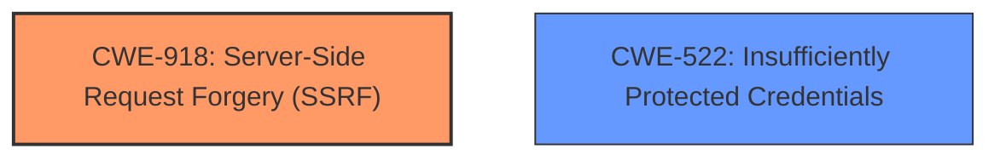

# Analysis Report for CVE-2022-29847

# Vulnerability Analysis Report: CVE-2022-29847

## Description


## Analysis (with Relationship Data)

# Summary
| CWE ID | CWE Name | Confidence | CWE Abstraction Level | CWE Vulnerability Mapping Label | CWE-Vulnerability Mapping Notes |
|---|---|---|---|---|---|
| CWE-918 | Server-Side Request Forgery (SSRF) | 0.7 | Base | Allowed | Primary CWE |
| CWE-522 | Insufficiently Protected Credentials | 0.5 | Class | Allowed-with-Review | Secondary Candidate |

## Evidence and Confidence

*   **Confidence Score:** 0.7
*   **Evidence Strength:** LOW

## Relationship Analysis
The primary relationship that influenced the selection of CWE-918 is its direct relevance to the vulnerability description. The vulnerability allows an unauthenticated attacker to invoke an API transaction to relay encrypted credentials to an arbitrary host, which aligns with the core concept of SSRF where the server is tricked into making a request to an unintended destination. While CWE-522 is also considered due to the involvement of credentials, SSRF is a more precise fit for the **root cause** of this vulnerability.



## Vulnerability Chain
The vulnerability chain starts with the lack of proper validation within the API transaction, leading to the SSRF. The SSRF then allows the attacker to potentially steal or misuse encrypted user credentials.

Root Cause: **Improper validation** within the API transaction -> Weakness: Server-Side Request Forgery (CWE-918) -> Impact: Potential relay of encrypted user credentials.

## Summary of Analysis
The initial assessment identified CWE-918 (Server-Side Request Forgery) as the primary candidate due to the API's ability to relay encrypted credentials to an arbitrary host. The description "unauthenticated attacker to invoke an API transaction that would allow them to relay encrypted WhatsUp Gold user credentials to an arbitrary host" strongly suggests that the server can be tricked into making a request to an unintended destination.

CWE-522 (Insufficiently Protected Credentials) was considered because the relayed information includes encrypted user credentials. However, the **root cause** isn't directly related to how the credentials are protected in transit or storage but rather to the SSRF vulnerability allowing the relay in the first place.

The selection of CWE-918 is based on the vulnerability description indicating a clear SSRF scenario. The evidence strength is LOW due to the absence of content in the "CVE Reference Links Content Summary" section. Therefore, the confidence score is 0.7.

Relevant CWE Information:

# Enhanced Context (25 CWEs)
The following CWEs were identified as potentially relevant to this vulnerability:

## CWE-74: Improper Neutralization of Special Elements in Output Used by a Downstream Component ('Injection')
**Abstraction Level**: Class
**Similarity Score**: 0.79
**Source**: dense

**Description**:
The product constructs all or part of a command, data structure, or record using externally-influenced input from an upstream component, but it does not neutralize or incorrectly neutralizes special elements that could modify how it is parsed or interpreted when it is sent to a downstream component.

**Mapping Guidance**:
- Usage: Discouraged
- Rationale: CWE-74 is high-level and often misused when lower-level weaknesses are more appropriate.

## CWE-918: Server-Side Request Forgery (SSRF)
**Abstraction Level**: Base
**Similarity Score**: 4848.88
**Source**: sparse

**Description**:
The web server receives a URL or similar request from an upstream component and retrieves the contents of this URL, but it does not sufficiently ensure that the request is being sent to the expected destination.

**Mapping Guidance**:
- Usage: Allowed
- Rationale: This CWE entry is at the Base level of abstraction, which is a preferred level of abstraction for mapping to the root causes of vulnerabilities.

## CWE-522: Insufficiently Protected Credentials
**Abstraction Level**: Class
**Similarity Score**: 4755.63
**Source**: sparse

**Description**:
The product transmits or stores authentication credentials, but it uses an insecure method that is susceptible to unauthorized interception and/or retrieval.

**Mapping Guidance**:
- Usage: Allowed-with-Review
- Rationale: This CWE entry is a Class and might have Base-level children that would be more appropriate.

## CWE-918: Server-Side Request Forgery (SSRF)
* Technical Explanation: The vulnerability allows an unauthenticated attacker to invoke an API transaction, causing the server to relay encrypted WhatsUp Gold user credentials to an arbitrary host. This matches the description of CWE-918, where a server receives a request (in this case, via an API) and retrieves content from a potentially unintended destination (the arbitrary host).
* Security Implications: An attacker could use this vulnerability to intercept and potentially decrypt sensitive user credentials, leading to unauthorized access to the WhatsUp Gold system.
* Relationship Analysis: CWE-918 is a Base-level CWE, making it a good fit for the **root cause** of this vulnerability.
* Mapping Guidance: The MITRE mapping guidance allows the usage of CWE-918, as it is at the Base level of abstraction.
* Why Not Other CWEs: Other CWEs like CWE-74 (Improper Neutralization of Special Elements in Output Used by a Downstream Component) were considered but deemed less relevant. While injection might be involved, the primary issue is that the server is being tricked into making requests to arbitrary hosts, which is the core of SSRF.

## CWE-522: Insufficiently Protected Credentials
* Technical Explanation: The vulnerability results in the relay of encrypted user credentials, which suggests the credentials may not be sufficiently protected during transmission. This aligns with CWE-522, which covers scenarios where credentials are transmitted or stored using insecure methods.
* Security Implications: If the encryption used for the credentials is weak or the transmission channel is not secure, an attacker could potentially intercept and decrypt the credentials.
* Relationship Analysis: CWE-522 is a Class-level CWE, and more specific Base or Variant-level CWEs might be more appropriate if more details about the credential protection mechanism were available.
* Mapping Guidance: The MITRE mapping guidance suggests reviewing children of CWE-522 for a better fit, which could not be done without more information.
* Why it is a secondary candidate: While credentials are involved, the **root cause** is the SSRF that enables the relay of the credentials, making CWE-918 the more accurate primary mapping.


## CWE Relationship Analysis

Current CWEs represent these abstraction levels: .


### Vulnerability Chain Analysis

**Chain starting from CWE-522:**
- 522 (Insufficiently Protected Credentials) - ROOT


**Chain starting from CWE-918:**
- 918 (Server-Side Request Forgery (SSRF)) - ROOT


### CWE Relationship Diagram

```mermaid
graph TD
    classDef primary fill:#f96,stroke:#333,stroke-width:2px
    classDef secondary fill:#69f,stroke:#333
    classDef tertiary fill:#9e9,stroke:#333
```


*Report generated on 2025-03-30 22:29:43*
