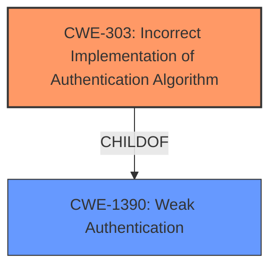

# Analysis for CVE-2022-29865

# Summary
| CWE ID | CWE Name | Confidence | CWE Abstraction Level | CWE Vulnerability Mapping Label | CWE-Vulnerability Mapping Notes |
|---|---|---|---|---|---|
| CWE-303 | Incorrect Implementation of Authentication Algorithm | 1.0 | Base | Primary | Allowed |
| CWE-1390 | Weak Authentication | 0.7 | Class | Secondary | Allowed-with-Review |

## Evidence and Confidence

*   **Confidence Score:** 0.9
*   **Evidence Strength:** HIGH

## Relationship Analysis
The primary CWE is CWE-303, a Base level weakness describing an incorrect implementation of an authentication algorithm. CWE-303 is a child of the Class level CWE-1390, Weak Authentication. CWE-1390 is a more general category, while CWE-303 pinpoints the specific flaw.

## Vulnerability Chain
The vulnerability chain begins with the **incorrect implementation of the authentication algorithm** (CWE-303). This leads to a **bypass of the application authentication check**, allowing a remote attacker to connect with crafted fake credentials. The impact is unauthorized access, potentially leading to data compromise or system manipulation.

## Summary of Analysis
The initial assessment identified CWE-303 as the primary root cause due to the **incorrect implementation of the authentication algorithm**. The vulnerability description states that a remote attacker can **bypass the application authentication check** using crafted fake credentials. The CVE Reference Links Content Summary explicitly mentions "Incorrect Implementation of Authentication Algorithm (CWE-303)" and "Bypass of application authentication mechanism."

The retriever results also listed CWE-303 as the top candidate with a high score. The CWE description precisely matches the vulnerability's root cause.

CWE-1390, Weak Authentication, was considered as a secondary CWE since the **incorrect implementation** leads to a weakened authentication process. However, CWE-303 provides a more specific and accurate representation of the vulnerability's root cause.

The final decision to use CWE-303 as the primary CWE is based on the direct evidence from the vulnerability description, CVE reference links, retriever results, and the CWE's precise match to the root cause. CWE-303 is at the optimal level of specificity (Base) as it accurately captures the **incorrect implementation of the authentication algorithm**.

Relevant CWE Information:

# Enhanced Context (25 CWEs)
The following CWEs were identified as potentially relevant to this vulnerability:

## CWE-303: Incorrect Implementation of Authentication Algorithm
**Abstraction Level**: Base
**Similarity Score**: 0.80
**Source**: dense

**Description**:
The requirements for the product dictate the use of an established authentication algorithm, but the implementation of the algorithm is incorrect.

**Mapping Guidance**:
- Usage: Allowed
- Rationale: This CWE entry is at the Base level of abstraction, which is a preferred level of abstraction for mapping to the root causes of vulnerabilities.

## CWE-1390: Weak Authentication
**Abstraction Level**: Class
**Similarity Score**: 0.77
**Source**: dense

**Description**:
The product uses an authentication mechanism to restrict access to specific users or identities, but the mechanism does not sufficiently prove that the claimed identity is correct.

**Mapping Guidance**:
- Usage: Allowed-with-Review
- Rationale: This CWE entry is a Class and might have Base-level children that would be more appropriate