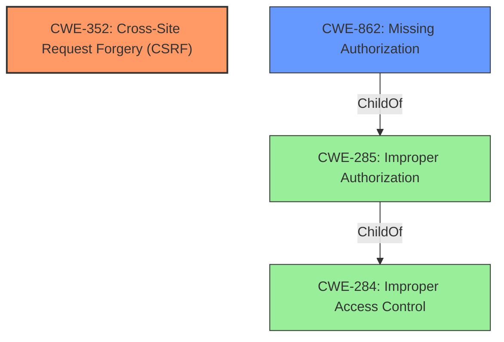

# Raw Analyzer Response for CVE-2022-2987

# Summary
| CWE ID  | CWE Name                                                                            | Confidence | CWE Abstraction Level | CWE Vulnerability Mapping Label | CWE-Vulnerability Mapping Notes |
| :-------- | :---------------------------------------------------------------------------------- | :--------- | :---------------------- | :------------------------------ | :------------------------------ |
| CWE-352   | Cross-Site Request Forgery (CSRF)                                                 | 1.0        | Compound                | Primary                         | Allowed                         |
| CWE-862   | Missing Authorization                                                             | 1.0        | Class                   | Secondary                       | Allowed-with-Review             |

## Evidence and Confidence

*   **Confidence Score:** 1.0
*   **Evidence Strength:** HIGH

## Relationship Analysis
The primary weakness is the **lack of authorization and CSRF checks**. This maps directly to **CWE-352** [Cross-Site Request Forgery (CSRF)] and **CWE-862** [Missing Authorization]. CWE-352 is a compound weakness that requires multiple conditions to be met, while CWE-862 represents the absence of an authorization check. CWE-862 is a child of CWE-285 (Improper Authorization) and CWE-284 (Improper Access Control), but CWE-862 is more specific and therefore a better fit.

## Vulnerability Chain
The vulnerability chain starts with the **lack of authorization and CSRF checks**, which allows unauthenticated attackers to update settings. This update allows the attacker to set their own LDAP server, bypassing the current authentication.

1.  **Root Cause:** **Lack of authorization and CSRF checks.**
2.  **Weakness:** Unauthenticated settings update.
3.  **Impact:** LDAP server settings modification.
4.  **Final Impact:** Authentication bypass.

## Summary of Analysis
The initial assessment, based on the vulnerability description and CVE reference summary, points to a **lack of authorization and CSRF checks**. The evidence is strong, explicitly stating the **rootcause** as the **lack of authorization and CSRF checks** when updating settings.

The retriever results suggest CWE-284 (Improper Access Control), CWE-352 (Cross-Site Request Forgery (CSRF)), and CWE-862 (Missing Authorization). While CWE-284 is too high-level and discouraged, CWE-352 and CWE-862 align well with the vulnerability description. CWE-352 addresses the **lack of CSRF checks**, and CWE-862 handles the **missing authorization**.

The graph relationships confirm that CWE-862 is a child of the more general CWE-285 and CWE-284, making CWE-862 the more specific and appropriate choice for the **missing authorization** aspect.

The selected CWEs are at the optimal level of specificity, providing a clear understanding of the vulnerability's nature. The vulnerability description key phrases and CVE reference summary directly support these choices. The confidence in this assessment is high (1.0), given the clear evidence and alignment with CWE guidelines.

**Supporting Evidence:**
*   "The Ldap WP Login / Active Directory Integration WordPress plugin before 3.0.2 does not have any authorisation and CSRF checks when updating its settings" - This directly supports the selection of CWE-352 and CWE-862.
*   "Attackers could set their own LDAP server to be used to authenticated users, therefore bypassing the current authentication" - This shows the impact of exploiting the lack of authorization.

**Other CWEs Considered But Not Used:**

*   **CWE-284 (Improper Access Control):** While this is a general access control issue, it's too broad. The vulnerability is specifically about missing authorization and CSRF protection. The mapping guidance discourages the use of CWE-284 in favor of more specific CWEs.
*   **CWE-863 (Incorrect Authorization):** This CWE implies that an authorization check is present but implemented incorrectly. In this case, there is no authorization check, making CWE-862 a better fit.
*   **CWE-434 (Unrestricted Upload of File with Dangerous Type):** This CWE is related to file uploads, which is not relevant to this vulnerability.
*   **CWE-90 (Improper Neutralization of Special Elements used in an LDAP Query ('LDAP Injection'))**: While LDAP is part of the vulnerability impact, the root cause is not related to improper neutralization.
*   **CWE-306 (Missing Authentication for Critical Function):** Authentication is related, but Authorization checks are missing within the code, which is more specific than missing authentication.