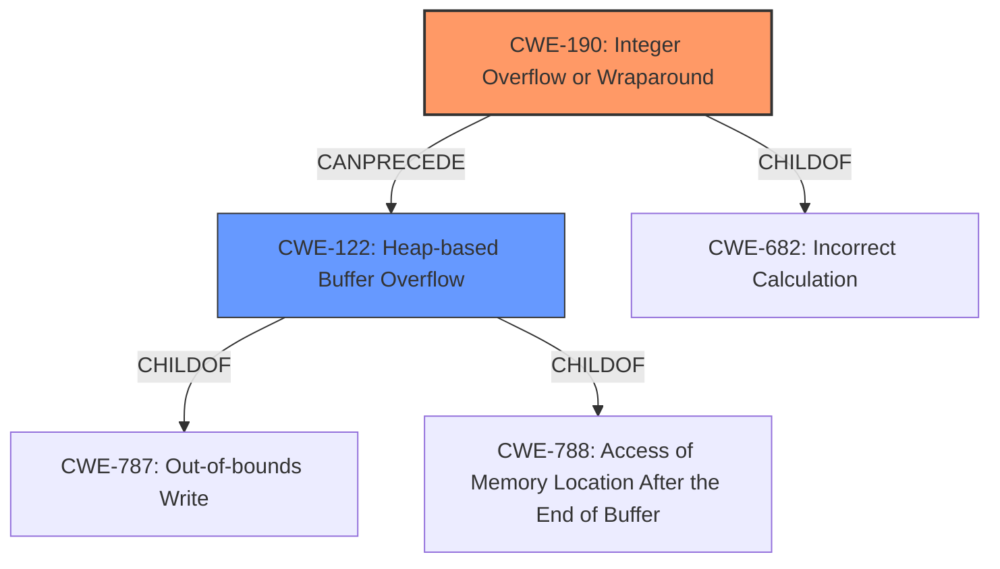

# Enhanced Analysis for CVE-2022-29886

# Summary
| CWE ID | CWE Name | Confidence | CWE Abstraction Level | CWE Vulnerability Mapping Label | CWE-Vulnerability Mapping Notes |
|---|---|---|---|---|---|
| CWE-190 | Integer Overflow or Wraparound | 1.0 | Base | Primary | Allowed |
| CWE-122 | Heap-based Buffer Overflow | 0.9 | Variant | Secondary | Allowed |

## Evidence and Confidence

*   **Confidence Score:** 0.95
*   **Evidence Strength:** HIGH

## Relationship Analysis
The primary weakness is CWE-190 Integer Overflow, which can lead to CWE-122 Heap-based Buffer Overflow. CWE-190 is a ChildOf CWE-682 (Incorrect Calculation). CWE-122 is a ChildOf CWE-787 (Out-of-bounds Write) and CWE-788. The relationship between CWE-190 and CWE-122 is a chain, where the integer overflow precedes and enables the heap buffer overflow. Choosing CWE-190 as the primary weakness and CWE-122 as a secondary weakness captures the full scope of the vulnerability.



## Vulnerability Chain
The vulnerability chain starts with an **integer overflow** (CWE-190) during the calculation of the buffer size, leading to an undersized buffer allocation. Subsequently, when data is copied into this undersized buffer, a **heap buffer overflow** (CWE-122) occurs, ultimately resulting in arbitrary code execution.

## Summary of Analysis
The initial analysis correctly identified the **integer overflow** (CWE-190) as the root cause. The **heap buffer overflow** (CWE-122) is a direct consequence of the integer overflow.

The evidence from the vulnerability description and CVE reference links supports this assessment:

*   "An **integer overflow** vulnerability exists in the way ESTsoft Alyac 2.5.8.544 parses OLE files."
*   "A specially-crafted OLE file can lead to a **heap buffer overflow**, which can result in arbitrary code execution."
*   "Root cause of vulnerability: **Integer overflow** during the calculation of the buffer size needed to store the Mini FAT sectors of an OLE file."
*   "Weaknesses/vulnerabilities present: **Integer overflow** leading to **heap buffer overflow**. Specifically, the multiplication of the 'Number of Mini FAT sectors' and 'sector size' is done using 32-bit integers, which can overflow if the result exceeds the maximum value, leading to allocating an undersized buffer. Later, when data is copied into this undersized buffer, a **heap buffer overflow** occurs."

The retriever results also support this, with CWE-190 having the highest score. While CWE-119 is listed, it is discouraged. CWE-122 is a more specific variant and accurately describes the heap-based nature of the buffer overflow.

The selected CWEs are at the optimal level of specificity. CWE-190 is a Base level CWE that accurately describes the root cause, while CWE-122 is a Variant level CWE that describes the specific type of buffer overflow.


## CWE Relationship Analysis

Current CWEs represent these abstraction levels: .


### Vulnerability Chain Analysis

**Chain starting from CWE-190:**
- 190 (Integer Overflow or Wraparound) - ROOT


**Chain starting from CWE-787:**
- 787 (Out-of-bounds Write) - ROOT


### CWE Relationship Diagram

```mermaid
graph TD
    classDef primary fill:#f96,stroke:#333,stroke-width:2px
    classDef secondary fill:#69f,stroke:#333
    classDef tertiary fill:#9e9,stroke:#333
```