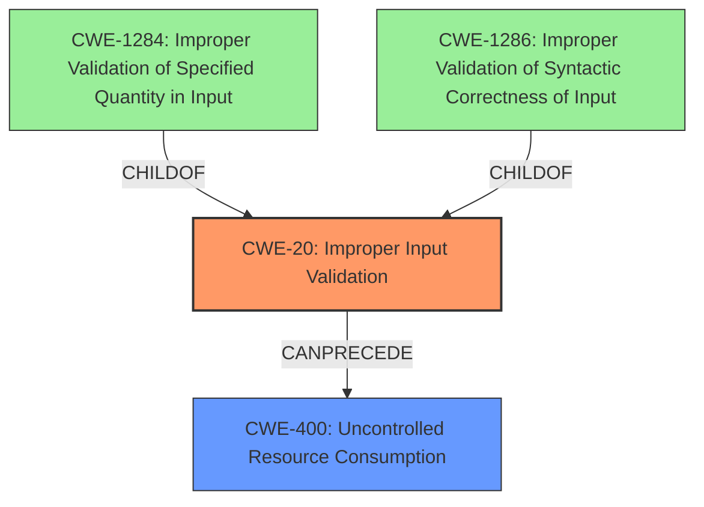

# Analysis Report for CVE-2022-29892

# Vulnerability Analysis Report: CVE-2022-29892

## Description


## Analysis (with Relationship Data)

# Summary
| CWE ID | CWE Name | Confidence | CWE Abstraction Level | CWE Vulnerability Mapping Label | CWE-Vulnerability Mapping Notes |
|---|---|---|---|---|---|
| CWE-20 | Improper Input Validation | 0.9 | Class | Primary | Discouraged |
| CWE-400 | Uncontrolled Resource Consumption | 0.7 | Class | Secondary | Discouraged |

## Evidence and Confidence

*   **Confidence Score:** 0.8
*   **Evidence Strength:** HIGH

## Relationship Analysis
The primary CWE selected is CWE-20, which is a class-level CWE. The retriever results suggested more specific base-level CWEs such as CWE-1284 and CWE-1286, children of CWE-20, but the evidence is not granular enough to confirm which *type* of input validation is missing, so CWE-20 is used. CWE-400 can result from improper input validation. CWE-400 is a class-level CWE with discouraged usage because it is often misused and a more specific CWE could be identified.



## Vulnerability Chain
The vulnerability chain starts with the **improper input validation** (CWE-20). This leads to repeatedly displaying errors which results in the final impact of denial-of-service (DoS). CWE-400 describes the final impact and it is CANPRECEDE by CWE-20.

## Summary of Analysis
The initial assessment identified **improper input validation** as the root cause, leading to a denial-of-service. The retriever results pointed to more specific CWEs related to input validation, such as CWE-1284 and CWE-1286. However, the provided evidence only states "**improper input validation**" without specifying the type. Therefore, selecting CWE-20 is appropriate because it directly reflects the documented root cause. The vulnerability description indicates a DoS, which can be mapped to CWE-400: Uncontrolled Resource Consumption, as the repeated errors likely consume resources.

*Vulnerability Description Key Phrases*:
- **rootcause:** **Improper input validation**
- **impact:** denial-of-service (DoS)

*CVE Reference Links Content Summary*:
- The root cause is an "**Improper input validation**" vulnerability in the Space functionality of Cybozu Garoon.
- The vulnerability is classified as CWE-20, which indicates a failure to properly validate user-supplied input. Specifically, the application does not perform adequate checks on user input within the Space feature.
- A successful exploit of this vulnerability can lead to a denial-of-service (DoS) condition. An attacker can repeatedly trigger errors in certain functions of the application.

CWE-20 is at the optimal level of specificity because the type of input that is not validated is not known.


## CWE Relationship Analysis

Current CWEs represent these abstraction levels: .


### Vulnerability Chain Analysis

**Chain starting from CWE-1284:**
- 1284 (Improper Validation of Specified Quantity in Input) - ROOT


**Chain starting from CWE-400:**
- 400 (Uncontrolled Resource Consumption) - ROOT


### CWE Relationship Diagram

```mermaid
graph TD
    classDef primary fill:#f96,stroke:#333,stroke-width:2px
    classDef secondary fill:#69f,stroke:#333
    classDef tertiary fill:#9e9,stroke:#333
```


*Report generated on 2025-03-30 19:58:10*
