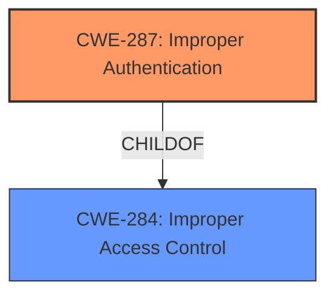

# Analysis for CVE-2022-29893

# Summary
| CWE ID | CWE Name | Confidence | CWE Abstraction Level | CWE Vulnerability Mapping Label | CWE-Vulnerability Mapping Notes |
|---|---|---|---|---|---|
| CWE-287 | Improper Authentication | 1.0 | Class | Primary | Discouraged |

## Evidence and Confidence

*   **Confidence Score:** 1.0
*   **Evidence Strength:** HIGH

## Relationship Analysis
The primary CWE selected is CWE-287, which is a Class-level CWE. While it has child CWEs, the provided information does not give enough detail to select a more specific CWE. CWE-287 is a child of CWE-284, which is a Pillar. The relationship between CWE-287 and CWE-284 highlights that authentication is a form of access control.

## Vulnerability Chain
The vulnerability chain starts with **Improper Authentication** (CWE-287), leading to escalation of privilege.

## Summary of Analysis
The initial analysis identified CWE-287 as the primary weakness due to the explicit mention of "**Improper authentication**" in the vulnerability description and CVE Reference Links Content Summary.
The vulnerability description states "**Improper authentication** in firmware for Intel(R) AMT before versions 11.8.93, 11.22.93, 11.12.93, 12.0.92, 14.1.67, 15.0.42, 16.1.25 may allow an authenticated user to potentially enable escalation of privilege via network access." The CVE Reference Links Content Summary corroborates this by stating: "Root cause: **Improper authentication** in firmware for Intel(R) AMT" and "Weaknesses: [\"Improper Authentication\"]".

The retriever results also listed CWE-287 as the top candidate.

CWE-287 is at the Class level of abstraction and the mapping guidance states "This CWE entry might be misused when lower-level CWE entries are likely to be applicable. It is a level-1 Class (i.e., a child of a Pillar)." and suggests considering children or descendants, beginning with CWE-1390: Weak Authentication or CWE-306: Missing Authentication for Critical Function. However, the description doesn't provide enough detail to determine if the authentication is weak or missing. Therefore, CWE-287 is the most appropriate choice based on the available information.

Relevant CWE Information:

# Enhanced Context (25 CWEs)

## CWE-287: Improper Authentication
**Abstraction:** Class
**Status:** Draft

### Description
When an actor claims to have a given identity, the product does not prove or insufficiently proves that the claim is correct.

### Extended Description
Not provided

### Alternative Terms
authentification: An alternate term is "authentification", which appears to be most commonly used by people from non-English-speaking countries.
AuthN: "AuthN" is typically used as an abbreviation of "authentication" within the web application security community. It is also distinct from "AuthZ," which is an abbreviation of "authorization." The use of "Auth" as an abbreviation is discouraged, since it could be used for either authentication or authorization.
AuthC: "AuthC" is used as an abbreviation of "authentication," but it appears to used less frequently than "AuthN."

### Relationships
ChildOf -> CWE-284
ChildOf -> CWE-284

### Mapping Guidance
**Usage:** Discouraged
**Rationale:** This CWE entry might be misused when lower-level CWE entries are likely to be applicable. It is a level-1 Class (i.e., a child of a Pillar).
**Comments:** Consider children or descendants, beginning with CWE-1390: Weak Authentication or CWE-306: Missing Authentication for Critical Function.
**Reasons:**
- Frequent Misuse
**Suggested Alternatives:**
- CWE-1390: Weak Authentication
- CWE-306: Missing Authentication for Critical Function