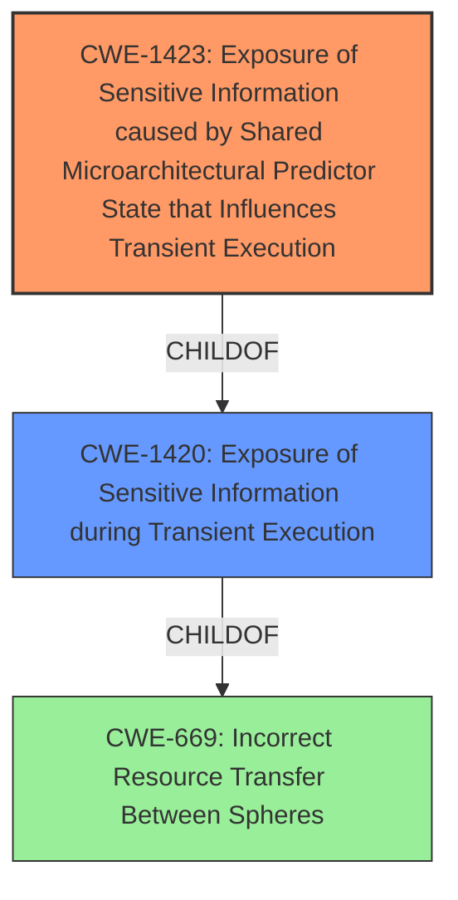

# Raw Analyzer Response for CVE-2022-29900

# Summary
| CWE ID | CWE Name | Confidence | CWE Abstraction Level | CWE Vulnerability Mapping Label | CWE-Vulnerability Mapping Notes |
|---|---|---|---|---|---|
| CWE-1423 | Exposure of Sensitive Information caused by Shared Microarchitectural Predictor State that Influences Transient Execution | 0.8 | Base | Allowed | Primary CWE |
| CWE-1420 | Exposure of Sensitive Information during Transient Execution | 0.6 | Base | Allowed-with-Review | Secondary Candidate |

## Evidence and Confidence

*   **Confidence Score:** 0.7
*   **Evidence Strength:** HIGH

## Relationship Analysis
The primary CWE selected, CWE-1423, is a child of CWE-1420, indicating a more specific type of transient execution vulnerability. The vulnerability description explicitly mentions "mis-trained branch predictions for return instructions," which directly relates to shared microarchitectural predictor state, thus justifying the choice of the more specific CWE-1423. CWE-1420 is a broader category and can be considered as a secondary CWE.

## Vulnerability Chain
The vulnerability chain starts with **mis-trained branch predictions** (root cause), leading to arbitrary speculative code execution (impact), which results in the potential **exposure of sensitive information**.

## Summary of Analysis
The initial assessment identified CWE-1423 as the most suitable primary CWE, based on the vulnerability description and the information contained in the CVE reference. The description clearly indicates that **mis-trained branch predictions** for return instructions are the root cause. This directly aligns with CWE-1423, which focuses on shared microarchitectural predictor state influencing transient execution. The CVE Reference Links Content Summary also states "Mis-trained branch predictions for return instructions" are the root cause, strengthening the selection of CWE-1423. The secondary candidate, CWE-1420, is a broader category encompassing transient execution vulnerabilities.

The evidence supporting the selection of CWE-1423 is: "Mis-trained branch predictions for return instructions may allow arbitrary speculative code execution under certain microarchitecture-dependent conditions." This excerpt directly links the root cause to the microarchitecture and the predictor state, fitting the description of CWE-1423.

The graph relationships influenced the final selection by highlighting the hierarchical structure, showing that CWE-1423 is a more specific type of CWE-1420.

The selected CWE is at the optimal level of specificity because it directly addresses the root cause related to shared microarchitectural predictor state. A more general CWE would not capture the specific nature of the vulnerability.

Relevant CWE Information:

# Enhanced Context (25 CWEs)
The following CWEs were identified as potentially relevant to this vulnerability:

## CWE-1342: Information Exposure through Microarchitectural State after Transient Execution
**Abstraction Level**: Base
**Similarity Score**: 0.79
**Source**: dense

**Description**:
The processor does not properly clear microarchitectural state after incorrect microcode assists or speculative execution, resulting in transient execution.

**Mapping Guidance**:
- Usage: Allowed
- Rationale: This CWE entry is at the Base level of abstraction, which is a preferred level of abstraction for mapping to the root causes of vulnerabilities.

## CWE-1420: Exposure of Sensitive Information during Transient Execution
**Abstraction Level**: Base
**Similarity Score**: 0.79
**Source**: dense

**Description**:
A processor event or prediction may allow incorrect operations (or correct operations with incorrect data) to execute transiently, potentially exposing data over a covert channel.

**Mapping Guidance**:
- Usage: Allowed-with-Review
- Rationale: This CWE entry is at the Base level of abstraction, which is a preferred level of abstraction for mapping to the root causes of vulnerabilities.

## CWE-208: Observable Timing Discrepancy
**Abstraction Level**: Base
**Similarity Score**: 0.78
**Source**: dense

**Description**:
Two separate operations in a product require different amounts of time to complete, in a way that is observable to an actor and reveals security-relevant information about the state of the product, such as whether a particular operation was successful or not.

**Mapping Guidance**:
- Usage: Allowed
- Rationale: This CWE entry is at the Base level of abstraction, which is a preferred level of abstraction for mapping to the root causes of vulnerabilities.

## CWE-1421: Exposure of Sensitive Information in Shared Microarchitectural Structures during Transient Execution
**Abstraction Level**: Base
**Similarity Score**: 0.77
**Source**: dense

**Description**:

			A processor event may allow transient operations to access
			architecturally restricted data (for example, in another address
			space) in a shared microarchitectural structure (for example, a CPU
			cache), potentially exposing the data over a covert channel.
		  

**Mapping Guidance**:
- Usage: Allowed
- Rationale: This CWE entry is at the Base level of abstraction, which is a preferred level of abstraction for mapping to the root causes of vulnerabilities

## CWE-1264: Hardware Logic with Insecure De-Synchronization between Control and Data Channels
**Abstraction Level**: Base
**Similarity Score**: 0.76
**Source**: dense

**Description**:
The hardware logic for error handling and security checks can incorrectly forward data before the security check is complete.

**Mapping Guidance**:
- Usage: Allowed
- Rationale: This CWE entry is at the Base level of abstraction, which is a preferred level of abstraction for mapping to the root causes of vulnerabilities.

## CWE-1256: Improper Restriction of Software Interfaces to Hardware Features
**Abstraction Level**: Base
**Similarity Score**: 0.76
**Source**: dense

**Description**:
The product provides software-controllable
			device functionality for capabilities such as power and
			clock management, but it does not properly limit
			functionality that can lead to modification of
			hardware memory or register bits, or the ability to
			observe physical side channels.

**Mapping Guidance**:
- Usage: Allowed
- Rationale: This CWE entry is at the Base level of abstraction, which is a preferred level of abstraction for mapping to the root causes of vulnerabilities.

## CWE-1423: Exposure of Sensitive Information caused by Shared Microarchitectural Predictor State that Influences Transient Execution
**Abstraction Level**: Base
**Similarity Score**: 0.75
**Source**: dense

**Description**:
Shared microarchitectural predictor state may allow code to influence
				transient execution across a hardware boundary, potentially exposing
				data that is accessible beyond the boundary over a covert channel.
			

**Mapping Guidance**:
- Usage: Allowed
- Rationale: This CWE entry is at the Base level of abstraction, which is a preferred level of abstraction for mapping to the root causes of vulnerabilities

## CWE-667: Improper Locking
**Abstraction Level**: Class
**Similarity Score**: 0.75
**Source**: dense

**Description**:
The product does not properly acquire or release a lock on a resource, leading to unexpected resource state changes and behaviors.

**Mapping Guidance**:
- Usage: Allowed-with-Review
- Rationale: This CWE entry is a Class and might have Base-level children that would be more appropriate

## CWE-1299: Missing Protection Mechanism for Alternate Hardware Interface
**Abstraction Level**: Base
**Similarity Score**: 0.75
**Source**: dense

**Description**:
The lack of protections on alternate paths to access
                control-protected assets (such as unprotected shadow registers
                and other external facing unguarded interfaces) allows an
                attacker to bypass existing protections to the asset that are
		only performed against the primary path.

**Mapping Guidance**:
- Usage: Allowed
- Rationale: This CWE entry is at the Base level of abstraction, which is a preferred level of abstraction for mapping to the root causes of vulnerabilities.

## CWE-1422: Exposure of Sensitive Information caused by Incorrect Data Forwarding during Transient Execution
**Abstraction Level**: Base
**Similarity Score**: 0.75
**Source**: dense

**Description**:
A processor event or prediction may allow incorrect or stale data to
		  be forwarded to transient operations, potentially exposing data over a
		  covert channel.

**Mapping Guidance**:
- Usage: Allowed
- Rationale: This CWE entry is at the Base level of abstraction, which is a preferred level of abstraction for mapping to the root causes of vulnerabilities

## CWE-1423: