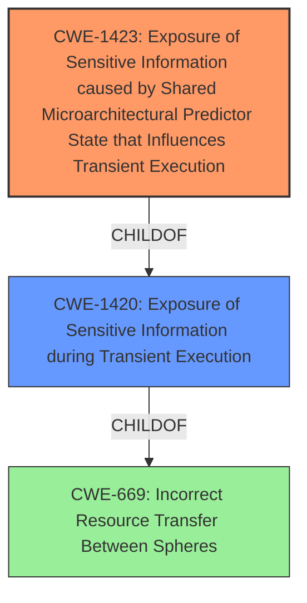

# Analysis for CVE-2022-29900

# Summary
| CWE ID | CWE Name | Confidence | CWE Abstraction Level | CWE Vulnerability Mapping Label | CWE-Vulnerability Mapping Notes |
|---|---|---|---|---|---|
| CWE-1423 | Exposure of Sensitive Information caused by Shared Microarchitectural Predictor State that Influences Transient Execution | 0.8 | Base | Allowed | Primary CWE |
| CWE-1420 | Exposure of Sensitive Information during Transient Execution | 0.6 | Base | Allowed-with-Review | Secondary Candidate |

## Evidence and Confidence

*   **Confidence Score:** 0.7
*   **Evidence Strength:** HIGH

## Relationship Analysis
The primary CWE selected, CWE-1423, is a child of CWE-1420, indicating a more specific type of transient execution vulnerability. The vulnerability description explicitly mentions "mis-trained branch predictions for return instructions," which directly relates to shared microarchitectural predictor state, thus justifying the choice of the more specific CWE-1423. CWE-1420 is a broader category and can be considered as a secondary CWE.



## Vulnerability Chain
The vulnerability chain starts with **mis-trained branch predictions** (root cause), leading to arbitrary speculative code execution (impact), which results in the potential **exposure of sensitive information**.

## Summary of Analysis
The initial assessment identified CWE-1423 as the most suitable primary CWE, based on the vulnerability description and the information contained in the CVE reference. The description clearly indicates that **mis-trained branch predictions** for return instructions are the root cause. This directly aligns with CWE-1423, which focuses on shared microarchitectural predictor state influencing transient execution. The CVE Reference Links Content Summary also states "Mis-trained branch predictions for return instructions" are the root cause, strengthening the selection of CWE-1423. The secondary candidate, CWE-1420, is a broader category encompassing transient execution vulnerabilities.

The evidence supporting the selection of CWE-1423 is: "Mis-trained branch predictions for return instructions may allow arbitrary speculative code execution under certain microarchitecture-dependent conditions." This excerpt directly links the root cause to the microarchitecture and the predictor state, fitting the description of CWE-1423.

The graph relationships influenced the final selection by highlighting the hierarchical structure, showing that CWE-1423 is a more specific type of CWE-1420.

The selected CWE is at the optimal level of specificity because it directly addresses the root cause related to shared microarchitectural predictor state. A more general CWE would not capture the specific nature of the vulnerability.

Relevant CWE Information:

# Enhanced Context (25 CWEs)
The following CWEs were identified as potentially relevant to this vulnerability:

## CWE-1342: Information Exposure through Microarchitectural State after Transient Execution
**Abstraction Level**: Base
**Similarity Score**: 0.79
**Source**: dense

**Description**:
The processor does not properly clear microarchitectural state after incorrect microcode assists or speculative execution, resulting in transient execution.

**Mapping Guidance**:
- Usage: Allowed
- Rationale: This CWE entry is at the Base level of abstraction, which is a preferred level of abstraction for mapping to the root causes of vulnerabilities.

## CWE-1420: Exposure of Sensitive Information during Transient Execution
**Abstraction Level**: Base
**Similarity Score**: 0.79
**Source**: dense

**Description**:
A processor event or prediction may allow incorrect operations (or correct operations with incorrect data) to execute transiently, potentially exposing data over a covert channel.

**Mapping Guidance**:
- Usage: Allowed-with-Review
- Rationale: This CWE entry is at the Base level of abstraction, which is a preferred level of abstraction for mapping to the root causes of vulnerabilities.

## CWE-208: Observable Timing Discrepancy
**Abstraction Level**: Base
**Similarity Score**: 0.78
**Source**: dense

**Description**:
Two separate operations in a product require different amounts of time to complete, in a way that is observable to an actor and reveals security-relevant information about the state of the product, such as whether a particular operation was successful or not.

**Mapping Guidance**:
- Usage: Allowed
- Rationale: This CWE entry is at the Base level of abstraction, which is a preferred level of abstraction for mapping to the root causes of vulnerabilities.

## CWE-1421: Exposure of Sensitive Information in Shared Microarchitectural Structures during Transient Execution
**Abstraction Level**: Base
**Similarity Score**: 0.77
**Source**: dense

**Description**:

			A processor event may allow transient operations to access
			architecturally restricted data (for example, in another address
			space) in a shared microarchitectural structure (for example, a CPU
			cache), potentially exposing the data over a covert channel.
		  

**Mapping Guidance**:
- Usage: Allowed
- Rationale: This CWE entry is at the Base level of abstraction, which is a preferred level of abstraction for mapping to the root causes of vulnerabilities

## CWE-1264: Hardware Logic with Insecure De-Synchronization between Control and Data Channels
**Abstraction Level**: Base
**Similarity Score**: 0.76
**Source**: dense

**Description**:
The hardware logic for error handling and security checks can incorrectly forward data before the security check is complete.

**Mapping Guidance**:
- Usage: Allowed
- Rationale: This CWE entry is at the Base level of abstraction, which is a preferred level of abstraction for mapping to the root causes of vulnerabilities.

## CWE-1256: Improper Restriction of Software Interfaces to Hardware Features
**Abstraction Level**: Base
**Similarity Score**: 0.76
**Source**: dense

**Description**:
The product provides software-controllable
			device functionality for capabilities such as power and
			clock management, but it does not properly limit
			functionality that can lead to modification of
			hardware memory or register bits, or the ability to
			observe physical side channels.

**Mapping Guidance**:
- Usage: Allowed
- Rationale: This CWE entry is at the Base level of abstraction, which is a preferred level of abstraction for mapping to the root causes of vulnerabilities.

## CWE-1423: Exposure of Sensitive Information caused by Shared Microarchitectural Predictor State that Influences Transient Execution
**Abstraction Level**: Base
**Similarity Score**: 0.75
**Source**: dense

**Description**:
Shared microarchitectural predictor state may allow code to influence
				transient execution across a hardware boundary, potentially exposing
				data that is accessible beyond the boundary over a covert channel.
			

**Mapping Guidance**:
- Usage: Allowed
- Rationale: This CWE entry is at the Base level of abstraction, which is a preferred level of abstraction for mapping to the root causes of vulnerabilities

## CWE-667: Improper Locking
**Abstraction Level**: Class
**Similarity Score**: 0.75
**Source**: dense

**Description**:
The product does not properly acquire or release a lock on a resource, leading to unexpected resource state changes and behaviors.

**Mapping Guidance**:
- Usage: Allowed-with-Review
- Rationale: This CWE entry is a Class and might have Base-level children that would be more appropriate

## CWE-1299: Missing Protection Mechanism for Alternate Hardware Interface
**Abstraction Level**: Base
**Similarity Score**: 0.75
**Source**: dense

**Description**:
The lack of protections on alternate paths to access
                control-protected assets (such as unprotected shadow registers
                and other external facing unguarded interfaces) allows an
                attacker to bypass existing protections to the asset that are
		only performed against the primary path.

**Mapping Guidance**:
- Usage: Allowed
- Rationale: This CWE entry is at the Base level of abstraction, which is a preferred level of abstraction for mapping to the root causes of vulnerabilities.

## CWE-1422: Exposure of Sensitive Information caused by Incorrect Data Forwarding during Transient Execution
**Abstraction Level**: Base
**Similarity Score**: 0.75
**Source**: dense

**Description**:
A processor event or prediction may allow incorrect or stale data to
		  be forwarded to transient operations, potentially exposing data over a
		  covert channel.

**Mapping Guidance**:
- Usage: Allowed
- Rationale: This CWE entry is at the Base level of abstraction, which is a preferred level of abstraction for mapping to the root causes of vulnerabilities

## CWE-1423:

# Enhanced Query for CVE-2022-29900

## Vulnerability Description
Mis-trained branch predictions for return instructions may allow arbitrary speculative code execution under certain microarchitecture-dependent conditions.

### Vulnerability Description Key Phrases
- **rootcause:** **mis-trained branch predictions**
- **impact:** arbitrary speculative code execution

## CVE Reference Links Content Summary
```
{
  "CVE-2022-29900": {
    "root_cause": "Mis-trained branch predictions for return instructions.",
    "weaknesses": [
      "Speculative execution",
      "Branch prediction vulnerability"
    ],
    "impact": "Arbitrary speculative code execution, information disclosure.",
    "attack_vectors": [
      "Local network attack"
    ],
    "required_attacker_capabilities": "Low user access with control over registers and memory at the victim's return instruction."
  }
}
```

## Retriever Results

### Top Combined Results

| Rank | CWE ID | Name | Abstraction | Usage  | Retrievers | Individual Scores |
|------|--------|------|-------------|-------|------------|-------------------|
| 1 | 1342 | Information Exposure through Microarchitectural State after Transient Execution | Base | Allowed | sparse | 0.351 |
| 2 | 1423 | Exposure of Sensitive Information caused by Shared Microarchitectural Predictor State that Influences Transient Execution | Base | Allowed | sparse | 0.146 |
| 3 | 1420 | Exposure of Sensitive Information during Transient Execution | Base | Allowed-with-Review | sparse | 0.127 |
| 4 | 1303 | Non-Transparent Sharing of Microarchitectural Resources | Base | Allowed | sparse | 0.100 |
| 5 | 1332 | Improper Handling of Faults that Lead to Instruction Skips | Base | Allowed | sparse | 0.093 |
| 6 | 1281 | Sequence of Processor Instructions Leads to Unexpected Behavior | Base | Allowed | dense | 0.585 |
| 7 | 1247 | Improper Protection Against Voltage and Clock Glitches | Base | Allowed | graph | 0.002 |
| 8 | 1037 | Processor Optimization Removal or Modification of Security-critical Code | Base | Allowed | sparse | 0.089 |
| 9 | 1264 | Hardware Logic with Insecure De-Synchronization between Control and Data Channels | Base | Allowed | sparse | 0.072 |
| 10 | 208 | Observable Timing Discrepancy | Base | Allowed | sparse | 0.070 |


# Complete CWE Specifications


## CWE-1342: Information Exposure through Microarchitectural State after Transient Execution
**Abstraction:** Base
**Status:** Incomplete

### Description
The processor does not properly clear microarchitectural state after incorrect microcode assists or speculative execution, resulting in transient execution.

### Extended Description


In many processor architectures an exception, mis-speculation, or microcode assist results in a flush operation to clear results that are no longer required. This action prevents these results from influencing architectural state that is intended to be visible from software. However, traces of this transient execution may remain in microarchitectural buffers, resulting in a change in microarchitectural state that can expose sensitive information to an attacker using side-channel analysis. For example, Load Value Injection (LVI) [REF-1202] can exploit direct injection of erroneous values into intermediate load and store buffers.


Several conditions may need to be fulfilled for a successful attack:


  1. incorrect transient execution that results in remanence of sensitive information;

  1. attacker has the ability to provoke microarchitectural exceptions;

  1. operations and structures in victim code that can be exploited must be identified.


### Alternative Terms
None

### Relationships
ChildOf -> CWE-226
ChildOf -> CWE-226

### Mapping Guidance
**Usage:** Allowed
**Rationale:** This CWE entry is at the Base level of abstraction, which is a preferred level of abstraction for mapping to the root causes of vulnerabilities.
**Comments:** Carefully read both the name and description to ensure that this mapping is an appropriate fit. Do not try to 'force' a mapping to a lower-level Base/Variant simply to comply with this preferred level of abstraction.
**Reasons:**
- Acceptable-Use


### Additional Notes
**[Relationship]** CWE-1342 differs from CWE-1303, which is related to misprediction and biasing microarchitectural components, while CWE-1342 addresses illegal data flows and retention. For example, Spectre is an instance of CWE-1303 biasing branch prediction to steer the transient execution indirectly.

**[Maintenance]** As of CWE 4.9, members of the CWE Hardware SIG are closely analyzing this entry and others to improve CWE's coverage of transient execution weaknesses, which include issues related to Spectre, Meltdown, and other attacks. Additional investigation may include other weaknesses related to microarchitectural state. As a result, this entry might change significantly in CWE 4.10.


### Observed Examples
- **CVE-2020-0551:** Load value injection in some processors utilizing speculative execution may allow an authenticated user to enable information disclosure via a side-channel with local access.


## CWE-1423: Exposure of Sensitive Information caused by Shared Microarchitectural Predictor State that Influences Transient Execution
**Abstraction:** Base
**Status:** Incomplete

### Description
Shared microarchitectural predictor state may allow code to influence
				transient execution across a hardware boundary, potentially exposing
				data that is accessible beyond the boundary over a covert channel.
			

### Extended Description


Many commodity processors have Instruction Set Architecture (ISA) features that protect software components from one another. These features can include memory segmentation, virtual memory, privilege rings, trusted execution environments, and virtual machines, among others. For example, virtual memory provides each process with its own address space, which prevents processes from accessing each other's private data. Many of these features can be used to form hardware-enforced security boundaries between software components.


When separate software components (for example, two processes) share microarchitectural predictor state across a hardware boundary, code in one component may be able to influence microarchitectural predictor behavior in another component. If the predictor can cause transient execution, the shared predictor state may allow an attacker to influence transient execution in a victim, and in a manner that could allow the attacker to infer private data from the victim by monitoring observable discrepancies (CWE-203) in a covert channel [REF-1400].


Predictor state may be shared when the processor transitions from one component to another (for example, when a process makes a system call to enter the kernel). Many commodity processors have features which prevent microarchitectural predictions that occur before a boundary from influencing predictions that occur after the boundary.


Predictor state may also be shared between hardware threads, for example, sibling hardware threads on a processor that supports simultaneous multithreading (SMT). This sharing may be benign if the hardware threads are simultaneously executing in the same software component, or it could expose a weakness if one sibling is a malicious software component, and the other sibling is a victim software component. Processors that share microarchitectural predictors between hardware threads may have features which prevent microarchitectural predictions that occur on one hardware thread from influencing predictions that occur on another hardware thread.


Features that restrict predictor state sharing across transitions or between hardware threads may be always-on, on by default, or may require opt-in from software.


### Alternative Terms
None

### Relationships
ChildOf -> CWE-1420
ChildOf -> CWE-1420

### Mapping Guidance
**Usage:** Allowed
**Rationale:** This CWE entry is at the Base level of abstraction, which is a preferred level of abstraction for mapping to the root causes of vulnerabilities
**Comments:** Use only when the weakness allows code in one processor context to influence the predictions of code in another processor context via predictor state that is shared between the two contexts. For example, Branch Target Injection, an instance of CWE-1423, can be mitigated by tagging each indirect branch predictor entry according to the processor context in which the entry was created, thus preventing entries created in one context from being used in a different context. However, the mitigated indirect branch predictor can still expose different weaknesses where malicious predictor entries created in one context are used later in the same context (context tags cannot prevent this). One such example is Intra-mode Branch Target Injection. Weaknesses of this sort can map to CWE-1420.
**Reasons:**
- Acceptable-Use
**Suggested Alternatives:**
- CWE-1420: If a weakness involves a microarchitectural predictor whose state is not shared across processor contexts, then CWE-1420 may be more appropriate for the mapping task.


### Observed Examples
- **CVE-2017-5754:** (Branch Target Injection, BTI, Spectre v2). Shared microarchitectural indirect branch predictor state may allow code to influence transient execution across a process, VM, or privilege boundary, potentially exposing data that is accessible beyond the boundary.
- **CVE-2022-0001:** (Branch History Injection, BHI, Spectre-BHB). Shared branch history state may allow user-mode code to influence transient execution in the kernel, potentially exposing kernel data over a covert channel.
- **CVE-2021-33149:** (RSB underflow, Retbleed). Shared return stack buffer state may allow code that executes before a prediction barrier to influence transient execution after the prediction barrier, potentially exposing data that is accessible beyond the barrier over a covert channel.


## CWE-1420: Exposure of Sensitive Information during Transient Execution
**Abstraction:** Base
**Status:** Incomplete

### Description
A processor event or prediction may allow incorrect operations (or correct operations with incorrect data) to execute transiently, potentially exposing data over a covert channel.

### Extended Description


When operations execute but do not commit to the processor's architectural state, this is commonly referred to as transient execution. This behavior can occur when the processor mis-predicts an outcome (such as a branch target), or when a processor event (such as an exception or microcode assist, etc.) is handled after younger operations have already executed. Operations that execute transiently may exhibit observable discrepancies (CWE-203) in covert channels [REF-1400] such as data caches. Observable discrepancies of this kind can be detected and analyzed using timing or power analysis techniques, which may allow an attacker to infer information about the operations that executed transiently. For example, the attacker may be able to infer confidential data that was accessed or used by those operations.


Transient execution weaknesses may be exploited using one of two methods. In the first method, the attacker generates a code sequence that exposes data through a covert channel when it is executed transiently (the attacker must also be able to trigger transient execution). Some transient execution weaknesses can only expose data that is accessible within the attacker's processor context. For example, an attacker executing code in a software sandbox may be able to use a transient execution weakness to expose data within the same address space, but outside of the attacker's sandbox. Other transient execution weaknesses can expose data that is architecturally inaccessible, that is, data protected by hardware-enforced boundaries such as page tables or privilege rings. These weaknesses are the subject of CWE-1421.


In the second exploitation method, the attacker first identifies a code sequence in a victim program that, when executed transiently, can expose data that is architecturally accessible within the victim's processor context. For instance, the attacker may search the victim program for code sequences that resemble a bounds-check bypass sequence (see Demonstrative Example 1). If the attacker can trigger a mis-prediction of the conditional branch and influence the index of the out-of-bounds array access, then the attacker may be able to infer the value of out-of-bounds data by monitoring observable discrepancies in a covert channel.


### Alternative Terms
None

### Relationships
ChildOf -> CWE-669

### Mapping Guidance
**Usage:** Allowed-with-Review
**Rationale:** This CWE entry is at the Base level of abstraction, which is a preferred level of abstraction for mapping to the root causes of vulnerabilities.
**Comments:** 

A vulnerability should only map to CWE-1420 if it cannot map to any of CWE-1420's child weaknesses. Follow this diagram:


**Reasons:**
- Acceptable-Use


### Observed Examples
- **CVE-2017-5753:** Microarchitectural conditional branch predictors may allow operations to execute transiently after a misprediction, potentially exposing data over a covert channel.
- **CVE-2021-0089:** A machine clear triggered by self-modifying code may allow incorrect operations to execute transiently, potentially exposing data over a covert channel.
- **CVE-2022-0002:** Microarchitectural indirect branch predictors may allow incorrect operations to execute transiently after a misprediction, potentially exposing data over a covert channel.


## CWE-1303: Non-Transparent Sharing of Microarchitectural Resources
**Abstraction:** Base
**Status:** Draft

### Description
Hardware structures shared across execution contexts (e.g., caches and branch predictors) can violate the expected architecture isolation between contexts.

### Extended Description


Modern processors use techniques such as out-of-order execution, speculation, prefetching, data forwarding, and caching to increase performance. Details about the implementation of these techniques are hidden from the programmer's view. This is problematic when the hardware implementation of these techniques results in resources being shared across supposedly isolated contexts. Contention for shared resources between different contexts opens covert channels that allow malicious programs executing in one context to recover information from another context.


Some examples of shared micro-architectural resources that have been used to leak information between contexts are caches, branch prediction logic, and load or store buffers. Speculative and out-of-order execution provides an attacker with increased control over which data is leaked through the covert channel.


If the extent of resource sharing between contexts in the design microarchitecture is undocumented, it is extremely difficult to ensure system assets are protected against disclosure.


### Alternative Terms
None

### Relationships
ChildOf -> CWE-1189
ChildOf -> CWE-203

### Mapping Guidance
**Usage:** Allowed
**Rationale:** This CWE entry is at the Base level of abstraction, which is a preferred level of abstraction for mapping to the root causes of vulnerabilities.
**Comments:** Carefully read both the name and description to ensure that this mapping is an appropriate fit. Do not try to 'force' a mapping to a lower-level Base/Variant simply to comply with this preferred level of abstraction.
**Reasons:**
- Acceptable-Use


### Additional Notes
**[Maintenance]** As of CWE 4.9, members of the CWE Hardware SIG are closely analyzing this entry and others to improve CWE's coverage of transient execution weaknesses, which include issues related to Spectre, Meltdown, and other attacks. Additional investigation may include other weaknesses related to microarchitectural state. Finally, this entry's demonstrative example might not be appropriate. As a result, this entry might change significantly in CWE 4.10.


## CWE-1332: Improper Handling of Faults that Lead to Instruction Skips
**Abstraction:** Base
**Status:** Stable

### Description
The device is missing or incorrectly implements circuitry or sensors that detect and mitigate the skipping of security-critical CPU instructions when they occur.

### Extended Description


The operating conditions of hardware may change in ways that cause unexpected behavior to occur, including the skipping of security-critical CPU instructions. Generally, this can occur due to electrical disturbances or when the device operates outside of its expected conditions.


In practice, application code may contain conditional branches that are security-sensitive (e.g., accepting or rejecting a user-provided password). These conditional branches are typically implemented by a single conditional branch instruction in the program binary which, if skipped, may lead to effectively flipping the branch condition - i.e., causing the wrong security-sensitive branch to be taken. This affects processes such as firmware authentication, password verification, and other security-sensitive decision points.


Attackers can use fault injection techniques to alter the operating conditions of hardware so that security-critical instructions are skipped more frequently or more reliably than they would in a "natural" setting.


### Alternative Terms
None

### Relationships
ChildOf -> CWE-1384
PeerOf -> CWE-1247

### Mapping Guidance
**Usage:** Allowed
**Rationale:** This CWE entry is at the Base level of abstraction, which is a preferred level of abstraction for mapping to the root causes of vulnerabilities.
**Comments:** Carefully read both the name and description to ensure that this mapping is an appropriate fit. Do not try to 'force' a mapping to a lower-level Base/Variant simply to comply with this preferred level of abstraction.
**Reasons:**
- Acceptable-Use


### Observed Examples
- **CVE-2019-15894:** fault injection attack bypasses the verification mode, potentially allowing arbitrary code execution.


## CWE-1281: Sequence of Processor Instructions Leads to Unexpected Behavior
**Abstraction:** Base
**Status:** Incomplete

### Description
Specific combinations of processor instructions lead to undesirable behavior such as locking the processor until a hard reset performed.

### Extended Description


If the instruction set architecture (ISA) and processor logic are not designed carefully and tested thoroughly, certain combinations of instructions may lead to locking the processor or other unexpected and undesirable behavior. Upon encountering unimplemented instruction opcodes or illegal instruction operands, the processor should throw an exception and carry on without negatively impacting security. However, specific combinations of legal and illegal instructions may cause unexpected behavior with security implications such as allowing unprivileged programs to completely lock the CPU. 


### Alternative Terms
None

### Relationships
ChildOf -> CWE-691

### Mapping Guidance
**Usage:** Allowed
**Rationale:** This CWE entry is at the Base level of abstraction, which is a preferred level of abstraction for mapping to the root causes of vulnerabilities.
**Comments:** Carefully read both the name and description to ensure that this mapping is an appropriate fit. Do not try to 'force' a mapping to a lower-level Base/Variant simply to comply with this preferred level of abstraction.
**Reasons:**
- Acceptable-Use


### Observed Examples
- **CVE-2021-26339:** A bug in AMD CPU's core logic allows a potential DoS by using a specific x86 instruction sequence to hang the processor
- **CVE-1999-1476:** A bug in some Intel Pentium processors allow DoS (hang) via an invalid "CMPXCHG8B" instruction, causing a deadlock


## CWE-1247: Improper Protection Against Voltage and Clock Glitches
**Abstraction:** Base
**Status:** Stable

### Description
The device does not contain or contains incorrectly implemented circuitry or sensors to detect and mitigate voltage and clock glitches and protect sensitive information or software contained on the device.

### Extended Description


A device might support features such as secure boot which are supplemented with hardware and firmware support. This involves establishing a chain of trust, starting with an immutable root of trust by checking the signature of the next stage (culminating with the OS and runtime software) against a golden value before transferring control. The intermediate stages typically set up the system in a secure state by configuring several access control settings. Similarly, security logic for exercising a debug or testing interface may be implemented in hardware, firmware, or both. A device needs to guard against fault attacks such as voltage glitches and clock glitches that an attacker may employ in an attempt to compromise the system.


### Alternative Terms
None

### Relationships
ChildOf -> CWE-1384

### Mapping Guidance
**Usage:** Allowed
**Rationale:** This CWE entry is at the Base level of abstraction, which is a preferred level of abstraction for mapping to the root causes of vulnerabilities.
**Comments:** Carefully read both the name and description to ensure that this mapping is an appropriate fit. Do not try to 'force' a mapping to a lower-level Base/Variant simply to comply with this preferred level of abstraction.
**Reasons:**
- Acceptable-Use


### Observed Examples
- **CVE-2019-17391:** Lack of anti-glitch protections allows an attacker to launch a physical attack to bypass the secure boot and read protected eFuses.
- **CVE-2021-33478:** IP communication firmware allows access to a boot shell via certain impulses


## CWE-1037: Processor Optimization Removal or Modification of Security-critical Code
**Abstraction:** Base
**Status:** Incomplete

### Description
The developer builds a security-critical protection mechanism into the software, but the processor optimizes the execution of the program such that the mechanism is removed or modified.

### Extended Description
Not provided

### Alternative Terms
None

### Relationships
ChildOf -> CWE-1038

### Mapping Guidance
**Usage:** Allowed
**Rationale:** This CWE entry is at the Base level of abstraction, which is a preferred level of abstraction for mapping to the root causes of vulnerabilities.
**Comments:** Carefully read both the name and description to ensure that this mapping is an appropriate fit. Do not try to 'force' a mapping to a lower-level Base/Variant simply to comply with this preferred level of abstraction.
**Reasons:**
- Acceptable-Use


### Additional Notes
**[Maintenance]** As of CWE 4.9, members of the CWE Hardware SIG are closely analyzing this entry and others to improve CWE's coverage of transient execution weaknesses, which include issues related to Spectre, Meltdown, and other attacks. Additional investigation may include other weaknesses related to microarchitectural state. As a result, this entry might change significantly in CWE 4.10.


### Observed Examples
- **CVE-2017-5715:** Intel, ARM, and AMD processor optimizations related to speculative execution and branch prediction cause access control checks to be bypassed when placing data into the cache. Often known as "Spectre".
- **CVE-2017-5753:** Intel, ARM, and AMD processor optimizations related to speculative execution and branch prediction cause access control checks to be bypassed when placing data into the cache. Often known as "Spectre".
- **CVE-2017-5754:** Intel processor optimizations related to speculative execution cause access control checks to be bypassed when placing data into the cache. Often known as "Meltdown".


## CWE-1264: Hardware Logic with Insecure De-Synchronization between Control and Data Channels
**Abstraction:** Base
**Status:** Incomplete

### Description
The hardware logic for error handling and security checks can incorrectly forward data before the security check is complete.

### Extended Description


Many high-performance on-chip bus protocols and processor data-paths employ separate channels for control and data to increase parallelism and maximize throughput. Bugs in the hardware logic that handle errors and security checks can make it possible for data to be forwarded before the completion of the security checks. If the data can propagate to a location in the hardware observable to an attacker, loss of data confidentiality can occur. 'Meltdown' is a concrete example of how de-synchronization between data and permissions checking logic can violate confidentiality requirements. Data loaded from a page marked as privileged was returned to the cpu regardless of current privilege level for performance reasons. The assumption was that the cpu could later remove all traces of this data during the handling of the illegal memory access exception, but this assumption was proven false as traces of the secret data were not removed from the microarchitectural state.


### Alternative Terms
None

### Relationships
ChildOf -> CWE-821
PeerOf -> CWE-1037

### Mapping Guidance
**Usage:** Allowed
**Rationale:** This CWE entry is at the Base level of abstraction, which is a preferred level of abstraction for mapping to the root causes of vulnerabilities.
**Comments:** Carefully read both the name and description to ensure that this mapping is an appropriate fit. Do not try to 'force' a mapping to a lower-level Base/Variant simply to comply with this preferred level of abstraction.
**Reasons:**
- Acceptable-Use


### Additional Notes
**[Maintenance]** As of CWE 4.9, members of the CWE Hardware SIG are closely analyzing this entry and others to improve CWE's coverage of transient execution weaknesses, which include issues related to Spectre, Meltdown, and other attacks. Additional investigation may include other weaknesses related to microarchitectural state. As a result, this entry might change significantly in CWE 4.10.


### Observed Examples
- **CVE-2017-5754:** Systems with microprocessors utilizing speculative execution and indirect branch prediction may allow unauthorized disclosure of information to an attacker with local user access via a side-channel analysis of the data cache.


## CWE-208: Observable Timing Discrepancy
**Abstraction:** Base
**Status:** Incomplete

### Description
Two separate operations in a product require different amounts of time to complete, in a way that is observable to an actor and reveals security-relevant information about the state of the product, such as whether a particular operation was successful or not.

### Extended Description
In security-relevant contexts, even small variations in timing can be exploited by attackers to indirectly infer certain details about the product's internal operations. For example, in some cryptographic algorithms, attackers can use timing differences to infer certain properties about a private key, making the key easier to guess. Timing discrepancies effectively form a timing side channel.

### Alternative Terms
None

### Relationships
ChildOf -> CWE-203
CanPrecede -> CWE-385
CanPrecede -> CWE-327

### Mapping Guidance
**Usage:** Allowed
**Rationale:** This CWE entry is at the Base level of abstraction, which is a preferred level of abstraction for mapping to the root causes of vulnerabilities.
**Comments:** Carefully read both the name and description to ensure that this mapping is an appropriate fit. Do not try to 'force' a mapping to a lower-level Base/Variant simply to comply with this preferred level of abstraction.
**Reasons:**
- Acceptable-Use


### Additional Notes
**[Relationship]** Often primary in cryptographic applications and algorithms.

**[Maintenance]** CWE 4.16 removed a demonstrative example for a hardware module because it was inaccurate and unable to be adapted. The CWE team is developing an alternative.


### Observed Examples
- **CVE-2019-10071:** Java-oriented framework compares HMAC signatures using String.equals() instead of a constant-time algorithm, causing timing discrepancies
- **CVE-2019-10482:** Smartphone OS uses comparison functions that are not in constant time, allowing side channels
- **CVE-2014-0984:** Password-checking function in router terminates validation of a password entry when it encounters the first incorrect character, which allows remote attackers to obtain passwords via a brute-force attack that relies on timing differences in responses to incorrect password guesses, aka a timing side-channel attack.

