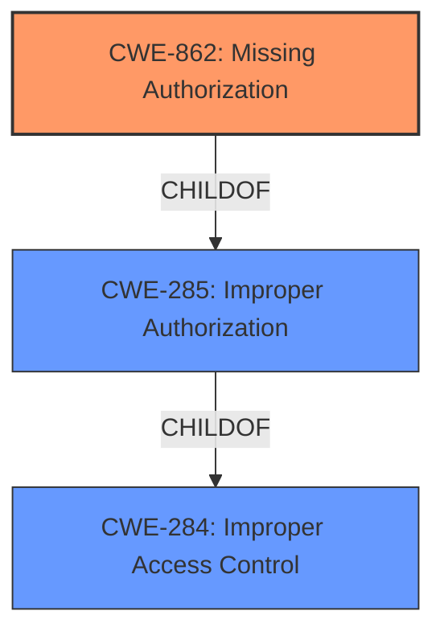

# Raw Analyzer Response for CVE-2022-29906

# Summary
| CWE ID | CWE Name | Confidence | CWE Abstraction Level | CWE Vulnerability Mapping Label | CWE-Vulnerability Mapping Notes |
|---|---|---|---|---|---|
| CWE-862 | Missing Authorization | 1.0 | Class | Allowed-with-Review | The product does not perform an authorization check when an actor attempts to access a resource or perform an action. |

## Evidence and Confidence

*   **Confidence Score:** 1.0
*   **Evidence Strength:** HIGH

## Relationship Analysis
The primary relationship that influenced the decision was the ChildOf relationship between CWE-862 and CWE-285 (Improper Authorization). CWE-862, Missing Authorization, is a more specific case of CWE-285. Also considered was the parent relationship between CWE-862 and CWE-284 (Improper Access Control).

## Vulnerability Chain
The vulnerability chain starts with the **omission of a check for the quizadmin user**, leading to the **missing authorization** and, consequently, the ability for unauthorized users to perform administrative actions.

## Summary of Analysis
The initial analysis focused on the **missing authorization** in the QuizGame extension's admin API module. The vulnerability description clearly states that the module "**omits a check for the quizadmin user**." This directly indicates a lack of authorization checks. The CVE Reference Links Content Summary confirms this by stating, "The API module only checked for a valid anti-CSRF token and that the request was a POST request with specific parameters, but it did not enforce user permission checks for administrative actions."

The retriever results also point to CWE-862 (Missing Authorization) and CWE-863 (Incorrect Authorization) as potential candidates. However, since the description explicitly mentions the *absence* of an authorization check, CWE-862 is more fitting than CWE-863, which implies that a check was performed but was incorrect.

The MITRE mapping guidance for CWE-862 suggests it is an Allowed-with-Review Class, with a note to examine children of this entry to see if there is a better fit. In this case, there isn't a more specific child.

Therefore, based on the explicit evidence in the vulnerability description and the supporting information in the CVE Reference Links Content Summary, CWE-862 (Missing Authorization) is the most appropriate CWE. It accurately represents the **root cause** of the vulnerability: the failure to perform an authorization check.

CWE-285 (Improper Authorization) was considered but not used because it is a more general Class that encompasses both missing and incorrect authorization. Since the vulnerability description specifies that the authorization check is missing altogether, CWE-862 is a more precise classification.

CWE-863 (Incorrect Authorization) was considered but not used because the vulnerability is not due to an incorrect authorization implementation, but rather the complete absence of one.

CWE-472 (External Control of Assumed-Immutable Web Parameter) was considered because the CSRF token is being checked, but it isn't relevant to the actual **rootcause** which is a **missing** check.

CWE-201 (Insertion of Sensitive Information Into Sent Data), CWE-267 (Privilege Defined With Unsafe Actions), CWE-778 (Insufficient Logging), CWE-434 (Unrestricted Upload of File with Dangerous Type) and CWE-352 (Cross-Site Request Forgery (CSRF)) were considered, but did not have sufficient evidence to support the mapping.