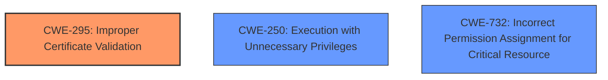

# Analysis for CVE-2022-29908

# Summary
| CWE ID | CWE Name | Confidence | CWE Abstraction Level | CWE Vulnerability Mapping Label | CWE-Vulnerability Mapping Notes |
|---|---|---|---|---|---|
| CWE-295 | Improper Certificate Validation | 0.9 | Base | Allowed | Primary CWE |
| CWE-250 | Execution with Unnecessary Privileges | 0.8 | Base | Allowed | Secondary Candidate |
| CWE-732 | Incorrect Permission Assignment for Critical Resource | 0.7 | Class | Allowed-with-Review | Secondary Candidate |

## Evidence and Confidence

*   **Confidence Score:** 0.8
*   **Evidence Strength:** HIGH

## Relationship Analysis
The primary weakness is **improper certificate validation** (CWE-295) because the update service accepts self-signed MSI packages. Secondary issues are **execution with unnecessary privileges** (CWE-250) because the service runs with SYSTEM privileges, and **incorrect permission assignment for critical resource** (CWE-732) because the directory `C:\ProgramData\fabasoft.plugin` is writable by arbitrary users.

## Vulnerability Chain
The vulnerability chain starts with **writable update directory**, then **insecure MSI signature validation**, which leads to **privileged update service**, and finally resulting in **local privilege escalation**.

## Summary of Analysis
The analysis indicates that the primary root cause is the **improper certificate validation** (CWE-295) within the Fabasoft Cloud Enterprise Client's update service. The service **fails to** properly validate the signatures of MSI packages, accepting self-signed certificates with Fabasoft's information in the certificate fields. This allows an attacker to bypass the signature check using a malicious, self-signed MSI package.

Supporting evidence from the "CVE Reference Links Content Summary":

*   "The update service accepts self-signed MSI packages as valid if they contain Fabasoft's information in the certificate fields, making it possible to bypass the signature check using a self-signed certificate."

Additionally, the update service runs with SYSTEM privileges (CWE-250), amplifying the impact of the **improper certificate validation** (CWE-295) by allowing the malicious MSI package to execute with elevated privileges. The writable update directory (CWE-732) enables attackers to place the malicious MSI files in the location where the update service will process them.

Based on the evidence, CWE-295 is the most specific and accurate representation of the root cause, classifying the **failure to** properly validate certificates. The other CWEs (CWE-250 and CWE-732) contribute to the exploitability and impact but are not the initial flaw that allows the attack.

Relevant CWE Information:

# Enhanced Context (25 CWEs)

## CWE-295: Improper Certificate Validation
**Abstraction:** Base
**Similarity Score**: 7535.98
**Description**: The product does not validate, or incorrectly validates, a certificate.
**Mapping Guidance**: Usage: Allowed

The vulnerability description states that "The update service accepts self-signed MSI packages as valid if they contain Fabasoft's information in the certificate fields." This directly aligns with the description of CWE-295.

## CWE-250: Execution with Unnecessary Privileges
**Abstraction:** Base
**Similarity Score**: 0.024
**Description**: The product performs an operation at a privilege level that is higher than the minimum level required.
**Mapping Guidance**: Usage: Allowed

The update service runs with SYSTEM privileges, meaning any MSI package it installs also gains SYSTEM privileges.

## CWE-732: Incorrect Permission Assignment for Critical Resource
**Abstraction:** Class
**Similarity Score**: 0.026
**Description**: The product specifies permissions for a security-critical resource in a way that allows that resource to be read or modified by unintended actors.
**Mapping Guidance**: Usage: Allowed-with-Review

The update directory `C:\ProgramData\fabasoft.plugin` is writable by arbitrary users, allowing them to place malicious MSI files.

**CWEs Considered But Not Used:**

*   **CWE-20 (Improper Input Validation):** While input validation is a broad category, the specific issue here is related to certificate validation. Therefore, CWE-295 is a more specific and accurate classification.
*   **CWE-269 (Improper Privilege Management):** This is a more general class, and CWE-250 provides a more specific description of the issue, which is running the update service with unnecessary privileges.
*   **CWE-22 (Improper Limitation of a Pathname to a Restricted Directory):** Not directly applicable, as the vulnerability does not involve path traversal.
*   **CWE-119 (Improper Restriction of Operations within the Bounds of a Memory Buffer):** Not directly applicable, as the vulnerability does not involve memory buffer operations.