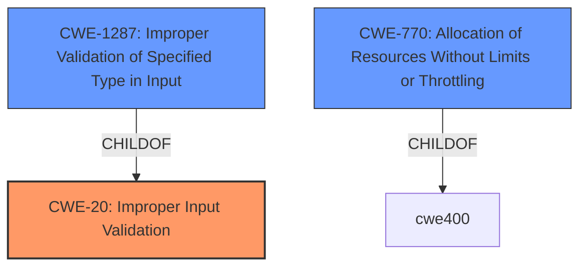

# Analysis for CVE-2022-29922

# Summary
| CWE ID | CWE Name | Confidence | CWE Abstraction Level | CWE Vulnerability Mapping Label | CWE-Vulnerability Mapping Notes |
|---|---|---|---|---|---|
| CWE-20 (Primary) | Improper Input Validation | 0.8 | Class | Discouraged | Consider lower-level children, such as CWE-1284, CWE-1286, CWE-1287, CWE-1288, or CWE-1289. |
| CWE-1287 | Improper Validation of Specified Type in Input | 0.7 | Base | Allowed | This CWE entry is at the Base level of abstraction, which is a preferred level of abstraction for mapping to the root causes of vulnerabilities. |
| CWE-770 | Allocation of Resources Without Limits or Throttling | 0.4 | Base | Allowed | This CWE entry is at the Base level of abstraction, which is a preferred level of abstraction for mapping to the root causes of vulnerabilities. |

## Evidence and Confidence

*   **Confidence Score:** 0.7
*   **Evidence Strength:** MEDIUM

## Relationship Analysis
The primary relationship that impacted my decision was the parent-child relationship between CWE-20 **Improper Input Validation** and its children, specifically CWE-1287 **Improper Validation of Specified Type in Input**. While CWE-20 is a broad class, the vulnerability description indicates that the **improper input validation** is related to the **incorrect data type** within the IEC 61850 packet. This suggests that a more specific CWE related to type validation might be appropriate.

## Vulnerability Chain
The chain of events is as follows:
1.  **Improper Input Validation** (CWE-20 and/or CWE-1287): The application fails to properly validate the data type of the input within the IEC 61850 packet.
2.  Denial of Service: Due to the **improper input validation**, the IEC 61850 OPC Server experiences a denial-of-service.

## Summary of Analysis
My analysis is primarily based on the provided vulnerability description, which explicitly mentions "**Improper Input Validation**" as the **root cause** and "denial-of-service" as the impact.

The vulnerability description states: "**Improper Input Validation** vulnerability in the handling of a specially crafted IEC 61850 packet with a valid data item but with incorrect data type in the IEC 61850 OPC Server in the Hitachi Energy MicroSCADA X SYS600, MicroSCADA Pro SYS600. The vulnerability may cause a denial-of-service on the IEC 61850 OPC Server part of the SYS600 product."

The retriever results also list CWE-20 **Improper Input Validation** as a possible match. However, the mapping guidance for CWE-20 discourages its use because it's often misused, and suggests considering lower-level children. Based on the **incorrect data type** mentioned in the description, CWE-1287 **Improper Validation of Specified Type in Input** is a more precise match as a secondary CWE.

Additionally, since the impact of the vulnerability is a denial-of-service, CWE-770 **Allocation of Resources Without Limits or Throttling** was considered because **improper input validation** can sometimes lead to excessive resource consumption, although there is no direct evidence to support this relationship.

I am selecting CWE-20 as the primary CWE because it is explicitly mentioned in the vulnerability description, however I'm adding CWE-1287 because it's a child of CWE-20 and more specific to the **rootcause** related to the "**incorrect data type**".

Relevant CWE Information:

# Enhanced Context (25 CWEs)
The following CWEs were identified as potentially relevant to this vulnerability:

## CWE-1289: Improper Validation of Unsafe Equivalence in Input
**Abstraction Level**: Base
**Similarity Score**: 0.79
**Source**: dense

**Description**:
The product receives an input value that is used as a resource identifier or other type of reference, but it does not validate or incorrectly validates that the input is equivalent to a potentially-unsafe value.

**Mapping Guidance**:
- Usage: Allowed
- Rationale: This CWE entry is at the Base level of abstraction, which is a preferred level of abstraction for mapping to the root causes of vulnerabilities.

## CWE-807: Reliance on Untrusted Inputs in a Security Decision
**Abstraction Level**: Base
**Similarity Score**: 0.77
**Source**: dense

**Description**:
The product uses a protection mechanism that relies on the existence or values of an input, but the input can be modified by an untrusted actor in a way that bypasses the protection mechanism.

**Mapping Guidance**:
- Usage: Allowed
- Rationale: This CWE entry is at the Base level of abstraction, which is a preferred level of abstraction for mapping to the root causes of vulnerabilities.

## CWE-274: Improper Handling of Insufficient Privileges
**Abstraction Level**: Base
**Similarity Score**: 0.76
**Source**: dense

**Description**:
The product does not handle or incorrectly handles when it has insufficient privileges to perform an operation, leading to resultant weaknesses.

**Mapping Guidance**:
- Usage: Discouraged
- Rationale: This CWE entry could be deprecated in a future version of CWE.

## CWE-668: Exposure of Resource to Wrong Sphere
**Abstraction Level**: Class
**Similarity Score**: 0.76
**Source**: dense

**Description**:
The product exposes a resource to the wrong control sphere, providing unintended actors with inappropriate access to the resource.

**Mapping Guidance**:
- Usage: Discouraged
- Rationale: CWE-668 is high-level and is often misused as a catch-all when lower-level CWE IDs might be applicable. It is sometimes used for low-information vulnerability reports [REF-1287]. It is a level-1 Class (i.e., a child of a Pillar). It is not useful for trend analysis.

## CWE-184: Incomplete List of Disallowed Inputs
**Abstraction Level**: Base
**Similarity Score**: 0.76
**Source**: dense

**Description**:
The product implements a protection mechanism that relies on a list of inputs (or properties of inputs) that are not allowed by policy or otherwise require other action to neutralize before additional processing takes place, but the list is incomplete.

**Mapping Guidance**:
- Usage: Allowed
- Rationale: This CWE entry is at the Base level of abstraction, which is a preferred level of abstraction for mapping to the root causes of vulnerabilities.

## CWE-280: Improper Handling of Insufficient Permissions or Privileges 
**Abstraction Level**: Base
**Similarity Score**: 0.76
**Source**: dense

**Description**:
The product does not handle or incorrectly handles when it has insufficient privileges to access resources or functionality as specified by their permissions. This may cause it to follow unexpected code paths that may leave the product in an invalid state.

**Mapping Guidance**:
- Usage: Allowed
- Rationale: This CWE entry is at the Base level of abstraction, which is a preferred level of abstraction for mapping to the root causes of vulnerabilities.

## CWE-138: Improper Neutralization of Special Elements
**Abstraction Level**: Class
**Similarity Score**: 0.76
**Source**: dense

**Description**:
The product receives input from an upstream component, but it does not neutralize or incorrectly neutralizes special elements that could be interpreted as control elements or syntactic markers when they are sent to a downstream component.

**Mapping Guidance**:
- Usage: Discouraged
- Rationale: This CWE entry is a level-1 Class (i.e., a child of a Pillar). It might have lower-level children that would be more appropriate

## CWE-73: External Control of File Name or Path
**Abstraction Level**: Base
**Similarity Score**: 0.76
**Source**: dense

**Description**:
The product allows user input to control or influence paths or file names that are used in filesystem operations.

**Mapping Guidance**:
- Usage: Allowed
- Rationale: This CWE entry is at the Base level of abstraction, which is a preferred level of abstraction for mapping to the root causes of vulnerabilities.

## CWE-74: Improper Neutralization of Special Elements in Output Used by a Downstream Component ('Injection')
**Abstraction Level**: Class
**Similarity Score**: 0.76
**Source