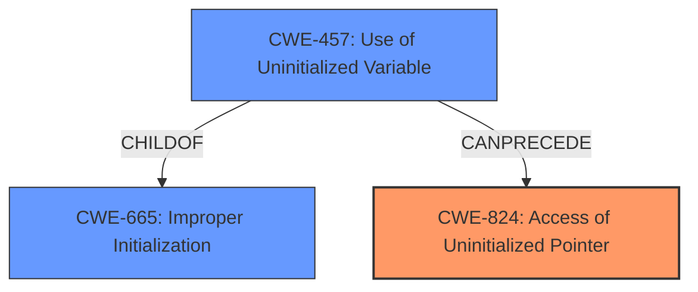

# Analysis for CVE-2022-29925

# Summary
| CWE ID | CWE Name | Confidence | CWE Abstraction Level | CWE Vulnerability Mapping Label | CWE-Vulnerability Mapping Notes |
|---|---|---|---|---|---|
| CWE-824 | Access of Uninitialized Pointer | 1.0 | Base | Allowed | Primary CWE |
| CWE-457 | Use of Uninitialized Variable | 0.7 | Variant | Allowed | Secondary Candidate |

## Evidence and Confidence

*   **Confidence Score:** 0.9
*   **Evidence Strength:** HIGH

## Relationship Analysis
The primary CWE is CWE-824, which is a Base level CWE describing the access of an uninitialized pointer. The retriever results suggest CWE-457 (Use of Uninitialized Variable) as a possible secondary candidate. CWE-457 is a Variant of CWE-665 (Improper Initialization) which could precede CWE-824.

## Vulnerability Chain
The vulnerability chain starts with an **uninitialized pointer** (potentially due to a **missing initialization of a variable**), which leads to an **access of that uninitialized pointer**, potentially causing information disclosure or arbitrary code execution.

## Summary of Analysis
The initial analysis identified CWE-824 as the primary weakness due to the explicit mention of an **"uninitialized pointer"** in both the vulnerability description and the CVE reference summary. The retriever results and relationship analysis suggest that CWE-457 could be a relevant secondary weakness, as the **lack of initialization** could lead to the **use of an uninitialized variable**, ultimately resulting in the **access of an uninitialized pointer**.

The vulnerability description states: "Access of **uninitialized pointer** vulnerability exists in the simulator module contained in the graphic editor V-SFT versions prior to v6.1.6.0, which may allow an attacker to obtain information and/or execute arbitrary code by having a user to open a specially crafted image file."

The CVE Reference Links Content Summary states: "The vulnerability is due to an "Access of Uninitialized Pointer" within the simulator module of the Fuji Electric V-SFT software...**Access of Uninitialized Pointer (CWE-824)**: The software attempts to use a pointer before it has been properly initialized...**Information Disclosure:** Exploitation could lead to the disclosure of sensitive information...**Arbitrary Code Execution:** Successful exploitation may allow an attacker to execute arbitrary code on the affected system."

CWE-824 is the most specific and accurately reflects the weakness. CWE-457 could be considered a contributing factor, but the description focuses on the consequences of accessing the uninitialized pointer.

Relevant CWE Information:

# Enhanced Context (25 CWEs)

## CWE-1289: Improper Validation of Unsafe Equivalence in Input
**Abstraction Level**: Base
**Similarity Score**: 0.81
**Source**: dense

**Description**:
The product receives an input value that is used as a resource identifier or other type of reference, but it does not validate or incorrectly validates that the input is equivalent to a potentially-unsafe value.
*Not Selected*: The vulnerability described does not involve validation of unsafe equivalences.

## CWE-822: Untrusted Pointer Dereference
**Abstraction Level**: Base
**Similarity Score**: 0.78
**Source**: dense

**Description**:
The product obtains a value from an untrusted source, converts this value to a pointer, and dereferences the resulting pointer.
*Not Selected*: The description explicitly mentions that the pointer is uninitialized, not necessarily from an untrusted source.

## CWE-252: Unchecked Return Value
**Abstraction Level**: Base
**Similarity Score**: 0.77
**Source**: dense

**Description**:
The product does not check the return value from a method or function, which can prevent it from detecting unexpected states and conditions.
*Not Selected*: The vulnerability description does not explicitly mention a failure to check return values.

## CWE-807: Reliance on Untrusted Inputs in a Security Decision
**Abstraction Level**: Base
**Similarity Score**: 0.77
**Source**: dense

**Description**:
The product uses a protection mechanism that relies on the existence or values of an input, but the input can be modified by an untrusted actor in a way that bypasses the protection mechanism.
*Not Selected*: The vulnerability does not involve reliance on untrusted inputs in a security decision.

## CWE-457: Use of Uninitialized Variable
**Abstraction Level**: Variant
**Similarity Score**: 0.77
**Source**: dense

**Description**:
The code uses a variable that has not been initialized, leading to unpredictable or unintended results.
*Selected*: This could be a contributing factor, as the **uninitialized pointer** is being used, which is an **uninitialized variable**.

## CWE-606: Unchecked Input for Loop Condition
**Abstraction Level**: Base
**Similarity Score**: 0.77
**Source**: dense

**Description**:
The product does not properly check inputs that are used for loop conditions, potentially leading to a denial of service or other consequences because of excessive looping.
*Not Selected*: The vulnerability is not related to unchecked input for loop conditions.

## CWE-183: Permissive List of Allowed Inputs
**Abstraction Level**: Base
**Similarity Score**: 0.77
**Source**: dense

**Description**:
The product implements a protection mechanism that relies on a list of inputs (or properties of inputs) that are explicitly allowed by policy because the inputs are assumed to be safe, but the list is too permissive - that is, it allows an input that is unsafe, leading to resultant weaknesses.
*Not Selected*: The vulnerability is not related to a permissive list of allowed inputs.

## CWE-824: Access of Uninitialized Pointer
**Abstraction Level**: Base
**Similarity Score**: 0.77
**Source**: dense

**Description**:
The product accesses or uses a pointer that has not been initialized.
*Selected*: This is the primary vulnerability described in the report.

## CWE-665: Improper Initialization
**Abstraction Level**: Class
**Similarity Score**: 0.77
**Source**: dense

**Description**:
The product does not initialize or incorrectly initializes a resource, which might leave the resource in an unexpected state when it is accessed or used.
*Not Selected*: CWE-665 is a class level weakness, and CWE-457 is a more specific variant. The report doesn't explicitly state that something was improperly initialized, but more that it was left uninitialized, so it is not as strong of a fit.

## CWE-1288: Improper Validation of Consistency within Input
**Abstraction Level**: Base
**Similarity Score**: 0.77
**Source**: dense

**Description**:
The product receives a complex input with multiple elements or fields that must be consistent with each other, but it does not validate or incorrectly validates that the input is actually consistent.
*Not Selected*: The vulnerability does not involve improper validation of consistency within input.

## CWE-119: Improper Restriction of Operations within the Bounds of a Memory Buffer
**Abstraction Level**: Class
**Similarity Score**: 7014.67
**Source**: sparse

**Description**:
The product performs operations on a memory buffer, but it reads from or writes to a memory location outside the buffer's intended boundary. This may result in read or write operations on unexpected memory locations that could be linked to other variables, data structures, or internal program data.
*Not Selected*: While an access of an uninitialized pointer *could* lead to out-of-bounds access, the root cause is the uninitialized pointer itself. CWE-119 is too general.

## CWE-476: NULL Pointer Dereference
**Abstraction Level**: base
**Similarity Score**: 4.33
**Source**: graph

**Description**:
CWE-476: NULL Pointer Dereference
*Not Selected*: While similar to CWE-824, CWE-476 is specific to NULL pointers, while CWE-824 covers all uninitialized pointers. An uninitialized pointer doesn't necessarily contain NULL.